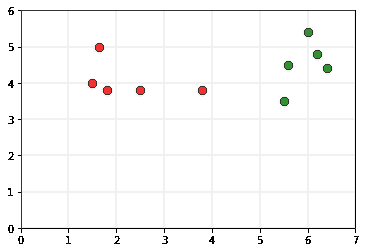
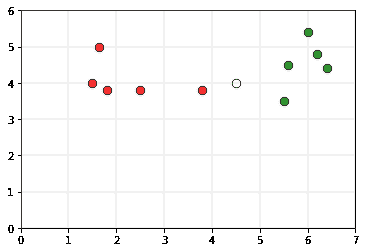
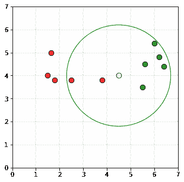

# r-最近邻居

> 原文:[https://www.geeksforgeeks.org/r-nearest-neighbors/](https://www.geeksforgeeks.org/r-nearest-neighbors/)

r-最近邻是[k-最近邻](https://www.geeksforgeeks.org/k-nearest-neighbours/)的修改版本。k 近邻的问题是 k 的选择。k 越小，分类器对异常值越敏感。如果 k 的值很大，那么分类器将包括来自其他类的许多点。正是从这个逻辑出发，我们得到了 r 近邻算法。

**直觉:**
考虑以下数据，作为训练集。

绿色点属于 0 类，红色点属于 1 类。
将白点 P 视为其

的查询点如果我们取圆的半径为 2.2 个单位，并且如果用点 P 作为圆心画圆，则图将如下所示

因为属于类别 1 的圆中的点数(5 个点)大于属于类别 0 的点数(2 个点)

**算法:**

> **步骤 1:** 给定点 P，确定位于以 P 为中心的半径为 r 的球中的数据集，
> 
> B<sub>r</sub> (P) = { X<sub>i</sub> ∊ X | dist( P, X<sub>i</sub> ) ≤ r }
> 
> **第二步:**如果 B <sub>r</sub> (P)为空，则输出整个数据集的多数类。
> 
> **第三步:**如果 B <sub>r</sub> (P)不为空，输出其中数据点的多数类。

**r 半径邻居算法的实现如下::**

## C/C++

```
// C++ program to implement the
// r nearest neighbours algorithm.
#include <bits/stdc++.h>
using namespace std;

struct Point
{
    // Class of point
    int val; 

    // Co-ordinate of point
    double x, y; 
};

// This function classifies the point p using
// r k neareast neighbour algorithm. It assumes only
// two groups and returns 0 if p belongs to class 0, else
// 1 (belongs to class 1).
int rNN(Point arr[], int n, float r, Point p)
{
    // frequency of group 0
    int freq1 = 0; 
    // frequency of group 1
    int freq2 = 0; 

    // Check if the distance is less than r
    for (int i = 0; i < n; i++)
    {

        if ((sqrt((arr[i].x - p.x) * (arr[i].x - p.x) + 
        (arr[i].y - p.y) * (arr[i].y - p.y))) <= r)
        {
            if (arr[i].val == 0)
                freq1++;
            else if (arr[i].val == 1)
                freq2++;
        }
    }
    return (freq1 > freq2 ? 0 : 1);
}

// Driver code
int main()
{
    // Number of data points
    int n = 10; 
    Point arr[n];

    arr[0].x = 1.5;
    arr[0].y = 4;
    arr[0].val = 0;

    arr[1].x = 1.8;
    arr[1].y = 3.8;
    arr[1].val = 0;

    arr[2].x = 1.65;
    arr[2].y = 5;
    arr[2].val = 0;

    arr[3].x = 2.5;
    arr[3].y = 3.8;
    arr[3].val = 0;

    arr[4].x = 3.8;
    arr[4].y = 3.8;
    arr[4].val = 0;

    arr[5].x = 5.5;
    arr[5].y = 3.5;
    arr[5].val = 1;

    arr[6].x = 5.6;
    arr[6].y = 4.5;
    arr[6].val = 1;

    arr[7].x = 6;
    arr[7].y = 5.4;
    arr[7].val = 1;

    arr[8].x = 6.2;
    arr[8].y = 4.8;
    arr[8].val = 1;

    arr[9].x = 6.4;
    arr[9].y = 4.4;
    arr[9].val = 1;

    // Query point
    Point p;
    p.x = 4.5;
    p.y = 4;

    // Parameter to decide the class of the query point
    float r = 2.2;
    printf("The value classified to query point"
           " is: %d.\n", rNN(arr, n, r, p));
    return 0;
}
```

## 蟒蛇 3

```
# Python3 program to implement the 
# r nearest neighbours algorithm. 
import math 

def rNN(points, p, r = 2.2): 
        ''' 
        This function classifies the point p using 
        r k neareast neighbour algorithm. It assumes only  
        two groups and returns 0 if p belongs to class 0, else 
        1 (belongs to class 1). 

        Parameters - 
                points : Dictionary of training points having two
                         keys - 0 and 1\. Each class have a list of
                         training data points belonging to them 

                p : A tuple, test data point of form (x, y) 
                k : radius of the r nearest neighbors 
        '''

        freq1 = 0
        freq2 = 0
        for group in points: 
                for feature in points[group]: 
                        if math.sqrt((feature[0]-p[0])**2 + 
                                     (feature[1]-p[1])**2) <= r:
                                if group == 0:
                                        freq1 += 1                      
                                elif group == 1: 
                                        freq2 += 1 

        return 0 if freq1>freq2 else 1

# Driver function 
def main(): 

        # Dictionary of training points having two keys - 0 and 1 
        # key 0 have points belong to class 0 
        # key 1 have points belong to class 1 

        points = {0:[(1.5, 4), (1.8, 3.8), (1.65, 5), (2.5, 3.8), (3.8, 3.8)], 
                  1:[(5.5, 3.5), (5.6, 4.5), (6, 5.4), (6.2, 4.8), (6.4, 4.4)]} 

        # query point p(x, y) 
        p = (4.5, 4) 

        # Parameter to decide the class of the query point 
        r = 2.2

        print("The value classified to query point is: {}".format(
                rNN(points, p, r))) 

if __name__ == '__main__': 
        main() 
```

**Output:**

```
The value classified to query point is: 1.

```

其他技术如 kd-tree、位置敏感散列可以用来降低查找邻居的时间复杂度。

**应用:**
该算法可用于识别异常值。如果模式与所选半径内的模式没有任何相似性，则可以将其识别为异常值。