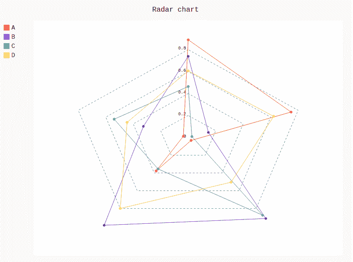
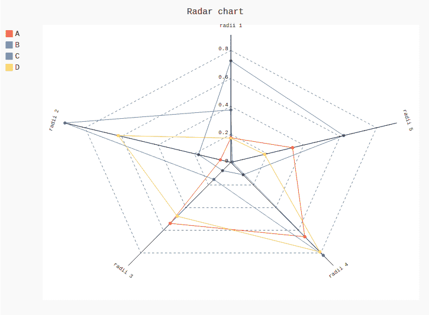
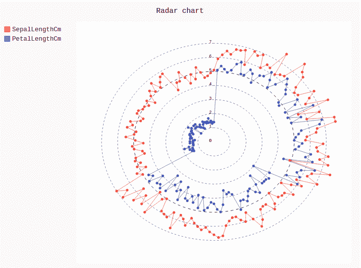

# pygal 雷达图

> 原文:[https://www.geeksforgeeks.org/radar-chart-in-pygal/](https://www.geeksforgeeks.org/radar-chart-in-pygal/)

Pygal 是一个 Python 模块，主要用于构建 SVG(标量矢量图形)图形和图表。SVG 是一种基于矢量的 XML 格式的图形，可以在任何编辑器中编辑。Pygal 可以用最少的代码行创建易于理解的图形。

## 雷达图

雷达图是由一系列等角辐条组成的图表，称为半径，每个辐条代表一个变量。雷达图基本上是以二维图表的形式显示数据的一种图形方法，该图表由三个或更多的定量变量组成，这些变量表示在从同一点开始的轴上。雷达图对中小型多元数据集更有帮助。它可以使用 Radar()方法创建。

**语法:**

```
radar_chart = pygal.Radar()

```

**例 1:**

## 蟒蛇 3

```
# importing pygal
import pygal
import numpy

# creating the chart object
radar_chart = pygal.Radar()

# naming the title
radar_chart.title = 'Radar chart'

# Random data
radar_chart.add('A', numpy.random.rand(5))
radar_chart.add('B', numpy.random.rand(5))
radar_chart.add('C', numpy.random.rand(5))
radar_chart.add('D', numpy.random.rand(5))

radar_chart
```

**输出:**



**例 2:**

## 蟒蛇 3

```
# importing pygal
import pygal
import numpy

# creating the chart object
radar_chart = pygal.Radar()

# naming the title
radar_chart.title = 'Radar chart'

radar_chart.x_labels = ['radii 1', 'radii 2',
                        'radii 3', 'radii 4',
                        'radii 5']

# Random data
radar_chart.add('A', numpy.random.rand(5))
radar_chart.add('B', numpy.random.rand(5))
radar_chart.add('C', numpy.random.rand(5))
radar_chart.add('D', numpy.random.rand(5))

radar_chart
```

**输出:**



**示例 3:** 使用虹膜数据集

## 蟒蛇 3

```
# importing pygal
import pygal
import pandas

# creating the chart object
radar_chart = pygal.Radar()

# naming the title
radar_chart.title = 'Radar chart'

df = pandas.read_csv('Iris.csv')

radar_chart.add("SepalLengthCm", df['SepalLengthCm'])
radar_chart.add("PetalLengthCm", df['PetalLengthCm'])
radar_chart
```

**输出:**

