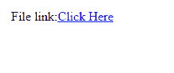

# 在 Python 中弹出文件下载对话框

> 原文:[https://www . geesforgeks . org/raise-a-file-download-dialog-in-python/](https://www.geeksforgeeks.org/raise-a-file-download-dialog-box-in-python/)

使用 **HTTP 头**可以为最终用户打开一个文件下载对话框，下载像 Python 中的 pdf、媒体对象、文档等文件。当需要开发一个功能，而不是在浏览器中显示文件，文件包含自动下载时，它会派上用场。
例如，如果你需要一个文件，比如说(GeeksForGeeks.txt)，点击数据库中的一个链接就可以下载，那么代码如下所示:

## 蟒蛇 3

```py
# python_script.py

# HTTP Header
print ("Content-Type:application/octet-stream; name = \"FileName\"\r\n")
print ("Content-Disposition: attachment; filename = \"FileName\"\r\n\n")

# Original File
my_file = open("GeeksForGeeks.txt", "rb")

# read the file content
text = my_file.read();

print (text)

# Close opened file
my_file.close()
```

如果你只是运行脚本，它只会读取如下原始文件:


**注意:**需要确保要下载的文件和 Python 脚本在同一个目录下。
**在应用程序中使用脚本:**
下面的代码是在应用程序中使用上述脚本的一个简单示例:

## 超文本标记语言

```py
<html>
<body>
<form enctype = "multipart/form-data" action = "python_script.py" method = "get">

<p>File link:<a href="GeeksForGeeks.txt" download>Click Here</a></p>

</form>
</body>
</html>                   
```

**输出:**



点击“点击这里”链接，下载框将弹出，并开始下载文件。