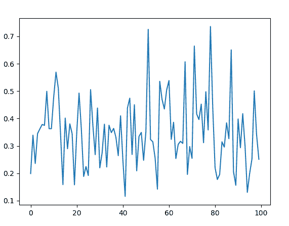

# Python 中的 random.betavariate()方法

> 原文:[https://www . geesforgeks . org/random-beta variate-method-in-python/](https://www.geeksforgeeks.org/random-betavariate-method-in-python/)

`**betavariate()**`是`random`模块的内置方法。用于返回带有[贝塔分布](https://en.wikipedia.org/wiki/Beta_distribution)的随机浮点数。返回值介于 0 和 1 之间。

> **语法:**随机β变量(α，β)
> 
> **参数:**
> α:大于 0
> β:大于 0
> 
> **返回:**一个介于 0 和 1 之间的随机β分布浮点数

**例 1:**

```py
# import the random module
import random

# determining the values of the parameters
alpha = 5
beta = 10

# using the betavariate() method
print(random.betavariate(alpha, beta))
```

**输出:**

```py
0.5148685287422776
```

**例 2:** 我们可以多次生成这个数，并绘制一个图来观察β分布。

```py
# import the required libraries
import random
import matplotlib.pyplot as plt

# store the random numbers in a 
# list
nums = []
low = 10
high = 100
mode = 20

for i in range(100):
    temp = random.betavariate(5, 10)
    nums.append(temp)

# plotting a graph
plt.plot(nums)
plt.show()
```

**输出:**
