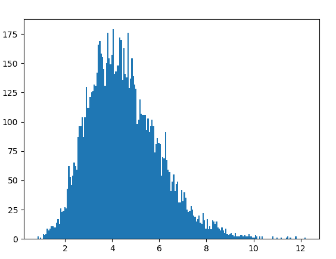

# Python 中的 random.gammavariate()函数

> 原文:[https://www . geesforgeks . org/random-gamma variable-function-in-python/](https://www.geeksforgeeks.org/random-gammavariate-function-in-python/)

`random`模块用于在 Python 中生成随机数。实际上不是随机的，而是用来生成伪随机数的。这意味着这些随机生成的数字是可以确定的。

## random.gammavariate()

`**gammavariate()**`是`random`模块的内置方法。用于返回带有[伽玛分布](https://en.wikipedia.org/wiki/Gamma_distribution)的随机浮点数。

> **语法:**random . gamma variable(α，β)
> 
> **参数:**
> α:大于 0
> β:大于 0
> 
> **返回:**一个随机伽玛分布浮点数

**例 1:**

```py
# import the random module
import random

# determining the values of the parameter
alpha = 100
beta = 2

# using the gammavariate() method
print(random.gammavariate(alpha, beta))
```

**输出:**

```py
4.647425239687329
```

**例 2:** 我们可以多次生成这个数，并绘制一个图来观察伽马分布。

```py
# import the required libraries 
import random 
import matplotlib.pyplot as plt 

# store the random numbers in a  
# list 
nums = [] 
alpha = 9
beta = 0.5

for i in range(100): 
    temp = random.gammavariate(alpha, beta)
    nums.append(temp) 

# plotting a graph 
plt.plot(nums) 
plt.show()
```

**输出:**

**例 3:** 我们可以创建一个直方图来观察伽马分布的密度。

```py
# import the required libraries 
import random 
import matplotlib.pyplot as plt 

# store the random numbers in a list 
nums = [] 
alpha = 9
beta = 0.5

for i in range(10000): 
    temp = random.gammavariate(alpha, beta)
    nums.append(temp) 

# plotting a graph 
plt.hist(nums, bins = 200) 
plt.show()
```

**输出:**
