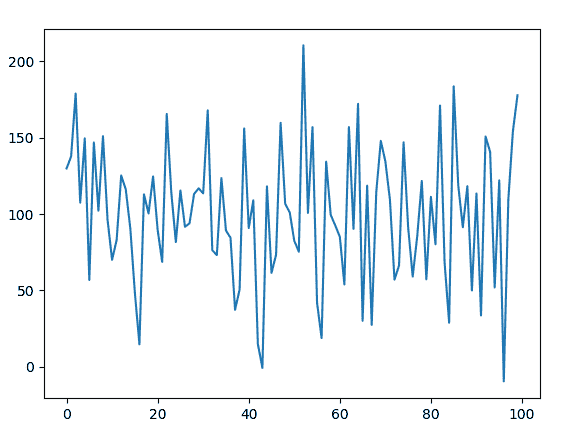
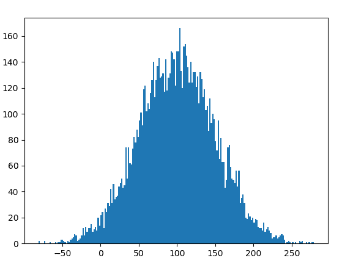

# Python 中的 random.gauss()函数

> 原文:[https://www . geesforgeks . org/random-gauss-function in-python/](https://www.geeksforgeeks.org/random-gauss-function-in-python/)

`random`模块用于在 Python 中生成随机数。实际上不是随机的，而是用来生成伪随机数的。这意味着这些随机生成的数字是可以确定的。

## random .高斯()

`**gauss()**`是`random`模块的内置方法。用于返回具有[高斯分布](https://en.wikipedia.org/wiki/Normal_distribution)的随机浮点数。

> **语法:**随机高斯(μ，σ)
> 
> **参数:**
> μ:均值
> σ:标准差
> 
> **返回:**一个随机高斯分布浮点数

**例 1:**

```py
# import the random module
import random

# determining the values of the parameters
mu = 100
sigma = 50

# using the gauss() method
print(random.gauss(mu, sigma))
```

**输出:**

```py
127.80261974806497
```

**例 2:** 我们可以多次生成这个数，并绘制一个图来观察高斯分布。

```py
# import the required libraries 
import random 
import matplotlib.pyplot as plt 

# store the random numbers in a  
# list 
nums = [] 
mu = 100
sigma = 50

for i in range(100): 
    temp = random.gauss(mu, sigma)
    nums.append(temp) 

# plotting a graph 
plt.plot(nums) 
plt.show()
```

**输出:**


**示例 3:** 我们可以创建一个直方图来观察高斯分布的密度。

```py
# import the required libraries 
import random 
import matplotlib.pyplot as plt 

# store the random numbers in a list 
nums = [] 
mu = 100
sigma = 50

for i in range(10000): 
    temp = random.gauss(mu, sigma) 
    nums.append(temp) 

# plotting a graph 
plt.hist(nums, bins = 200) 
plt.show()
```

**输出:**
