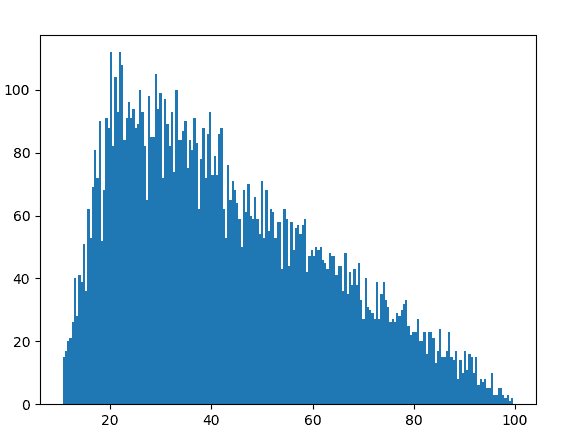

# Python 中的 random .三角形()方法

> 原文:[https://www . geesforgeks . org/random-trial-in-method-python/](https://www.geeksforgeeks.org/random-triangular-method-in-python/)

`**triangular()**`是`random`模块的内置方法。它用于返回一个范围内的随机浮点数，偏向一个极端。

> **语法:**随机三角形(低，高，模式)
> 
> **参数:**
> 低:随机数下限
> 高:随机数上限
> 模式:附加偏差；低<模式<高
> 
> 如果参数是(10，100，20)，那么由于偏差，生成的大多数随机数将更接近 10，而不是 100。
> 
> **返回:**一个随机浮点数

**例 1:**

```py
# import the random module
import random

# determining the values of the parameters
low = 10
high = 100
mode = 20

# using the triangular() method
print(random.triangular(low, high, mode))
```

**输出:**

```py
22.614510550239572
```

**例 2:** 如果我们多次生成这个数，我们大概可以识别出偏差。

```py
# import the random module
import random

# determining the values of the parameters
low = 10
high = 100
mode = 20

# running the triangular method with the
# same parameters multiple times
for i in range(10):
    print(random.triangular(low, high, mode))
```

**输出:**

```py
58.645768016894735
46.690692250503226
33.57590419190895
52.331804090351305
33.09451214875767
12.03845752596168
32.816080679206294
20.4739124559502
82.49208123077557
63.511062284733015
```

**示例 3:** 我们可以通过绘制图形来可视化**三角形**图案。

```py
# import the required libraries
import random
import matplotlib.pyplot as plt

# store the random numbers in a list
nums = []
low = 10
high = 100
mode = 20

for i in range(10000):
    temp = random.triangular(low, high, mode)
    nums.append(temp)

# plotting a graph
plt.hist(nums, bins = 200)
plt.show()
```

**输出:**
