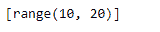
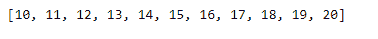

# 范围()到 Python 中的列表

> 原文:[https://www.geeksforgeeks.org/range-to-a-list-in-python/](https://www.geeksforgeeks.org/range-to-a-list-in-python/)

很多时候，我们希望创建一个包含连续值的列表，比如 100-200。我们来讨论一下如何使用`[range()](https://www.geeksforgeeks.org/python-range-method/)`函数创建列表。

**这样行吗？**

```py
# Create a list in a range of 10-20
My_list = [range(10, 20, 1)]

# Print the list
print(My_list)
```

**输出:**

正如我们在输出中所看到的，结果并不是我们所期望的那样，因为 Python 并没有对 range()函数的结果进行解包。

**代码#1:** 我们可以使用参数拆包运算符，即 ***** 。

```py
# Create a list in a range of 10-20
My_list = [*range(10, 21, 1)]

# Print the list
print(My_list)
```

**输出:**

正如我们在输出中看到的，参数-解包运算符已经成功解包了 range 函数的结果。

**代码#2 :** 我们可以使用`[extend()](https://www.geeksforgeeks.org/append-extend-python/)`函数来解包范围函数的结果。

```py
# Create an empty list
My_list = []

# Value to begin and end with
start, end = 10, 20

# Check if start value is smaller than end value
if start < end:
    # unpack the result
    My_list.extend(range(start, end))
    # Append the last value
    My_list.append(end)

# Print the list
print(My_list)
```

**输出:**
