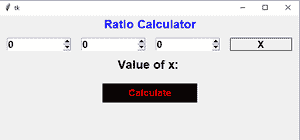

# 使用 Tkit

的比率计算器图形用户界面

> 原文:[https://www . geesforgeks . org/ratio-calculator-GUI-using-tkinter/](https://www.geeksforgeeks.org/ratio-calculator-gui-using-tkinter/)

**先决条件:** [Python 图形用户界面–tkinter](https://www.geeksforgeeks.org/python-gui-tkinter/)

*Tkinter* 是 Python 中开发 GUI(图形用户界面)最常用的库。它是 Python 附带的 Tk 图形用户界面工具包的标准 Python 接口。由于 Tk 和*Tkit*在大多数 Unix 平台和视窗系统上都可用，用*Tkit*开发图形用户界面应用程序变得最快和最容易。

在本文中，我们将讨论如何使用 *Tkinter* 模块创建比率计算器。

## **什么是**比率计算器？****

计算器根据给定的比值计算分母。

**说明:**

```
Input:
a = 10
b = 20
c = 30
d = ?
a : d = c : d
Output:
value of d is 60.0
```

**下面是计算器的样子:**



**使用的配方:**

```
a/b = c/d
```

这里 *a* 和 *b* 是给定的比值， *c* 是输入的数值，我们必须找到比值，即分母 *d* 。

**分步方法:**

*   创建正常 *Tkinter* 窗口

## 蟒蛇 3

```
# Import module
from tkinter import *

# Create object
root = Tk()

# Adjust size
root.geometry("400x400")

# Execute tkinter
root.mainloop()
```