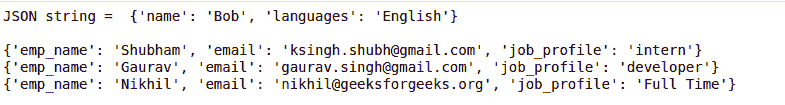

# 使用 Python 读取 JSON 文件

> 原文:[https://www.geeksforgeeks.org/read-json-file-using-python/](https://www.geeksforgeeks.org/read-json-file-using-python/)

JSON 的完整形式是 JavaScript 对象符号。这意味着由编程语言中的文本组成的脚本(可执行)文件用于存储和传输数据。Python 通过一个名为 json 的内置包支持 JSON。为了使用这个特性，我们在 Python 脚本中导入 json 包。JSON 中的文本是通过带引号的字符串完成的，该字符串包含{ }内键值映射中的值。

## 从 JSON 阅读

用 Python 加载一个 JSON 对象非常容易。Python 有一个名为 json 的内置包，可以用来处理 JSON 数据。这是通过使用 JSON 模块来完成的，该模块为我们提供了许多方法，其中 loads()和 load()方法将帮助我们读取 JSON 文件。

#### JSON 的反序列化

JSON 的反序列化意味着将 JSON 对象转换成它们各自的 Python 对象。它使用 load()/loads()方法。如果您使用了来自另一个程序的 JSON 数据，或者获得了 JSON 的字符串格式，那么它可以很容易地用 load()/loads()反序列化，后者通常用于从字符串加载，否则，根对象在 list 或 dict 中。见下表。

<figure class="table">

| jsonobject | PYTHON 对象 |
| --- | --- |
| 目标 | 词典 |
| 排列 | 目录 |
| 线 | 潜艇用热中子反应堆（submarine thermal reactor 的缩写） |
| 空 | 没有人 |
| 数字(整数) | （同 Internationalorganizations）国际组织 |
| 数字(实数) | 漂浮物 |
| 真实的 | 真实的 |
| 错误的 | 错误的 |

</figure>

**json.load():** json.load()接受文件对象，解析 json 数据，用数据填充一个 Python 字典，然后返回给你。

**语法:**

```
json.load(file object)
```

**示例:**假设 JSON 文件如下所示:


我们想阅读这个文件的内容。下面是实现。

## 蟒蛇 3

```
# Python program to read
# json file

import json

# Opening JSON file
f = open('data.json')

# returns JSON object as
# a dictionary
data = json.load(f)

# Iterating through the json
# list
for i in data['emp_details']:
    print(i)

# Closing file
f.close()
```

**输出:**


**json.loads():** 如果有 json 字符串，可以用 json.loads()方法解析，json.loads()不取文件路径，而是把文件内容作为字符串，用 fileobject.read()配合 json.loads()我们可以返回文件的内容。

**语法:**

```
json.loads(jsonstring) #for Json string

json.loads(fileobject.read()) #for fileobject
```

**示例:**该示例显示了从字符串和 JSON 文件中读取。使用上面显示的文件。

## 蟒蛇 3

```
# Python program to read
# json file

import json

# JSON string
a = '{"name": "Bob", "languages": "English"}'

# deserializes into dict
# and returns dict.
y = json.loads(a)

print("JSON string = ", y)
print()

# JSON file
f = open ('data.json', "r")

# Reading from file
data = json.loads(f.read())

# Iterating through the json
# list
for i in data['emp_details']:
    print(i)

# Closing file
f.close()
```

**输出:**

