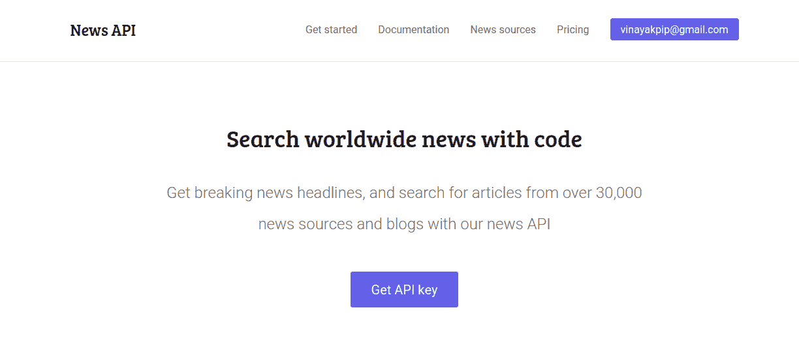

# 使用 newsapi | Python 阅读最新消息

> 原文:[https://www . geesforgeks . org/read-latest-news-using-news API-python/](https://www.geeksforgeeks.org/read-latest-news-using-newsapi-python/)

在本文中，我们将学习如何创建 Python 脚本来阅读最新消息。我们将从新闻 API 获取新闻，之后，我们将使用 pyttsx3 阅读新闻。

**所需模块:**

```
pyttsx3 - pip install pyttsx3
requests - pip install requests
```

**Getting news API :**To get a API for news we will use [newsapi.org](https://newsapi.org/). we will create account and take API key by clicking on get API button.



**步骤#1:** 导入所需模块

```
import pyttsx3
import requests
import json
import time
```

**第 2 步:**用 API 键设置 URL，把你的 API 键放在这里。

```
url = ('https://newsapi.org/v2/top-headlines?'
       'country = in&'
       'apiKey =')

url += 'your_api_key_here'
```

**步骤#3:** 为 pyttsx3 设置阅读新闻的引擎。

```
engine = pyttsx3.init()
```

**步骤#4:** 设置我们引擎的属性，意味着读取速率、音量和声音。

```
rate = engine.getProperty('rate')
engine.setProperty('rate', rate + 10)

volume = engine.getProperty('volume')
engine.setProperty('volume', volume-0.60)

sound = engine.getProperty ('voices');
engine.setProperty('voice', 'sound[1].id')
```

**第五步:**尝试发送请求获取消息。在这里， **engine.say()** 功能用于阅读新闻。

```
try:
    response = requests.get(url)
except:
    engine.say("can, t access link, plz check you internet ")

news = json.loads(response.text)
```

```
for new in news['articles']:
    print("##############################################################\n")
    print(str(new['title']), "\n\n")
    engine.say(str(new['title']))
    print('______________________________________________________\n')

    engine.runAndWait()

    print(str(new['description']), "\n\n")
    engine.say(str(new['description']))
    engine.runAndWait()
    print("..............................................................")
    time.sleep(2)
```

现在，一切都准备好了，构建一个阅读新文章的循环。

下面是完整的 Python 实现:

```
import pyttsx3
import requests
import json
import time

url = ('https://newsapi.org/v2/top-headlines?'
       'country = in&'
       'apiKey =')

url +='your_api_key_here'

engine = pyttsx3.init()
rate = engine.getProperty('rate')
engine.setProperty('rate', rate + 10)

volume = engine.getProperty('volume')
engine.setProperty('volume', volume-0.60)

sound = engine.getProperty ('voices');
engine.setProperty('voice', 'sound[1].id')

try:
    response = requests.get(url)
except:
    engine.say("can, t access link, plz check you internet ")

news = json.loads(response.text)

for new in news['articles']:
    print("##############################################################\n")
    print(str(new['title']), "\n\n")
    engine.say(str(new['title']))
    print('______________________________________________________\n')

    engine.runAndWait()

    print(str(new['description']), "\n\n")
    engine.say(str(new['description']))
    engine.runAndWait()
    print("..............................................................")
    time.sleep(2)
```

**输出:**
