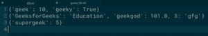
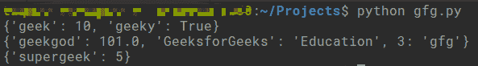

# 从 Python 文件中读取字典列表

> 原文:[https://www . geeksforgeeks . org/从 python 文件中读取词典列表/](https://www.geeksforgeeks.org/read-list-of-dictionaries-from-file-in-python/)

Python 中的 [**字典**](https://www.geeksforgeeks.org/python-dictionary/) 是一个集合，其中每个值都映射到一个键。因为它们是无序的，并且对存储在字典中的值和键的数据类型没有限制，所以用 Python 从文件中读取字典是很棘手的。

### 方法

问题陈述提到了必须从文件中读取的字典列表。有两种方法可以做到这一点:

**1。从文本文件中读取**

我们可以从文本文件中读取字符串形式的数据，并将这些数据转换成 Python 中的字典。假设我们的数据存储在以下格式的文本文件中–

```
{'geek': 10, 'geeky': True}
{'GeeksforGeeks': 'Education', 'geekgod': 101.0, 3: 'gfg'}
{'supergeek': 5}

```

该方法将包括以下步骤:

*   以读取模式打开文本文件并读取内容
*   将内容中的每一行解析成字典。

**2。使用泡菜模块阅读**

Python 中的 pickle 模块主要用于数据持久性至关重要的数据科学等领域。pickle 模块将给定的数据作为一个序列化的字节序列存储到文件中，以后可以很容易地检索到这些文件。Pickle 模块支持各种 Python 对象，字典就是其中之一。该方法包括以下步骤:

*   导入泡菜模块
*   以读取二进制模式打开文件
*   使用 pickle 模块的转储方法将数据加载到变量中

```
list_dictionary = pickle.load(filehandler)

```

以下是上述方法的示例。

**1。从文本文件读取:**

**输入文件:**



## 蟒蛇 3

```
def parse(d):
    dictionary = dict()
    # Removes curly braces and splits the pairs into a list
    pairs = d.strip('{}').split(', ')
    for i in pairs:
        pair = i.split(': ')
        # Other symbols from the key-value pair should be stripped.
        dictionary[pair[0].strip('\'\'\"\"')] = pair[1].strip('\'\'\"\"')
    return dictionary
try:
    geeky_file = open('geeky_file.txt', 'rt')
    lines = geeky_file.read().split('\n')
    for l in lines:
        if l != '':
            dictionary = parse(l)
            print(dictionary)
    geeky_file.close()
except:
    print("Something unexpected occurred!")
```

**输出:**

```
{'geek': '10', 'geeky': 'True'}
{'GeeksforGeeks': 'Education', 'geekgod': '101.0', '3': 'gfg'}
{'supergeek': '5'}
```

**2。使用泡菜阅读**

## 蟒蛇 3

```
import pickle

try:
    geeky_file = open('GFG.txt', 'r')
    dictionary_list = pickle.load(geeky_file)

    for d in dictionary_list:
        print(d)
    geeky_file.close()

except:
    print("Something unexpected occurred!")
```

**输出:**

