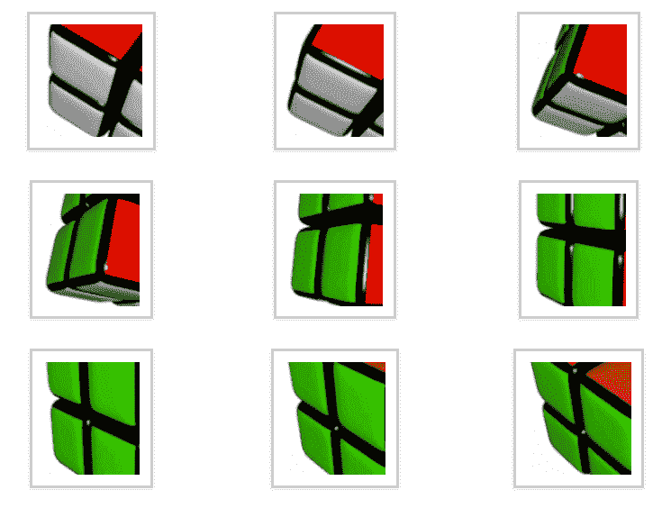

# 读取魔杖蟒中的修改器

> 原文:[https://www . geesforgeks . org/read-modifiers-in-wand-python/](https://www.geeksforgeeks.org/read-modifiers-in-wand-python/)

**读取修改器**是指读取后立即修改输入图像或文件格式，或者在读取图像后立即使图像完美地进行操作。这可以通过使用 Image()函数的 filename 参数来完成。

例如，假设我们想要读取(100 x 100)尺寸/纵横比的图像，但原始图像的尺寸/纵横比为(200 X 200)。因此，我们可以使用“读取”修改器，以便在读取图像后立即将其转换为(100 X 100)尺寸/纵横比。

我们可以使用 read 修饰符来显示。gif 文件。也可以从 pdf 文件中选择特定的页面

**阅读修饰语的类型:**

1.  阅读框架/页面
2.  读取调整大小
3.  阅读作物

> **语法:**将图像(文件名= ' filename . format[Read _ modifier]')修改为 _Read:

**示例 1:** 假设我们只需要从 pdf 中读取第一页并将其转换为。png 格式。

```
# Import Image from wand.image module
from wand.image import Image

    # Read first page of pdf using Image() function
    with Image(filename ='document.pdf[0]') as first_page:

        # convert pdf page to image file
        first_page.convert("png")

        # save final image
        first_page.save(filename = "first_page_image.png")
```

**输出:**


**例 2:**

**输入:**


```
# Import Image from wand.image module
from wand.image import Image

# Read first six frames of gif using Image() function
with Image(filename='sample.gif[0-5]') as f:
    #save final image
    f.save(filename = "final.gif")
```

**输出:**


**示例 3:** 在本例中，我们将执行读取调整大小。

**输入:**


```
# Import Image from wand.image module
from wand.image import Image

# Read first six frames of gif using Image() function
with Image(filename ='initial.jpg[400x300]') as resized_image:
    # convert  jpg image file to png image file
    resized_image.convert("png")
    # save final image
    resized_image.save(filename = 'final.png')
```

**输出:**


**示例 4:** 在本例中，我们将执行读取裁剪，然后以另一种格式保存。

```
# Import Image from wand.image module
from wand.image import Image

# Read first six frames of gif using Image() function
with Image(filename ='sample.gif[100x100 + 50 + 75]') as cropped_image:
    # convert gif file to png file
    cropped_image.convert("png")
    # save final image
    cropped_image.save(filename = 'final.png')
```

**输入:**


**输出:**


