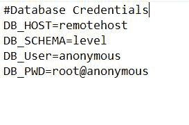
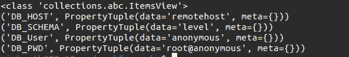
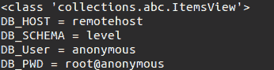
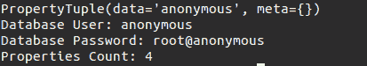

# 使用 Python 中的 jproperties 读取属性文件

> 原文:[https://www . geesforgeks . org/read-properties-file-using-jpproperties-in-python/](https://www.geeksforgeeks.org/read-properties-file-using-jproperties-in-python/)

在本文中，我们将看到如何使用 **jproperties** 模块读取 python 中的属性文件。它是一个 Python 的 Java 属性文件解析器和编写器。安装时，在您的终端上运行该命令。

```
pip install jproperties
```

**本模块的各种属性:**

*   **获取()**读取与键相关联的值的方法或基于索引的访问。
*   **items()** 方法获取所有键-值对的集合，并迭代该集合以从属性中读取所有键-值对。
*   该文件每行都包含键值对(也就是说，它是 python 中的字典)。该运算符 equals (=)用作键和值之间的分隔符

**我们将使用这个属性文件(示例. properties)进行演示:**



**示例 1:** 打印所有属性详细信息。

**进场:**

*   导入模块
*   将属性文件加载到我们的属性对象中。
*   这里 **items()** 方法是获取元组的集合，其中包含 key 和对应的 **PropertyTuple** 值

**下面是实现:**

## 蟒蛇 3

```
from jproperties import Properties

configs = Properties()
with open('example.properties', 'rb') as read_prop:
    configs.load(read_prop)

prop_view = configs.items()
print(type(prop_view))

for item in prop_view:
    print(item)
```

**输出:**



使用项目()方法输出程序

**示例 2:** 打印属性文件在键的基础上，像 Python 字典中的值对

**进场:**

*   导入模块
*   然后我们打开。“rb”模式下的属性文件，然后我们使用 load()函数
*   然后我们使用 items()方法获取集合这里的所有键值对(即:print(type(prop_view))打印指定参数的类类型

**以下是完整实现:**

## 蟒蛇 3

```
from jproperties import Properties
configs = Properties()

with open('example.properties', 'rb') as read_prop:
    configs.load(read_prop)

prop_view = configs.items()
print(type(prop_view))

for item in prop_view:
    print(item[0], '=', item[1].data)
```

**输出:**



**示例 3:** 根据我们的需要打印每个特定的值-数据

**进场:**

*   导入模块
*   然后我们打开。“rb”模式下的属性文件，然后我们使用 load()函数
*   使用 get()方法返回具有指定键的项的值。
*   使用 len()函数获取文件属性的计数。

**以下是完整实现:**

## 蟒蛇 3

```
from jproperties import Properties
configs = Properties()

with open('example.properties', 'rb') as read_prop:
    configs.load(read_prop)

print(configs.get("DB_User"))  
print(f'Database User: {configs.get("DB_User").data}')   
print(f'Database Password: {configs["DB_PWD"].data}')  
print(f'Properties Count: {len(configs)}')   
```

**输出:**



这是使用 get()方法输出的属性文件