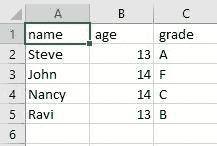
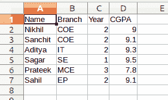
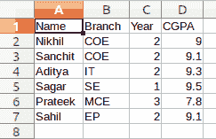

# 用 Python 读写 CSV 文件

> 原文:[https://www . geesforgeks . org/read-and-writing-CSV-files-in-python/](https://www.geeksforgeeks.org/reading-and-writing-csv-files-in-python/)

**CSV(逗号分隔值)**格式是电子表格和数据库最常见的导入和导出格式。它是在数据科学中使用的应用程序和流行数据格式之间交换数据的最常见方法之一。它得到了广泛应用的支持。CSV 文件存储表格数据，其中每个数据字段由*分隔符*分隔(大多数情况下为逗号)。要表示 CSV 文件，必须用 ***保存。csv*** 文件扩展名。

## 从 CSV 文件中读取

Python 包含一个名为`csv`的模块，用于处理 CSV 文件。模块中的 reader 类用于从 CSV 文件中读取数据。首先，在“r”模式下使用 open()方法打开 CSV 文件(打开文件时指定读取模式)，该方法返回文件对象，然后使用 CSV 模块的`reader()`方法读取该文件，该方法返回遍历指定 CSV 文档中所有行的读取器对象。

**语法:**

```
csv.reader(csvfile, dialect='excel', **fmtparams
```

**注意:**关键字“with”与`open()`方法一起使用，因为它简化了异常处理并自动关闭 CSV 文件。

**示例:**

考虑下面的 CSV 文件–



```
import csv 

# opening the CSV file 
with open('Giants.csv', mode ='r')as file: 

  # reading the CSV file 
  csvFile = csv.reader(file) 

  # displaying the contents of the CSV file 
  for lines in csvFile: 
        print(lines) 
```

**输出:**

```
[['Steve', 13, 'A'],
['John', 14, 'F'],
['Nancy', 14, 'C'],
['Ravi', 13, 'B']]

```

## 正在写入 CSV 文件

`csv.writer`类用于向 CSV 文件插入数据。此类返回一个 writer 对象，该对象负责将用户数据转换为分隔字符串。CSV 文件对象应使用换行符= "打开，否则引用字段中的换行符将无法正确解释。

**语法:**

```
csv.writer(csvfile, dialect='excel', **fmtparams)
```

csv.writer 类提供了两种写入 csv 的方法。分别是`writerow()`和`writerows()`。

*   **writerow():** 这个方法一次写一行。可以使用此方法写入字段行。
    **语法:**

    ```
    writerow(fields)
    ```

*   **writerows():** 此方法用于一次写入多行。这可用于编写行列表。
    **语法:**

    ```
    writerows(rows)
    ```

**示例:**

```
# Python program to demonstrate
# writing to CSV

import csv 

# field names 
fields = ['Name', 'Branch', 'Year', 'CGPA'] 

# data rows of csv file 
rows = [ ['Nikhil', 'COE', '2', '9.0'], 
         ['Sanchit', 'COE', '2', '9.1'], 
         ['Aditya', 'IT', '2', '9.3'], 
         ['Sagar', 'SE', '1', '9.5'], 
         ['Prateek', 'MCE', '3', '7.8'], 
         ['Sahil', 'EP', '2', '9.1']] 

# name of csv file 
filename = "university_records.csv"

# writing to csv file 
with open(filename, 'w') as csvfile: 
    # creating a csv writer object 
    csvwriter = csv.writer(csvfile) 

    # writing the fields 
    csvwriter.writerow(fields) 

    # writing the data rows 
    csvwriter.writerows(rows)
```

**输出:**



我们也可以把字典写到 CSV 文件中。为此，csv 模块提供 CSV。DictWriter 类。这个类返回一个 writer 对象，它将字典映射到输出行。

**语法:**

> csv。DictWriter(csvfile，fieldnames，restval= "，extrasaction = ' raise '，方言='excel '，*args，**kwds)

csv。DictWriter 提供了两种写入 CSV 的方法。它们是:

*   **writeheader():** `writeheader()` method simply writes the first row of your csv file using the pre-specified fieldnames.

    **语法:**

    ```
    writeheader()

    ```

*   **writerows():** `writerows` method simply writes all the rows but in each row, it writes only the values(not keys).

    **语法:**

    ```
    writerows(mydict)

    ```

**示例:**

```
# importing the csv module 
import csv 

# my data rows as dictionary objects 
mydict =[{'branch': 'COE', 'cgpa': '9.0', 'name': 'Nikhil', 'year': '2'}, 
         {'branch': 'COE', 'cgpa': '9.1', 'name': 'Sanchit', 'year': '2'}, 
         {'branch': 'IT', 'cgpa': '9.3', 'name': 'Aditya', 'year': '2'}, 
         {'branch': 'SE', 'cgpa': '9.5', 'name': 'Sagar', 'year': '1'}, 
         {'branch': 'MCE', 'cgpa': '7.8', 'name': 'Prateek', 'year': '3'}, 
         {'branch': 'EP', 'cgpa': '9.1', 'name': 'Sahil', 'year': '2'}] 

# field names 
fields = ['name', 'branch', 'year', 'cgpa'] 

# name of csv file 
filename = "university_records.csv"

# writing to csv file 
with open(filename, 'w') as csvfile: 
    # creating a csv dict writer object 
    writer = csv.DictWriter(csvfile, fieldnames = fields) 

    # writing headers (field names) 
    writer.writeheader() 

    # writing data rows 
    writer.writerows(mydict) 
```

**输出:**

