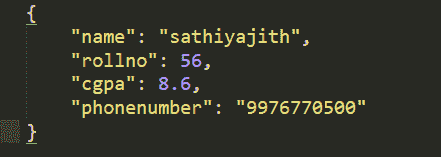
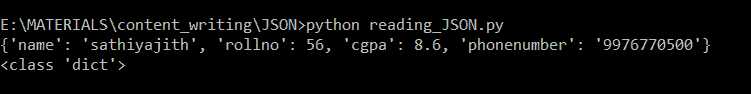

# 用 Python 将 JSON 读写到文件中

> 原文:[https://www . geesforgeks . org/读写-json-to-a-file-in-python/](https://www.geeksforgeeks.org/reading-and-writing-json-to-a-file-in-python/)

JSON 的完整形式是 JavaScript 对象符号。这意味着由编程语言中的文本组成的脚本(可执行)文件用于存储和传输数据。Python 通过一个名为`json`的内置包支持 JSON。为了使用这个特性，我们在 Python 脚本中导入 json 包。JSON 中的文本是通过引用字符串完成的，该字符串包含`{ }`内键值映射中的值。它类似于 Python 中的字典。

## 用 python 将 JSON 写入文件

序列化 JSON 是指将数据转换成一系列字节(因此是串行的)以存储或通过网络传输。为了处理文件中的数据流，Python 中的 JSON 库使用`dump()`或`dumps()`函数将 Python 对象转换成它们各自的 JSON 对象，这样就可以轻松地将数据写入文件。见下表。

| PYTHON 对象 | jsonobject |
| --- | --- |
| 词典 | 目标 |
| 列表、元组 | 排列 |
| 潜艇用热中子反应堆（submarine thermal reactor 的缩写） | 线 |
| 整型、长整型、浮点型 | 数字 |
| 真实的 | 真实的 |
| 错误的 | 错误的 |
| 没有人 | 空 |

**使用 json.dumps()**

python 中的 JSON 包有一个名为`json.dumps()`的函数，它有助于将字典转换为 JSON 对象。

它需要两个参数:

1.  **字典–**应该转换为 JSON 对象的字典的名称。
2.  **缩进–**定义缩进的单位数

将字典转换为 JSON 对象后，只需使用“write”函数将其写入文件。

**示例:**

```py
# Python program to write JSON
# to a file

import json

# Data to be written
dictionary ={
    "name" : "sathiyajith",
    "rollno" : 56,
    "cgpa" : 8.6,
    "phonenumber" : "9976770500"
}

# Serializing json 
json_object = json.dumps(dictionary, indent = 4)

# Writing to sample.json
with open("sample.json", "w") as outfile:
    outfile.write(json_object)
```

**输出:**



**使用 json.dump()**

将 JSON 写入文件的另一种方式是使用`json.dump()`方法

JSON 包具有“转储”功能，直接将字典以 JSON 的形式写入文件，而不需要将其转换为实际的 JSON 对象。

它需要两个参数:

1.  **字典–**应该转换为 JSON 对象的字典的名称。
2.  **文件指针–**以写入或追加模式打开的文件的指针。

**示例:**

```py
# Python program to write JSON
# to a file

import json

# Data to be written
dictionary ={
    "name" : "sathiyajith",
    "rollno" : 56,
    "cgpa" : 8.6,
    "phonenumber" : "9976770500"
}

with open("sample.json", "w") as outfile:
    json.dump(dictionary, outfile)
```

**输出:**


## 使用 python 从文件中读取 JSON

反序列化与序列化相反，即将 JSON 对象转换为它们各自的 Python 对象。使用`load()`方法。如果你已经使用了来自另一个程序的 JSON 数据，或者是作为 JSON 的字符串格式获得的，那么很容易用`load()`反序列化，通常用来从字符串加载，否则，根对象在 list 或者 dict 中。

**使用 json.load()**

json 包有`json.load()`功能，将 json 文件中的 JSON 内容加载到字典中。

它需要一个参数:

*   **文件指针:**指向 JSON 文件的文件指针。

```py
# Python program to read JSON
# from a file

import json

# Opening JSON file
with open('sample.json', 'r') as openfile:

    # Reading from json file
    json_object = json.load(openfile)

print(json_object)
print(type(json_object))
```

**输出:**

