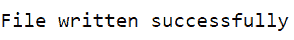
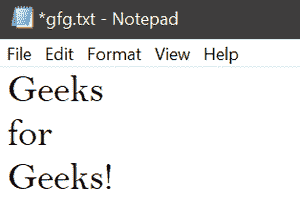
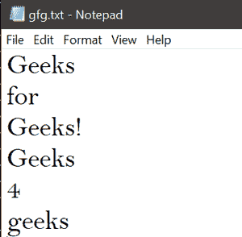
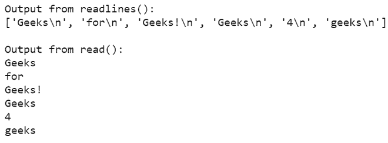

# 在 Python 中将列表读写到文件中

> 原文:[https://www . geesforgeks . org/读写列表转 python 文件/](https://www.geeksforgeeks.org/reading-and-writing-lists-to-a-file-in-python/)

读写文件是每种编程语言的重要功能。几乎每个应用程序都涉及文件的读写操作。为了能够读写文件，编程语言为文件输入/输出库提供了内置的方法，允许创建、更新以及从文件中读取数据。Python 也不例外。Python 也提供了执行文件操作的内置方法。Python 中的 io 模块用于文件处理。以下示例演示了在 Python 中读取和写入列表到文件。

**涉及的方法有:**

**打开(文件路径，模式):**用于以所需模式打开所需文件。open()方法支持多种模式，其中有三种模式值得关注:

*   **r:** 读取(默认)
*   **w:** 写
*   **a:** 追加

**write():** 将字符串 str1 插入文本文件中的一行。

**read():** 用于从使用 *open()* 方法打开的文件中读取数据。

**下面是用 Python 描述** **读写文件列表的各种例子:**

**例 1:**

在带有块的*内，使用 w+模式下的 *open()* 方法打开文件， *w+* 参数将在写入模式下创建一个新的文本文件。带有*块的*确保一旦整个块被执行，文件自动关闭。*

## 蟒蛇 3

```
# assign list
l = ['Geeks','for','Geeks!']

# open file
with open('gfg.txt', 'w+') as f:

    # write elements of list
    for items in l:
        f.write('%s\n' %items)

    print("File written successfully")

# close the file
f.close()
```

**输出:**



以下是创建的文本文件 *gfg.txt* :



从文件中读取列表，在上例中写入的文件在本例中被读取。在读取 *r* 模式下，使用 open()方法打开文件。从文件中读取的数据被打印到输出屏幕上。使用 *close()* 方法关闭打开的文件。

## 蟒蛇 3

```
# open file in read mode
f = open('gfg.txt', 'r')

# display content of the file
print(f.read())

# close the file
f.close()
```

**输出:**


**例 2:**

在具有块的*内的 *a* 模式下，使用 *open()* 方法打开文件，则 *a* 参数会将文本追加到现有文本文件中。带有*块的*确保一旦执行了整个块，文件将自动关闭。*

## 蟒蛇 3

```
# assign list
l = ['Geeks', '4', 'geeks']

# open file
with open('gfg.txt', 'a') as f:

    # write elements of list
    for items in l:
        f.write('%s\n' % items)

    print("File appended successfully")

# close the file
f.close()
```

**输出:**


以下是文本文件 *gfg.txt* :



现在阅读文本文件

## 蟒蛇 3

```
# open file in read mode
f = open('gfg.txt', 'r')

# display content of the file
for x in f.readlines():
    print(x, end='')

# close the file
f.close()
```

**输出:**


*read()* 和*readline()*的主要区别在于 *read()* 一次读取文件的全部内容，而*readline()*一次读取每一行。通过 *read()* 我们还可以指定要读取的字符数。*readline()*方法将文件的每一行作为字符串列表返回。

**实施:**

## 蟒蛇 3

```
# open file form two file objects
f1 = open('gfg.txt', 'r')
f2 = open('gfg.txt', 'r')

# display content of the file
print("\nOutput from readlines():")
print(f1.readlines())

print("\nOutput from read():")
print(f2.read())

# close the files
f1.close()
f2.close()
```

**输出:**

