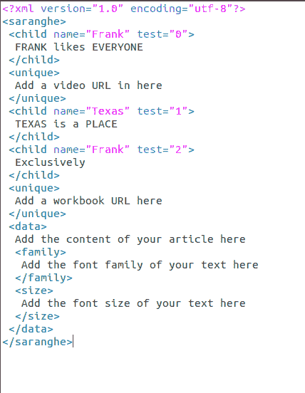

# 用 Python 读写 XML 文件

> 原文:[https://www . geesforgeks . org/读写-xml-files-in-python/](https://www.geeksforgeeks.org/reading-and-writing-xml-files-in-python/)

**可扩展标记语言**，俗称 XML，是一种专门设计的语言，易于人类和计算机共同解释。该语言定义了一组用于以特定格式编码文档的规则。在本文中，已经描述了用 python 读写 XML 文件的方法。

**注意:**一般来说，从 XML 文件中读取数据并分析其逻辑组件的过程称为**解析**。因此，当我们提到读取 xml 文件时，我们指的是**解析 XML 文档**。

在本文中，我们将研究两个可以用于 xml 解析的库。它们是:

*   与 lxml xml 解析器一起使用的漂亮的输出
*   elemonttree 图书馆。

## 在 lxml 解析器旁边使用漂亮的输出

为了读写 xml 文件，我们将使用一个名为 BeautifulSoup 的 Python 库。为了安装库，在终端中键入以下命令。

```
pip install beautifulsoup4
```

美丽汤支持 Python 标准库中包含的 HTML 解析器，但它也支持许多第三方 Python 解析器。一个是 lxml 解析器(用于解析 XML/HTML 文档)。可以通过在操作系统的命令处理器中运行以下命令来安装 lxml:

```
pip install lxml
```

首先，我们将学习如何读取一个 XML 文件。我们还会解析存储在其中的数据。稍后我们将学习如何创建一个 XML 文件并将数据写入其中。

### 从 XML 文件中读取数据

解析 xml 文件需要两个步骤:-

*   查找标签
*   从标签中提取

**示例:**

**使用的 XML 文件:**



## 蟒蛇 3

```
from bs4 import BeautifulSoup

# Reading the data inside the xml
# file to a variable under the name
# data
with open('dict.xml', 'r') as f:
    data = f.read()

# Passing the stored data inside
# the beautifulsoup parser, storing
# the returned object
Bs_data = BeautifulSoup(data, "xml")

# Finding all instances of tag
# `unique`
b_unique = Bs_data.find_all('unique')

print(b_unique)

# Using find() to extract attributes
# of the first instance of the tag
b_name = Bs_data.find('child', {'name':'Frank'})

print(b_name)

# Extracting the data stored in a
# specific attribute of the
# `child` tag
value = b_name.get('test')

print(value)
```