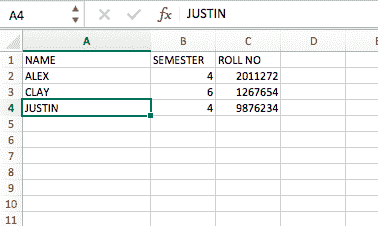

# 使用 Python 读取 excel 文件

> 原文:[https://www . geesforgeks . org/reading-excel-file-use-python/](https://www.geeksforgeeks.org/reading-excel-file-using-python/)

使用 xlrd 模块，可以从电子表格中检索信息。例如，读取、写入或修改数据可以在 Python 中完成。此外，用户可能需要浏览各种表单，根据某些标准检索数据，或者修改一些行和列，并做大量工作。

**xlrd** 模块用于从电子表格中提取数据。

命令安装 xlrd 模块:

```
pip install xlrd

```

**输入文件:**



**代码#1:** 提取特定单元格

## 蟒蛇 3

```
# Reading an excel file using Python
import xlrd

# Give the location of the file
loc = ("path of file")

# To open Workbook
wb = xlrd.open_workbook(loc)
sheet = wb.sheet_by_index(0)

# For row 0 and column 0
print(sheet.cell_value(0, 0))
```

输出:

```
'NAME'

```

**代码#2:** 提取行数

## 蟒蛇 3

```
# Program to extract number
# of rows using Python
import xlrd

# Give the location of the file
loc = ("path of file")

wb = xlrd.open_workbook(loc)
sheet = wb.sheet_by_index(0)
sheet.cell_value(0, 0)

# Extracting number of rows
print(sheet.nrows)
```

输出:

```
4

```

**代码#3:** 提取列数

## 蟒蛇 3

```
# Program to extract number of
# columns in Python
import xlrd

loc = ("path of file")

wb = xlrd.open_workbook(loc)
sheet = wb.sheet_by_index(0)

# For row 0 and column 0
sheet.cell_value(0, 0)

# Extracting number of columns
print(sheet.ncols)
```

输出:

```
3

```

**代码#4 :** 提取所有列名

## 蟒蛇 3

```
# Program extracting all columns
# name in Python
import xlrd

loc = ("path of file")

wb = xlrd.open_workbook(loc)
sheet = wb.sheet_by_index(0)

# For row 0 and column 0
sheet.cell_value(0, 0)

for i in range(sheet.ncols):
    print(sheet.cell_value(0, i))
```

输出:

```
NAME
SEMESTER
ROLL NO

```

**代码#5:** 提取第一列

## 蟒蛇 3

```
# Program extracting first column
import xlrd

loc = ("path of file")

wb = xlrd.open_workbook(loc)
sheet = wb.sheet_by_index(0)
sheet.cell_value(0, 0)

for i in range(sheet.nrows):
    print(sheet.cell_value(i, 0))
```

输出:

```
NAME
ALEX
CLAY
JUSTIN

```

**代码#6:** 提取特定的行值

## 蟒蛇 3

```
# Program to extract a particular row value
import xlrd

loc = ("path of file")

wb = xlrd.open_workbook(loc)
sheet = wb.sheet_by_index(0)

sheet.cell_value(0, 0)

print(sheet.row_values(1))
```

输出:

```
['ALEX', 4.0, 2011272.0]

```