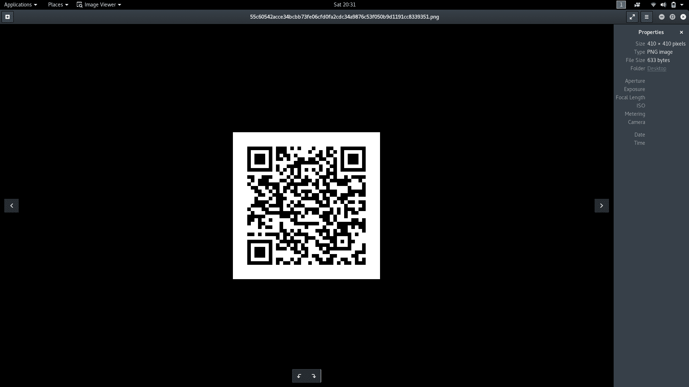
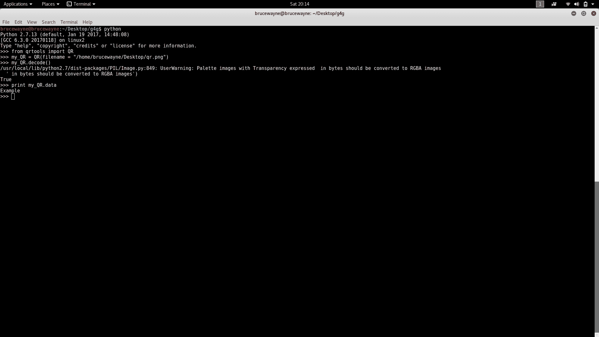
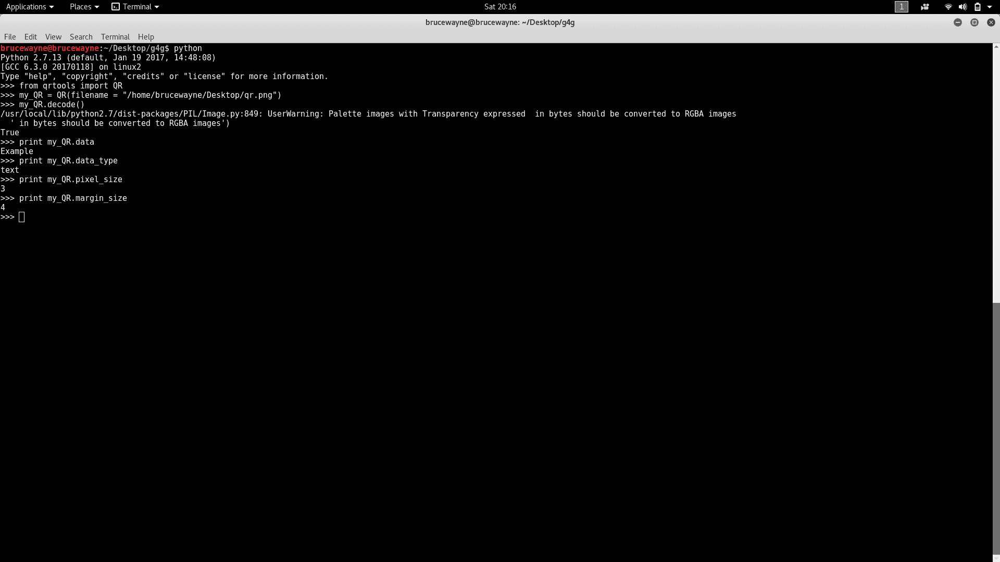

# 使用 QRtools 读取和生成 Python 中的二维码

> 原文:[https://www . geesforgeks . org/reading-generating-QR-codes-python-using-QR tools/](https://www.geeksforgeeks.org/reading-generating-qr-codes-python-using-qrtools/)

本文旨在介绍 python 库:qrtools 的使用。该库可用于读取二维码和生成二维码。

**什么是二维码？**

二维码是一种二维条形码的商标。二维条形码类似于一维条形码，但每单位面积可以存储更多信息。

**安装和依赖关系**

1.  **Debian Linux:** qrtools can be installed on debian based linux systems with the following commands

    ```
    sudo apt-get update
    sudo apt-get install python-qrtools

    ```

    还必须安装以下依赖项

    ```
    [sudo] pip install pypng
    [sudo] pip install zbar
    [sudo] pip install pillow

    ```

2.  **Windows:** 可以从[这里](https://pypi.python.org/pypi/qrtools/0.0.1)下载文件，在 Windows 上安装 qrtools。在下载和提取时，从文件夹

    ```
    python setup.py install

    ```

    中运行以下命令

**生成二维码**

qrtools 包含一个类 QR(可以在源代码中查看)，为此我们必须首先创建一个对象。该对象采用以下参数

1.  数据
2.  像素大小
3.  水平
4.  边距 _ 大小
5.  数据类型

要创建具有默认设置的二维码，我们必须在创建对象时简单地指定数据。请注意，如果要使用非 ASCII 对象，数据必须是 unicode 对象。

```
# Python program to generate QR code
from qrtools
import QR

# creates the QR object
my_QR = QR(data = u"Example")

# encodes to a QR code
my_QR.encode()
```

如果程序运行成功，则返回值 0，二维码存储在 tmp 文件夹中。要知道确切的位置，请使用以下命令

```
print (my_QR.filename)

```

**样本输出**

```
/tmp/qr-1496334996.385343/7489ebbcc2a00056ddaaaac190bce473e5c03696ea1bd8ed83cf59a174283862.png

```


根据我们的方便，这个文件现在可以移动到另一个文件夹

```
# Python program to generate QR code
from qrtools import QR

import os
my_QR = QR(data = u"Example")
my_QR.encode()

# command to move the QR code to the desktop
os.system("sudo mv " + my_QR.filename + " ~/Desktop")
```

二维码的像素值也可以通过在二维码对象创建期间指定该值来改变。对于使用智能手机上的扫描仪进行阅读来说，默认大小往往会小一点，因此 10 左右的大小对于这种目的来说是理想的，例如:

```
my_QR = QR(data = u"example", pixel_size = 10)

```

下面的二维码像素大小为 10，并已用网址编码



我们还可以在二维码中添加电子邮件数据、短信数据、彩信数据、书签等。下面的代码摘录取自源代码，它指定了可以使用的各种数据类型以及使用这些数据所需的数据格式:

```
# use these for custom data formats eg. url, phone number, VCARD
# data should be an unicode object or a list of unicode objects
data_encode = {
    'text': lambda data: data,
    'url': encode_url,
    'email': lambda data: 'mailto:' + re.compile(
        r'^mailto:', re.IGNORECASE
    ).sub('', data),
    'emailmessage': lambda data: 'MATMSG:TO:' + data[0] + ';SUB:' + data[1] + 
                           ';BODY:' + data[2] + ';;',
    'telephone': lambda data: 'tel:' + re.compile(
        r'^tel:', re.IGNORECASE
    ).sub('', data),
    'sms': lambda data: 'SMSTO:' + data[0] + ':' + data[1],
    'mms': lambda data: 'MMSTO:' + data[0] + ':' + data[1],
    'geo': lambda data: 'geo:' + data[0] + ', ' + data[1],
    'bookmark': lambda data: "MEBKM:TITLE:" + data[0] + ";URL:" + 
                                    data[1] + ";;",
    # phonebook or meCard should be a list of tuples like this:
    # [('N', 'Name'), ('TEL', '231698890'), ...]
    'phonebook': lambda data: "MECARD:" + ";".join([":".join(i) 
                                        for i in data]) + ";"
}
```

从上面的代码中，我们观察到了在创建二维码时可以分配和使用的各种数据类型。例如，要使用书签作为数据，我们必须以列表的形式提供数据，包括标题和 url。要做到这一点，我们必须做到以下几点

```
# Python program to generate QR code
from qrtools import QR

# creates the QR object
my_QR = QR(data = [u"geeksforgeeks", u"https://www.geeksforgeeks.org/"], 
                                      data_type = 'bookmark')

# encodes to a QR code
my_QR.encode()
```

**读取二维码**

扫描和读取二维码相对简单。创建二维码对象时，我们必须简单地指定二维码的路径作为参数。假设我们正在尝试解码文章开头创建的二维码。

```
# Python program to Scan and Read a QR code
from qrtools import QR
my_QR = QR(filename = "home/user/Desktop/qr.png")

# decodes the QR code and returns True if successful
my_QR.decode()

# prints the data
print (my_QR.data)
```

**输出:**

```
Example

```



我们还可以打印在创建 QR 对象时传递的其他参数的值，以生成 QR 码，例如，使用文章开头生成的相同 QR 码，另外添加这些打印语句将提供以下附加输出

```
print (my_QR.data_type)
print (my_QR.pixel_size)
print (my_QR.margin_size)

```

**输出:**

```
text
3
4

```



本文由 **Deepak Srivatsav** 供稿。如果你喜欢 GeeksforGeeks 并想投稿，你也可以使用[write.geeksforgeeks.org](https://write.geeksforgeeks.org)写一篇文章或者把你的文章邮寄到 review-team@geeksforgeeks.org。看到你的文章出现在极客博客主页上，帮助其他极客。

如果你发现任何不正确的地方，或者你想分享更多关于上面讨论的话题的信息，请写评论。