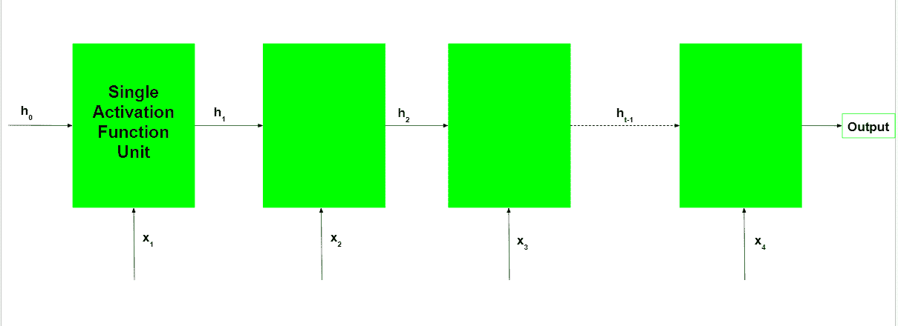
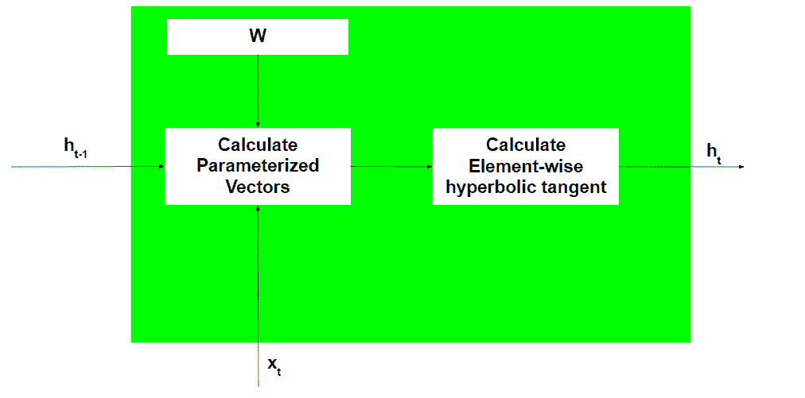
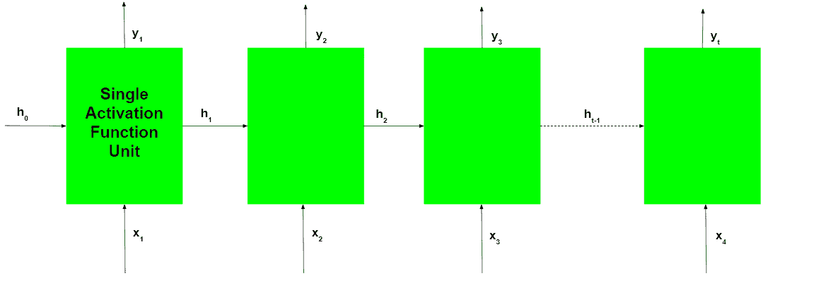
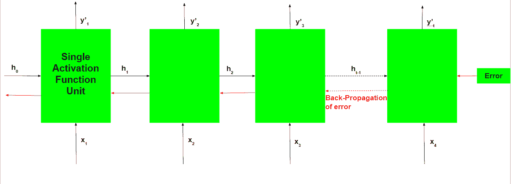

# 递归神经网络解释

> 原文:[https://www . geeksforgeeks . org/recursive-neural-networks-explain/](https://www.geeksforgeeks.org/recurrent-neural-networks-explanation/)

今天，不同的机器学习技术被用来处理不同类型的数据。最难处理和预测的数据类型之一是顺序数据。顺序数据不同于其他类型的数据，因为虽然可以假设典型数据集的所有特征都与顺序无关，但不能假设顺序数据集的所有特征都与顺序无关。为了处理这类数据，提出了**递归神经网络**的概念。它在结构上不同于其他人工神经网络。当其他网络在前馈过程或反向传播过程中沿线性方向“行进”时，递归网络遵循递归关系而不是前馈路径，并使用通过时间的**反向传播**来学习。

递归神经网络由多个固定的激活功能单元组成，每个时间步长一个。每个单元都有一个内部状态，称为单元的隐藏状态。这种隐藏状态表示网络当前在给定时间步长持有的过去知识。这种隐藏状态在每个时间步都会更新，以表示网络对过去的认识发生了变化。使用以下循环关系更新隐藏状态:-


```
[Tex]- The new hidden state[/Tex]
[Tex]- The old hidden state[/Tex]
[Tex]- The current input[/Tex]
[Tex]- The fixed function with trainable weights[/Tex]
```

**注:**通常，为了理解递归神经网络的概念，它通常以展开的形式进行说明，本文将遵循这一规范。

在每个时间步，使用上面给出的递归关系计算新的隐藏状态。这个新生成的隐藏状态被用来生成一个新的隐藏状态等等。

递归神经网络的基本工作流程如下



注意是网络的初始隐藏状态。通常，它是一个零向量，但也可以有其他值。一种方法是将关于数据的假设编码到网络的初始隐藏状态中。例如，对于确定知名人士发表的演讲的音调的问题，该人过去演讲的音调可以被编码成初始隐藏状态。另一种技术是使初始隐藏状态成为一个可训练的参数。虽然这些技术给网络增加了很少的细微差别，但是将隐藏状态向量初始化为零通常是一个有效的选择。

**各循环单元的工作:**

1.  Take input the previously hidden state vector and the current input vector. 

    注意，由于隐藏状态和当前输入被视为向量，向量中的每个元素被放置在与其他维度正交的不同维度中。因此，当每个元素乘以另一个元素时，只有当所涉及的元素非零并且元素在同一维度时，才给出非零值。

2.  Element-wise multiplies the hidden state vector by the hidden state weights and similarly performs the element-wise multiplication of the current input vector and the current input weights. This generates the parameterized hidden state vector and the current input vector. 

    注意，不同向量的权重存储在可训练权重矩阵中。

3.  执行两个参数化向量的向量相加，然后计算元素方向的双曲正切，以生成新的隐藏状态向量。



在循环网络的训练过程中，网络还会在每个时间步长生成一个输出。该输出用于使用梯度下降训练网络。



所涉及的反向传播类似于典型人工神经网络中使用的反向传播，只是有一些小的变化。这些变化如下

让网络任意时间步长的预测输出为，实际输出为。那么每个时间步长的误差由下式给出


总误差由所有时间步长的误差总和给出。


类似地，值可以计算为每个时间步长的梯度总和。


利用微积分的链式法则，并利用时间步长 t 的输出是递归单元的当前隐藏状态的函数的事实，出现以下表达式:-


注意，在上面的表达式中使用的权重矩阵 W 对于输入向量和隐藏状态向量是不同的，并且仅仅为了便于标注而以这种方式使用。

因此出现了以下表达式:-


因此，通过时间的反向传播与典型的反向传播的不同之处仅在于，每个时间步长的误差被求和以计算总误差。



尽管基本的递归神经网络相当有效，但它可能会遇到一个严重的问题。对于深度网络，反向传播过程会导致以下问题:-

*   **消失梯度:**当梯度变得非常小并趋于零时，就会出现这种情况。
*   **爆炸梯度:**当梯度由于反向传播而变得过大时，就会出现这种情况。

爆炸梯度的问题可以通过使用黑客技术来解决——通过对及时传回的梯度设置一个阈值。但这种解决方案并不能解决问题，还可能降低网络的效率。为了解决这些问题，递归神经网络的两个主要变体被开发出来——长短期记忆网络和**门控递归单位网络**。