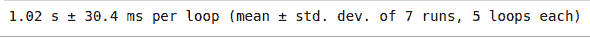
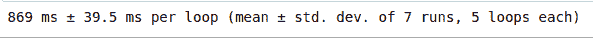

# 使用列表理解减少 Python 中的执行时间

> 原文:[https://www . geesforgeks . org/减少 python 中的执行时间-使用列表-理解/](https://www.geeksforgeeks.org/reducing-execution-time-in-python-using-list-comprehensions/)

**先决条件:**[Python 中的理解](http://geeksforgeeks.org/comprehensions-in-python/)

大多数用 Python 编码的有竞争力的程序员在给定的时间限制内执行程序时经常会遇到困难。列表理解有助于我们减少程序的执行时间，在这种情况下，您需要根据任何数学表达式创建一个列表。我们将考虑一个例子来证明上述说法。

**示例:**要形成一个 10**7 以内的所有偶数的列表，我们可以通过以下方式实现

**方法 1:**

```
%%timeit -n 100

even =[ ]
for i in range(10**7):
    if i % 2 == 0:
        even.append(i)
```

**输出:**


**方法二:**

```
%%timeit -n 100

even =[i for i in range(10**7) if i % 2 == 0]
```

**输出:**



我们可以看到上面两个程序的运行时间的差异，这种差异随着我们范围的增加而增加，当数学表达式有点复杂时也是如此。当这些类型的列表是一个非常大的程序的一部分时，这种时间差非常重要。

**注意:**使用了 Jupyter Notebook 中提供的`%%timeit`工具，它按照我们指定的次数重复执行同一个单元格，并返回执行给定程序所花费的平均/平均时间。

下面是 Python 3 代码片段，用于检查上述程序的执行时间，

```
import time 

# Using for loop
start = time.time()
a =[ ]

for i in range(10**7):
    if i % 2 == 0:
        a.append(i)

print("Execution time = ", time.time()-start)

# Using list comprehension
start = time.time()

a =[i for i in range(10**7) if i % 2 == 0]
print("Execution time = ", time.time()-start)
```

**输出:**

```
Execution time =  1.558159589767456
Execution time =  0.9690220355987549
```