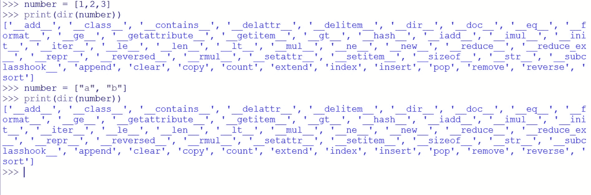

# Python 中的反射

> 原文:[https://www.geeksforgeeks.org/reflection-in-python/](https://www.geeksforgeeks.org/reflection-in-python/)

[反射](https://www.geeksforgeeks.org/reflection-in-java/)是指代码能够检查可能作为参数传递给函数的对象的属性。例如，如果我们写类型(obj)，那么 Python 将返回一个表示 obj 类型的对象。

使用反射，我们可以编写一个递归的反向函数，它将适用于字符串、列表和任何其他支持切片和连接的序列。如果对象是对字符串的引用，那么 Python 将返回字符串类型对象。此外，如果我们写 str()，我们会得到一个空字符串。换句话说，写 str()和写“”是一回事。同样，写 list()和写[]是一回事。

```
# Python program to illustrate reflection 
def reverse(sequence): 
    sequence_type = type(sequence) 
    empty_sequence = sequence_type() 

    if sequence == empty_sequence: 
        return empty_sequence 

    rest = reverse(sequence[1:]) 
    first_sequence = sequence[0:1] 

    # Combine the result 
    final_result = rest + first_sequence

    return final_result 

# Driver code 
print(reverse([10, 20, 30, 40])) 
print(reverse("GeeksForGeeks")) 
```

输出:

```
[40, 30, 20, 10]
skeeGroFskeeG

```

**反射使能功能**

启用反射的函数包括 type()、isinstance()、callable()、dir()和 getattr()。

1.  **类型和位置**–在此参考
2.  **Callable() :**A callable means anything that can be called. For an object, determines whether it can be called. A class can be made callable by providing a __call__() method. The callable() method returns True if the object passed appears callable. If not, it returns False.
    Examples:

    ```
    x = 5

    def testFunction():
      print("Test")

    y = testFunction

    if (callable(x)):
        print("x is callable")
    else:
        print("x is not callable")

    if (callable(y)):
        print("y is callable")
    else:
        print("y is not callable")

    ```

    输出:

    ```
    x is not callable
    y is callable
    ```

    在面向对象程序设计中使用时是可调用的

    ```
    class Foo1:
      def __call__(self):
        print('Print Something')

    print(callable(Foo1))

    ```

    输出:

    ```
    True
    ```

3.  **Dir:**Dir()方法试图返回对象的有效属性列表。dir()试图返回对象的有效属性列表。

    **示例:**

    ```
    number = [1,2,3]
    print(dir(number))

    characters = ["a", "b"]
    print(dir(number))
    ```

    输出:

    

4.  **Getattr :** The getattr() method returns the value of the named attribute of an object. If not found, it returns the default value provided to the function.The getattr method takes three parameters **object**, **name** and **default(optional).**

    ```
    class Employee:
        salary = 25000
        company_name= "geeksforgeeks"

    employee = Employee()
    print('The salary is:', getattr(employee, "salary"))
    print('The salary is:', employee.salary)
    ```

    输出:

    ```
    The salary is: 25000
    The salary is: 25000
    ```

**参考链接**
2。[docs _ python](https://docs.python.org/3.6/c-api/reflection.html)T5】3。 [wikibooks](https://en.wikibooks.org/wiki/Python_Programming/Reflection)

本文由 **[Subhajit Saha](https://www.linkedin.com/in/subhajit-saha-06aa29131/)** 供稿。如果你喜欢 GeeksforGeeks 并想投稿，你也可以使用[contribute.geeksforgeeks.org](http://www.contribute.geeksforgeeks.org)写一篇文章或者把你的文章邮寄到 contribute@geeksforgeeks.org。看到你的文章出现在极客博客主页上，帮助其他极客。

如果你发现任何不正确的地方，或者你想分享更多关于上面讨论的话题的信息，请写评论。