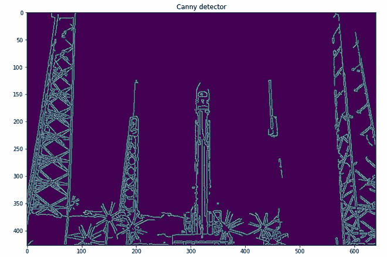
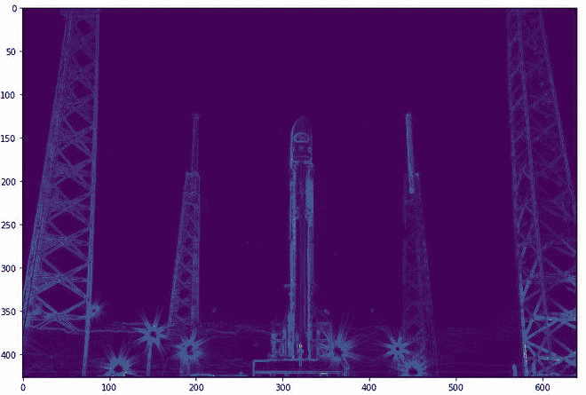
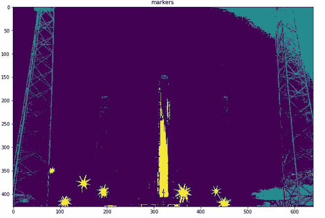
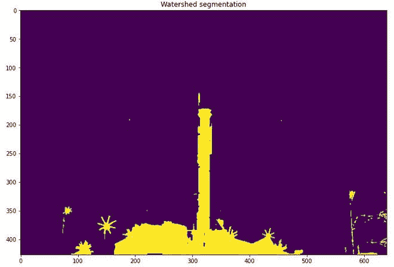
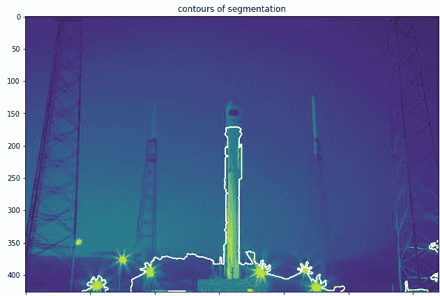
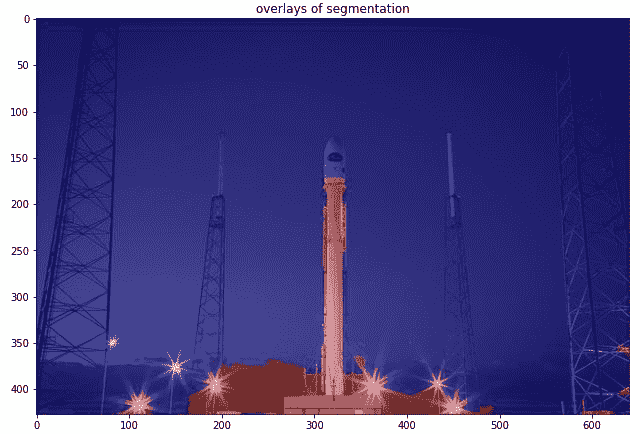

# 基于区域和边缘的分割

> 原文:[https://www . geeksforgeeks . org/基于区域和边缘的细分/](https://www.geeksforgeeks.org/region-and-edge-based-segmentaion/)

### 分割

分割是基于不连续性或相似性标准对图像中的一个或多个区域或对象进行分离。图像中的区域可以通过其边界(边缘)或内部来定义，并且这两种表示是相等的。执行分段的方法主要有三种:

*   基于像素的分割
*   基于区域的分割
*   基于边缘的分割

### 基于边缘的分割

基于边缘的分割包含 2 个步骤:

*   **边缘检测:**在边缘检测中，我们需要找到作为物体边缘像素的像素。目标检测方法有很多，如索贝尔算子、拉普拉斯算子、Canny 算子等。

<figure class="table">

| one | Zero | -1 |
| --- | --- | --- |
| Two | Zero | -2 |
| --- | --- | --- |
| one | Zero | -1 |
| --- | --- | --- |
| 索贝尔垂直算子 |

</figure>

<figure class="table">

| +1 | Two | one |
| --- | --- | --- |
| Zero | Zero | Zero |
| --- | --- | --- |
| -1 | -2 | -1 |
| --- | --- | --- |
| 索贝尔水平算子 |

</figure>

<figure class="table">

| Zero | -1 | Zero |
| --- | --- | --- |
| -1 | four | -1 |
| --- | --- | --- |
| Zero | -1 | Zero |
| --- | --- | --- |
| 负拉普拉斯算子 |

</figure>

*   **边缘链接:**在这一步中，我们尝试通过链接相邻的边缘来细化边缘检测，并组合形成整个对象。可以使用以下两种方法中的任何一种来执行边缘链接:
    *   局部处理:在这种方法中，我们使用梯度和方向来链接邻域边缘。如果两条边具有相似的方向向量，那么它们可以被链接。
    *   全局处理:这个方法可以使用 HOG 变换来完成
*   **优点**:
    *   这种方法类似于人类大脑处理分割任务的方式。
    *   适用于对象和背景对比度良好的图像。
*   **限制:**
    *   不适用于平滑过渡和低对比度的图像。
    *   对噪音敏感。
    *   鲁棒的边缘链接并不简单，而且易于执行。

### 基于区域的分割

在这种分割中，我们通过递归地包含与种子像素相似且相连的相邻像素来增长区域。我们使用相似性度量，例如灰度等级相同的区域的灰度等级差异。我们使用连通性来防止连接图像的不同部分。

基于区域的分割有两种变体:

*   **自上而下的方法**
    *   首先，我们需要定义预定义的种子像素。我们可以将所有像素定义为种子像素或随机选择的像素。增长区域，直到图像中的所有像素都属于该区域。
*   **自下而上的方法**
    *   仅从感兴趣的对象中选择种子。仅当满足相似性标准时才增长区域。
*   **相似性度量:**
    *   相似性度量可以是不同类型的:对于灰度图像，相似性度量可以是不同的纹理和其他空间属性、区域内的强度差或区域的距离 b/w 平均值。
*   **区域合并技术:**
    *   在区域合并技术中，我们尝试合并包含单个对象的区域，并将其与背景分离..区域合并技术有很多，如分水岭算法、分割合并算法等**。**
*   **优点:**
    *   因为它执行简单的阈值计算，所以执行起来更快。
    *   当对象和背景具有高对比度时，基于区域的分割效果更好。
*   **限制:**
    *   当物体和背景的 b/w 像素值没有显著差异时，并没有产生很多精确的分割结果。

### 实施:

*   在这个实现中，我们将执行基于边缘和区域的分割。我们将使用 scikit 图像模块和它提供的数据集的图像。

## 蟒蛇 3

```py
# code
import numpy as np
import matplotlib.pyplot as plt
from skimage.feature import canny
from skimage import data,morphology
from skimage.color import rgb2gray
import scipy.ndimage as nd
plt.rcParams["figure.figsize"] = (12,8)
%matplotlib inline

# load images and convert grayscale
rocket = data.rocket()
rocket_wh = rgb2gray(rocket)

# apply edge segmentation
# plot canny edge detection
edges = canny(rocket_wh)
plt.imshow(edges, interpolation='gaussian')
plt.title('Canny detector')

# fill regions to perform edge segmentation
fill_im = nd.binary_fill_holes(edges)
plt.imshow(fill_im)
plt.title('Region Filling')

# Region Segmentation
# First we print the elevation map
elevation_map = sobel(rocket_wh)
plt.imshow(elevation_map)

# Since, the contrast difference is not much. Anyways we will perform it
markers = np.zeros_like(rocket_wh)
markers[rocket_wh < 0.1171875] = 1 # 30/255
markers[rocket_wh > 0.5859375] = 2 # 150/255

plt.imshow(markers)
plt.title('markers')

# Perform watershed region segmentation
segmentation = morphology.watershed(elevation_map, markers)

plt.imshow(segmentation)
plt.title('Watershed segmentation')

# plot overlays and contour
segmentation = nd.binary_fill_holes(segmentation - 1)
label_rock, _ = nd.label(segmentation)
# overlay image with different labels
image_label_overlay = label2rgb(label_rock, image=rocket_wh)

fig, (ax1, ax2) = plt.subplots(1, 2, figsize=(24, 16), sharey=True)
ax1.imshow(rocket_wh)
ax1.contour(segmentation, [0.8], linewidths=1.8, colors='w')
ax2.imshow(image_label_overlay)

fig.subplots_adjust(**margins)
```

**输出:**

 



立面图



### 参考文献:

*   [**sci kit-图像分割**](https://scikit-image.org/docs/dev/user_guide/tutorial_segmentation.html)