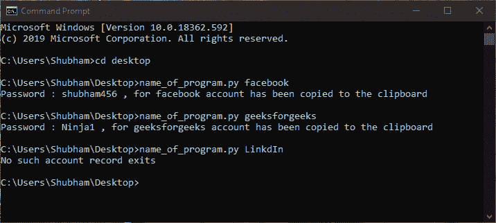

# 使用 Python 中的 Pyperclip 模块记住密码并复制到剪贴板

> 原文:[https://www . geeksforgeeks . org/使用 python 中的-pyperclip-module 将密码记住并复制到剪贴板/](https://www.geeksforgeeks.org/remember-and-copy-passwords-to-clipboard-using-pyperclip-module-in-python/)

记住我们不同账户的所有密码总是一件困难的工作。这是一个非常简单的 Python 程序，它使用`sys`模块从**命令终端**和`pyperclip`模块获取帐户名作为参数，将各自帐户的密码粘贴到剪贴板上。

Pyperclip 模块没有预装 Python。要安装它，请在终端中键入以下命令。

```
pip install pyperclip
```

**示例:**

> **命令终端输入:**name _ of _ program . py facebook
> **命令终端输出:**密码:shubham456，为 Facebook 账号已复制到剪贴板
> 
> **命令终端输入:**名称 _of_program.py Ayushi
> **命令终端输出:**不存在这样的账户记录

**方法:**我们初始化一个字典，用键作为帐户名，用密码作为它们的值。这里`sys.argv`是传递给 Python 程序的命令行参数列表，`sys.argv[0]`是 Python 程序的名称，`sys.argv[1]`对应用户写的第一个参数。

然后程序检查字典中是否存在这样的帐户(密钥)，如果存在这样的帐户，则将密码复制到剪贴板并显示相应的消息。如果不存在这样的帐户，程序将显示一条消息“不存在这样的帐户记录”。

下面是上述方法的实现:

```
import sys, pyperclip

# function to copy account passwords
# to clipboard
def manager(account):

    # dictionary in which keys are account 
    # name and values are their passwords
    passwords ={ "email" : "Ayushi123", 
                "facebook" : "shubham456",
                "instagram" : "Ayushi789",
                "geeksforgeeks" : "Ninja1" 
               }

    if account in passwords:

        # copies password to clipboard
        pyperclip.copy(passwords[account])

        print("Password :", passwords[account],
              ", for", account,
             "account", 
              "has been copied to the clipboard")
    else :
        print("No such account record exits")

# Driver function
if __name__ == "__main__":

    # command line argument that is name of 
    # account passed to program through cmd
    account = sys.argv[1]

    # calling manager function
    manager(account)

# This article has been contributed by
# Shubham Singh Chauhan
```

**输出:**
