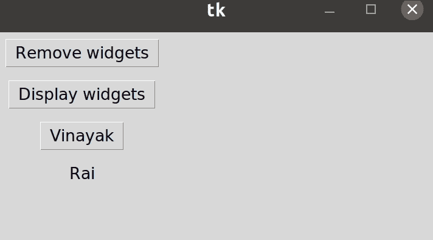

# 从 Tkinter 的网格中移除部件

> 原文:[https://www . geesforgeks . org/remove-widgets-from-grid-in-tkinter/](https://www.geeksforgeeks.org/remove-widgets-from-grid-in-tkinter/)

你知道吗，当你在应用程序中工作时，你可以通过点击一个按钮来移除或显示网格中的小部件？我们可以通过用 **grid_remove()** 方法为每个小部件声明 remove 函数，然后在按钮中调用该函数，从而从网格中移除小部件。同样，为了在屏幕上显示小部件，我们可以用**网格()**方法为每个小部件声明显示函数，然后在按钮中调用该函数。

### 所需步骤:

**第一步:**首先导入库 tkinter。

```py
from tkinter import *
```

**步骤 2:** 现在，使用 tkinter 创建一个 GUI 应用程序。

```py
app=Tk()
```

**步骤 3:** 然后，在 tkinter 中创建一个从网格中移除小部件的函数。在创建的函数中，我们使用了内置函数 **grid_remove()** 来移除某些小部件。

```py
def remove(widget1):
    widget1.grid_remove()
```

这里，我们传递了一个小部件作为参数。您可以添加任意数量的希望从某个网格中移除的小部件。

**第 4 步:**此外，创建一个函数在 tkinter 的网格中显示小部件。在创建的函数中，我们使用内置函数**网格()**将特定的小部件和网格值一起显示在您想要显示的位置。

> def 显示(widget1):
> 
> widget1.grid(column=#Column 值，您想要在其中取回小部件，
> 
> row = #想要取回小部件的 row 值，
> 
> padx=10，
> 
> pady=10）

这里，我们传递了一个小部件作为参数。通过指定网格位置，您可以添加任意数量的希望在特定网格中显示的小部件。

**步骤 5:** 接下来，我们使用上面声明的函数创建需要隐藏或显示的小部件。要从网格的特定行和列中移除并显示小部件:

*   对于小部件**标签**，声明标签为:

> l1 =标签(app，text = " #您希望在标签中显示的文本")
> 
> L1 . grid(Column = #要指定标签的列值，
> 
> row = #要指定标签行值，
> 
> padx = #的填充值，
> 
> pady = #的填充值)

*   对于小部件**文本框**，将文本框声明为:

> l = StringVar()
> 
> l1 = Entry(app，width = 15，textvariable = l)
> 
> L1 . grid(Column = #要指定文本框的列值，
> 
> row = #要指定文本框的 row 值，
> 
> padx = #的填充值，
> 
> pady = #的填充值)

*   对于小部件**按钮**，将按钮声明为:

> l1 =按钮(app，text = " #您希望在按钮中显示的文本")
> 
> L1 . grid(Column = #要指定按钮的列值，
> 
> row = #要指定按钮行值，
> 
> padx = #的填充值，
> 
> pady = #的填充值)

*   对于除上述指定之外的任何其他小部件，请声明该小部件来代替这些小部件。

**步骤 6:** 稍后，创建一个按钮，当点击该按钮时，将从屏幕上移除小部件。

> remove_btn = Button(app，text = "Remove widgets "，command = lambda : remove(l1))
> 
> remove_btn.grid(列=0，行=0，padx=10，pady=10)

**重要提示:**不要忘记在按钮的命令属性中调用 remove 函数，方法是在您之前创建的函数中指定参数的数量。

**步骤 7:** 此外，创建一个按钮，当点击该按钮时，将在屏幕上显示小部件。

> display_btn = Button(app，text = " #您希望给 Button 的文本"，command = lambda : display(l1))
> 
> display_btn.grid(列=0，行=1，padx=10，pady=10)

**重要提示:**不要忘记在按钮的命令属性中调用 display 函数，方法是在您之前创建的函数中指定参数的数量。

**第八步:**最后，做在屏幕上显示 GUI app 的循环。

```py
app.mainloop()
```

**示例:**

在本例中，我们将使用单个按钮“**移除小部件**”从网格值(行=3，列=0)中移除一个名为“ **Rai** 的标签，同时使用按钮“**显示小部件**”在网格值(行=3，列=0)处显示标签并在网格值(行=4，列=0)处按钮返回

## 计算机编程语言

```py
# Python program to remove widgets
# from grid in tkinter

# Import the library tkinter
from tkinter import *

# Create a GUI app
app = Tk()

# Creating a function for removing widgets from grid
def remove(widget1, widget2):
    widget1.grid_remove()
    widget2.grid_remove()

# Creating a function for making widget visible again
def display(widget1, widget2):
    widget1.grid(column=0, row=3, padx=10, pady=10)
    widget2.grid(column=0, row=4, padx=10, pady=10)

# Button widgets
b1 = Button(app, text="Vinayak")
b1.grid(column=0, row=3, padx=10, pady=10)

# Label Widgets
l1 = Label(app, text="Rai")
l1.grid(column=0, row=4, padx=10, pady=10)

# Create and show button with remove() function
remove_btn = Button(app, text="Remove widgets", 
                    command=lambda: remove(b1, l1))
remove_btn.grid(column=0, row=0, padx=10, pady=10)

# Create and show button with display() function
display_btn = Button(app, text="Display widgets",
                     command=lambda: display(b1, l1))
display_btn.grid(column=0, row=1, padx=10, pady=10)

# Make infinite loop for displaying app on screen
app.mainloop()
```

**输出:**

