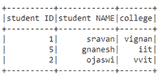
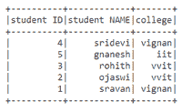

# 根据 PySpark 数据框中的特定列删除重复行

> 原文:[https://www . geesforgeks . org/remove-replicate-rows-based-on-specific-column-in-py spark-data frame/](https://www.geeksforgeeks.org/removing-duplicate-rows-based-on-specific-column-in-pyspark-dataframe/)

在本文中，我们将使用 Python 中的 pyspark 从 dataframe 中删除基于特定列的重复行。重复数据是指基于某些条件(列值)的相同数据。为此，我们使用 dropDuplicates()方法:

> **语法** : dataframe.dropDuplicates(['第 1 列'，'第 2 列'，'第 n 列'])。显示()
> 
> 哪里，
> 
> *   dataframe 是输入数据帧，列名是特定的列
> *   show()方法用于显示数据帧

让我们创建数据帧。

## 蟒蛇 3

```py
# importing module
import pyspark

# importing sparksession from pyspark.sql
# module
from pyspark.sql import SparkSession

# creating sparksession and giving an app name
spark = SparkSession.builder.appName('sparkdf').getOrCreate()

# list  of students  data
data = [["1", "sravan", "vignan"], ["2", "ojaswi", "vvit"],
        ["3", "rohith", "vvit"], ["4", "sridevi", "vignan"], 
        ["1", "sravan", "vignan"], ["5", "gnanesh", "iit"]]

# specify column names
columns = ['student ID', 'student NAME', 'college']

# creating a dataframe from the lists of data
dataframe = spark.createDataFrame(data, columns)

print('Actual data in dataframe')
dataframe.show()
```

**输出:**


**基于一列的下降**

## 蟒蛇 3

```py
# remove duplicate rows based on college 
# column
dataframe.dropDuplicates(['college']).show()
```

**输出:**



**基于多列的投放**

## 蟒蛇 3

```py
# remove duplicate rows based on college 
# and ID column
dataframe.dropDuplicates(['college', 'student ID']).show()
```

**输出:**

