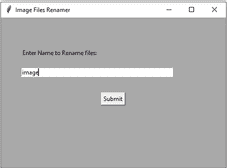
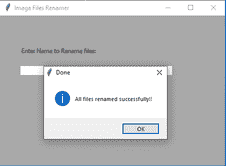

# 使用 Tkinter

重命名图像文件夹

> 原文:[https://www . geesforgeks . org/rename-a-folder-of-images-using-tkinter/](https://www.geeksforgeeks.org/rename-a-folder-of-images-using-tkinter/)

**先决条件:**[Python GUI–tkinter](https://www.geeksforgeeks.org/python-gui-tkinter/)、 [os.listdir()方法](https://www.geeksforgeeks.org/python-os-listdir-method/)、 [os.rename()方法](https://www.geeksforgeeks.org/python-os-rename-method/)

在本文中，任务是使用 Python 重命名一批图像。现在假设文件夹中有随机名称的图像。例如，考虑下面的图像:


现在的要求是以有序的方式重命名它们，并附加它们各自图像的原始尺寸，如`image-0-362x326, image-1-351x414`，…等等。手动完成这项任务将是一项乏味的任务，但是这个目标可以使用操作系统模块中的`rename()`和`listdir()`方法来实现。

### 重命名()方法

在 Python 3 中，`**rename()**`方法用于重命名文件或目录。这个方法是 os 模块的一部分，非常方便。

> **语法:** os.rename(src，dst)
> 
> **参数:**
> **src:** 是要重命名的文件的源地址
> **dst:** 是新名称的目的地。

### listdir()方法

**listdir** 方法列出给定目录的所有内容。

> **语法:** list = os.listdir('Src ')
> 
> **参数:**
> **Src:** 是要列出来的来源

下面的代码将为我们完成这项工作。使用 Tkinter 模块，它会询问存储所有图像的文件夹路径。它遍历 xyz 文件夹中所有图像的列表，定义目标(dst)和源(src)地址，并使用 rename()方法重命名。

下面是实现。

```
# Python 3 code to rename multiple image
# files in a directory or folder 

import os  
from tkinter import messagebox
import cv2
from tkinter import filedialog
from tkinter import * 

height1 = 0
width1 = 0

# Function to select folder to rename images
def get_folder_path():

    root = Tk()
    root.withdraw()
    folder_selected = filedialog.askdirectory()

    return folder_selected

# Function to rename multiple files
def submit():

    source = src_dir.get()
    src_dir.set("")
    global width1
    global height1

    input_folder = get_folder_path()
    i = 0

    for img_file in os.listdir(input_folder):

        file_name = os.path.splitext(img_file)[0]
        extension = os.path.splitext(img_file)[1]

        if extension == '.jpg':
            src = os.path.join(input_folder, img_file)
            img = cv2.imread(src)
            h, w, c = img.shape
            dst = source + '-' + str(i) + '-' + str(w) + "x" + str(h) + ".jpg"
            dst = os.path.join(input_folder, dst)

            # rename() function will rename all the files
            os.rename(src, dst)
            i += 1

    messagebox.showinfo("Done", "All files renamed successfully !!")

# Driver Code
if __name__ == '__main__':
    top = Tk()
    top.geometry("450x300")
    top.title("Image Files Renamer")
    top.configure(background ="Dark grey")

    # For Input Label
    input_path = Label(top, 
                       text ="Enter Name to Rename files:",
                       bg ="Dark grey").place(x = 40, y = 60)

    # For Input Textbox
    src_dir = StringVar()
    input_path_entry_area = Entry(top,
                                  textvariable = src_dir,
                                  width = 50).place(x = 40, y = 100)

     # For submit button
    submit_button = Button(top, 
                           text ="Submit",
                           command = submit).place(x = 200, y = 150)

    top.mainloop()
```

**输出:**





