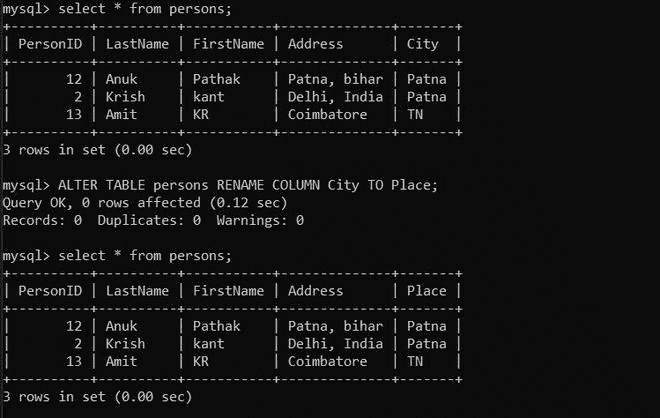
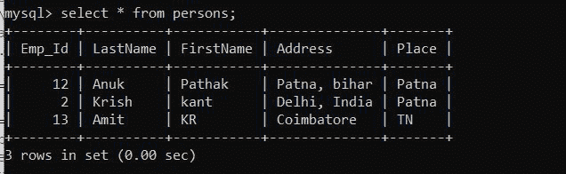

# 使用 Python 重命名 MySQL 中的列名

> 原文:[https://www . geesforgeks . org/rename-column-name-in-MySQL-using-python/](https://www.geeksforgeeks.org/rename-column-name-in-mysql-using-python/)

在本文中，我们将看到如何使用 Python 重命名或更改列表的名称。Python 允许广泛的数据库服务器与应用程序的集成。从 Python 访问数据库需要数据库接口。 [**MySQL 连接器**](https://www.geeksforgeeks.org/mysql-connector-python-module-in-python/) -Python 模块是 Python 中的一个 API，用于与 MySQL 数据库进行通信。

**进场:**

*   导入模块。
*   向数据库发出连接请求。
*   为数据库游标创建一个对象。
*   执行以下 MySQL 查询:

```py
ALTER TABLE your_table_name RENAME COLUMN original_column_name TO new_column_name;
```

**示例:**

在本例中，我们将该数据库表用于以下查询；



**下面是实现:**

## 蟒蛇 3

```py
# Establish connection to MySQL database
import mysql.connector

db = mysql.connector.connect(
  host="localhost",
  user="root",
  password="root123",
  database = "geeks"
  )

#getting the cursor by cursor() method
mycursor = db.cursor()

query = "ALTER TABLE persons RENAME COLUMN PersonID TO Emp_Id;"
mycursor.execute(query)

# close the Connection
db.close()
```

**运行完这个脚本后，让我们检查一下表:**

