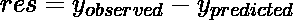
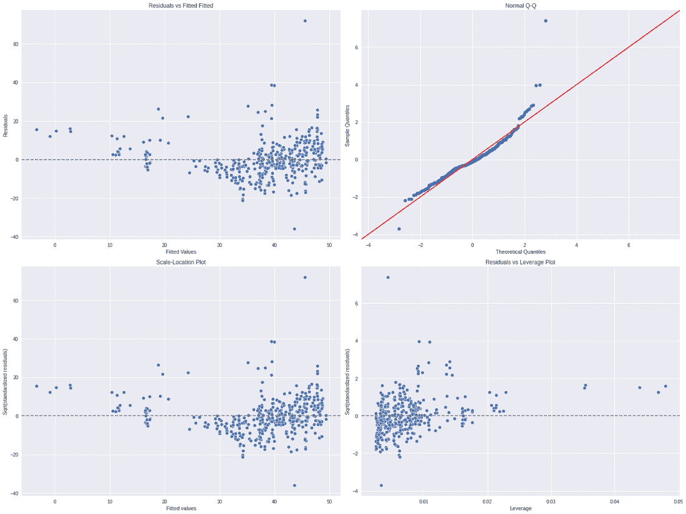
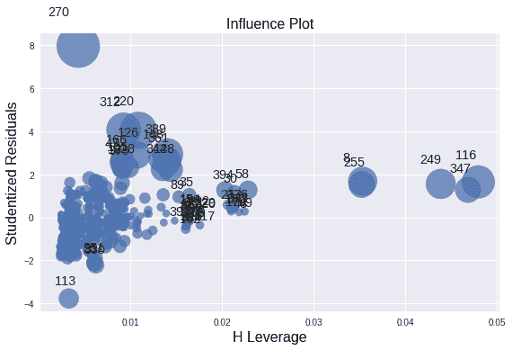

# 剩余杠杆图(回归诊断)

> 原文:[https://www . geeksforgeeks . org/残差-杠杆-图-回归-诊断/](https://www.geeksforgeeks.org/residual-leverage-plot-regression-diagnostic/)

在线性或多元回归中，仅仅将模型拟合到数据集中是不够的。但是，它可能不会给出预期的结果。将线性或多元回归有效地应用于数据集。我们需要在数据集上检查一些假设，这些假设使得线性/多元回归有效并产生更好的准确性。

#### 回归的假设

回归分析需要数据集遵循一些假设。这些假设是:

*   观察是相互独立的。它应该与另一个观察结果相关。
*   数据是正常分布的。
*   自变量和因变量的平均值之间的关系是线性的。
*   数据具有同质性，这意味着因变量的每个值的残差方差是相同的。

为了进行良好的线性回归分析，我们还需要检查是否违反了这些假设:

*   如果数据包含非线性趋势，那么它将无法通过线性回归进行适当拟合，从而导致较高的残差或误差率。
*   要检查数据集中的正态性，请在数据上绘制一个 Q-Q 图。
*   观测值之间的相关性被称为自相关。我们可以检查自相关图。
*   同质性的存在可以通过诸如比例位置图和剩余与遗留图等图来估计。

### 回归诊断图

上述图表可用于验证和测试上述假设，是回归诊断的一部分。这种诊断可以用来检查假设是否成立。在我们逐一讨论诊断图之前，让我们讨论一些重要术语:

*   **异常值**:异常值是指与大部分数据集不同的点。一般来说，异常值具有较高的残余值，这意味着差值大于 b/w 观测值和预测值。
*   **杠杆点**:杠杆点定义为 x 值远离 x 均值的观测值。
*   **影响点**:影响观察定义为对模型拟合影响较大的观察。找到影响点的一种方法是比较有和没有每次观察的模型拟合度。

以下是我们在诊断图中使用的图:

*   **残差对拟合图:**残差可以计算为:



此图用于检查线性和同质性，如果模型满足线性关系的条件，那么它应该有一条偏差很大的水平线。如果模型满足同质性条件，则图应该围绕 y=0 线均匀分布。

*   **Q-Q 图:**该图用于检查数据集的正态性，如果数据集存在正态性，那么散点将沿着 45 度虚线分布。
*   **比例尺-位置图:**是以正方形为根的标准值对预测值的图。该图用于检查残差的同质性。水平线上均匀分布的残差表示残差的同质性。
*   **残差 vs 杠杆图/库克距离图:**第四点是库克距离图，用来衡量不同地块的影响力。每次观测的库克距离统计量测量的是当特定观测被忽略时模型估计的变化程度。烹饪距离图每次观察的烹饪距离测量。然而，残差对杠杆图是标准化残差和点的杠杆点之间的图。

### 履行

在这个实现中，我们将绘制不同的诊断图。为此，我们使用[房地产数据集](https://www.kaggle.com/quantbruce/real-estate-price-prediction/)并应用普通最小二乘(OLS)回归。然后我们绘制回归诊断图和库克距离图。

## 蟒蛇 3

```
# imports
import numpy as np
import pandas as pd
import matplotlib.pyplot as plt
import statsmodels.api as sm
import statsmodels.formula.api as smf

# Load Real State Data
data = pd.read_csv('/content/Real estate.csv')
data.head()

# Fit a OLS regression variable
model =smf.ols(formula=' Y ~ X3 + X2', data= data )
results = model.fit()
print(results.summary())

# Get different Variables for diagnostic
residuals = results.resid
fitted_value = results.fittedvalues
stand_resids = results.resid_pearson
influence = results.get_influence()
leverage = influence.hat_matrix_diag

# PLot different diagnostic plots
plt.rcParams["figure.figsize"] = (20,15)
fig, ax = plt.subplots(nrows=2, ncols=2)

plt.style.use('seaborn')

# Residual vs Fitted Plot
sns.scatterplot(x=fitted_value, y=residuals, ax=ax[0, 0])
ax[0, 0].axhline(y=0, color='grey', linestyle='dashed')
ax[0, 0].set_xlabel('Fitted Values')
ax[0, 0].set_ylabel('Residuals')
ax[0, 0].set_title('Residuals vs Fitted Fitted')

# Normal Q-Q plot
sm.qqplot(residuals, fit=True, line='45',ax=ax[0, 1], c='#4C72B0')
ax[0, 1].set_title('Normal Q-Q')

# Scale-Location Plot
sns.scatterplot(x=fitted_value, y=residuals, ax=ax[1, 0])
ax[1, 0].axhline(y=0, color='grey', linestyle='dashed')
ax[1, 0].set_xlabel('Fitted values')
ax[1, 0].set_ylabel('Sqrt(standardized residuals)')
ax[1, 0].set_title('Scale-Location Plot')

# Residual vs Leverage Plot
sns.scatterplot(x=leverage, y=stand_resids, ax=ax[1, 1])
ax[1, 1].axhline(y=0, color='grey', linestyle='dashed')
ax[1, 1].set_xlabel('Leverage')
ax[1, 1].set_ylabel('Sqrt(standardized residuals)')
ax[1, 1].set_title('Residuals vs Leverage Plot')

plt.tight_layout()
plt.show()

# PLot Cook's distance plot
sm.graphics.influence_plot(results, criterion="cooks")
```

```
------------
# data
No    X1    X2    X3    X4    X5    X6    Y
0    1    2012.917    32.0    84.87882    10    24.98298    121.54024    37.9
1    2    2012.917    19.5    306.59470    9    24.98034    121.53951    42.2
2    3    2013.583    13.3    561.98450    5    24.98746    121.54391    47.3
3    4    2013.500    13.3    561.98450    5    24.98746    121.54391    54.8
4    5    2012.833    5.0    390.56840    5    24.97937    121.54245    43.1
------------
OLS Regression Results                            
==============================================================================
Dep. Variable:                      Y   R-squared:                       0.491
Model:                            OLS   Adj. R-squared:                  0.489
Method:                 Least Squares   F-statistic:                     198.3
Date:                Thu, 19 Aug 2021   Prob (F-statistic):           5.07e-61
Time:                        17:56:17   Log-Likelihood:                -1527.9
No. Observations:                 414   AIC:                             3062.
Df Residuals:                     411   BIC:                             3074.
Df Model:                           2                                         
Covariance Type:            nonrobust                                         
==============================================================================
                 coef    std err          t      P>|t|      [0.025      0.975]
------------------------------------------------------------------------------
Intercept     49.8856      0.968     51.547      0.000      47.983      51.788
X3            -0.0072      0.000    -18.997      0.000      -0.008      -0.006
X2            -0.2310      0.042     -5.496      0.000      -0.314      -0.148
==============================================================================
Omnibus:                      161.397   Durbin-Watson:                   2.130
Prob(Omnibus):                  0.000   Jarque-Bera (JB):             1297.792
Skew:                           1.443   Prob(JB):                    1.54e-282
Kurtosis:                      11.180   Cond. No.                     3.37e+03
==============================================================================

Warnings:
[1] Standard Errors assume that the covariance matrix of the errors is correctly specified.
[2] The condition number is large, 3.37e+03\. This might indicate that there are
strong multicollinearity or other numerical problems.
--------------
```

<center>


回归诊断图



库克距离图

</center>

### **参考文献:**

*   [BUMC 回归诊断](https://sphweb.bumc.bu.edu/otlt/MPH-Modules/BS/R/R5_Correlation-Regression/R5_Correlation-Regression7.html)
*   [弗吉尼亚大学](https://sphweb.bumc.bu.edu/otlt/MPH-Modules/BS/R/R5_Correlation-Regression/R5_Correlation-Regression7.html)