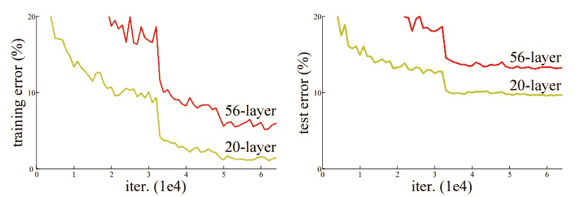
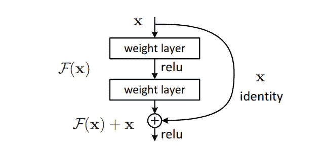
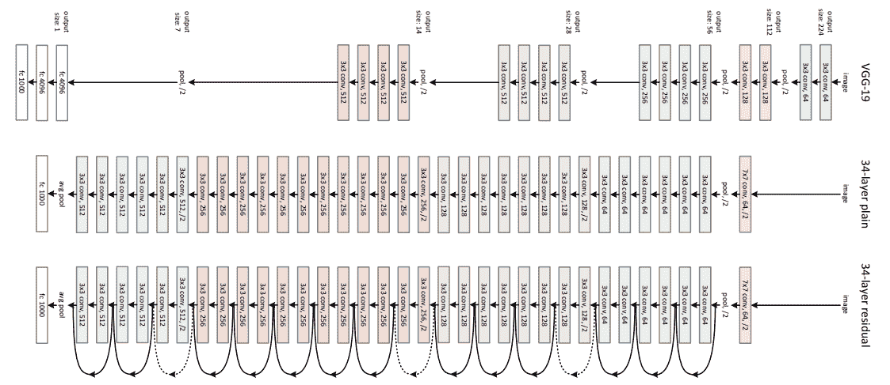
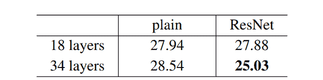
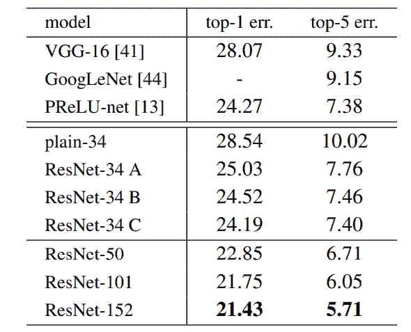
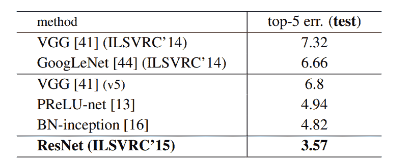

# 剩余网络(ResNet)–深度学习

> 原文:[https://www . geesforgeks . org/residual-networks-resnet-deep-learning/](https://www.geeksforgeeks.org/residual-networks-resnet-deep-learning/)

在第一个赢得 ImageNet 2012 竞赛的基于 CNN 的架构(AlexNet)之后，后续每一个获胜的架构都在深度神经网络中使用更多的层来降低错误率。这适用于较少的层数，但是当我们增加层数时，在深度学习中有一个常见的问题，这就是所谓的消失/爆炸梯度。这会导致渐变变成 0 或太大。因此，当我们增加层数时，训练和测试的错误率也会增加。
[](https://media.geeksforgeeks.org/wp-content/uploads/20200424200128/abc.jpg) 
在上面的图中，我们可以观察到 56 层 CNN 在训练和测试数据集上给出的错误率都比 20 层 CNN 架构要高，如果这是过度拟合的结果，那么我们应该在 56 层 CNN 中有更低的训练错误，但是它也有更高的训练错误。在对错误率进行进一步分析后，作者得出结论:这是由消失/爆炸梯度引起的。

ResNet 是由微软研究院的研究人员在 2015 年提出的，它引入了一种新的架构，称为残差网络。

**残差块:**
为了解决渐变消失/爆炸的问题，该架构引入了称为残差网络的概念。在这个网络中，我们使用一种称为 ***的技术跳过连接*** 。跳过连接跳过几层的训练，直接连接到输出。

这个网络背后的方法是代替层学习底层映射，我们允许网络拟合残差映射。所以，不要说 H(x)，初始映射 *、* 让网络适合，*F(x):= H(x)–x*给出 *H(x) := F(x) + x* 。
[](https://media.geeksforgeeks.org/wp-content/uploads/20200424011510/Residual-Block.PNG)
添加这种类型的跳过连接的好处是，如果任何一层损害了架构的性能，那么它将被正则化跳过。因此，这导致训练非常深的神经网络，而没有由消失/爆炸梯度引起的问题。作者在 CIFAR-10 数据集上进行了 100-1000 层的实验。

还有一种类似的方法叫“高速公路网”，这些网络也采用跳越连接。类似于 LSTM，这些跳跃连接也使用参数门。这些门决定有多少信息通过跳过连接。然而，这种体系结构并没有提供比 ResNet 体系结构更好的准确性。

**网络架构:**

该网络采用 34 层纯网络体系结构，其灵感来自 VGG-19，其中添加了快捷方式连接。然后，这些快捷连接将体系结构转换为剩余网络。
[](https://media.geeksforgeeks.org/wp-content/uploads/20200424011138/ResNet.PNG) 
**执行:**

使用 Tensorflow 和 Keras API，我们可以从头开始设计 ResNet 架构(包括残余块)。下面是不同 ResNet 架构的实现。对于这个实现，我们使用 CIFAR-10 数据集。该数据集包含 10 个不同类别(飞机、汽车、鸟类、猫、鹿、狗、青蛙、马、船和卡车)的 60，000 张 32×32 彩色图像。该数据集可以从 k *纪元进行评估。数据集*应用编程接口函数。

*   首先，我们导入 keras 模块及其 API。这些应用编程接口有助于构建 ResNet 模型的架构。

**Code: Importing Libraries**

```
# Import Keras modules and its important APIs
import keras
from keras.layers import Dense, Conv2D, BatchNormalization, Activation
from keras.layers import AveragePooling2D, Input, Flatten
from keras.optimizers import Adam
from keras.callbacks import ModelCheckpoint, LearningRateScheduler
from keras.callbacks import ReduceLROnPlateau
from keras.preprocessing.image import ImageDataGenerator
from keras.regularizers import l2
from keras import backend as K
from keras.models import Model
from keras.datasets import cifar10
import numpy as np
import os
```

*   现在，我们为 ResNet 架构设置了不同的超参数。我们还对数据集进行了一些预处理，为训练做准备。

**Code: Setting Training Hyperparameters**

```
# Setting Training Hyperparameters
batch_size = 32  # original ResNet paper uses batch_size = 128 for training
epochs = 200
data_augmentation = True
num_classes = 10

# Data Preprocessing 
subtract_pixel_mean = True
n = 3

# Select ResNet Version
version = 1

# Computed depth of 
if version == 1:
    depth = n * 6 + 2
elif version == 2:
    depth = n * 9 + 2

# Model name, depth and version
model_type = 'ResNet % dv % d' % (depth, version)

# Load the CIFAR-10 data.
(x_train, y_train), (x_test, y_test) = cifar10.load_data()

# Input image dimensions.
input_shape = x_train.shape[1:]

# Normalize data.
x_train = x_train.astype('float32') / 255
x_test = x_test.astype('float32') / 255

# If subtract pixel mean is enabled
if subtract_pixel_mean:
    x_train_mean = np.mean(x_train, axis = 0)
    x_train -= x_train_mean
    x_test -= x_train_mean

# Print Training and Test Samples 
print('x_train shape:', x_train.shape)
print(x_train.shape[0], 'train samples')
print(x_test.shape[0], 'test samples')
print('y_train shape:', y_train.shape)

# Convert class vectors to binary class matrices.
y_train = keras.utils.to_categorical(y_train, num_classes)
y_test = keras.utils.to_categorical(y_test, num_classes)
```

*   在这一步中，我们根据时代的数量来设置学习率。随着时代的增多，学习率必须降低，以确保更好的学习。

**代码:设置不同时期的左后**

```
# Setting LR for different number of Epochs
def lr_schedule(epoch):
    lr = 1e-3
    if epoch > 180:
        lr *= 0.5e-3
    elif epoch > 160:
        lr *= 1e-3
    elif epoch > 120:
        lr *= 1e-2
    elif epoch > 80:
        lr *= 1e-1
    print('Learning rate: ', lr)
    return lr
```

*   在这一步中，我们定义了可用于定义 ResNet V1 和 V2 架构的基本 ResNet 构建块。

**Code: Basic ResNet Building Block**

```
# Basic ResNet Building Block
def resnet_layer(inputs,
                 num_filters = 16,
                 kernel_size = 3,
                 strides = 1,
                 activation ='relu',
                 batch_normalization = True,
    conv = Conv2D(num_filters,
                  kernel_size = kernel_size,
                  strides = strides,
                  padding ='same',
                  kernel_initializer ='he_normal',
                  kernel_regularizer = l2(1e-4))

    x = inputs
    if conv_first:
        x = conv(x)
        if batch_normalization:
            x = BatchNormalization()(x)
        if activation is not None:
            x = Activation(activation)(x)
    else:
        if batch_normalization:
            x = BatchNormalization()(x)
        if activation is not None:
            x = Activation(activation)(x)
        x = conv(x)
    return x
```

*   在这一步中，我们定义了基于上面定义的 ResNet 构建块的 ResNet V1 体系结构:

**Code: ResNet V1 architecture**

```
# 
def resnet_v1(input_shape, depth, num_classes = 10):

    if (depth - 2) % 6 != 0:
        raise ValueError('depth should be 6n + 2 (eg 20, 32, 44 in [a])')
    # Start model definition.
    num_filters = 16
    num_res_blocks = int((depth - 2) / 6)

    inputs = Input(shape = input_shape)
    x = resnet_layer(inputs = inputs)
    # Instantiate the stack of residual units
    for stack in range(3):
        for res_block in range(num_res_blocks):
            strides = 1
            if stack > 0 and res_block == 0:  # first layer but not first stack
                strides = 2  # downsample
            y = resnet_layer(inputs = x,
                             num_filters = num_filters,
                             strides = strides)
            y = resnet_layer(inputs = y,
                             num_filters = num_filters,
                             activation = None)
            if stack > 0 and res_block == 0:  # first layer but not first stack
                # linear projection residual shortcut connection to match
                # changed dims
                x = resnet_layer(inputs = x,
                                 num_filters = num_filters,
                                 kernel_size = 1,
                                 strides = strides,
                                 activation = None,
                                 batch_normalization = False)
            x = keras.layers.add([x, y])
            x = Activation('relu')(x)
        num_filters *= 2

    # Add classifier on top.
    # v1 does not use BN after last shortcut connection-ReLU
    x = AveragePooling2D(pool_size = 8)(x)
    y = Flatten()(x)
    outputs = Dense(num_classes,
                    activation ='softmax',
                    kernel_initializer ='he_normal')(y)

    # Instantiate model.
    model = Model(inputs = inputs, outputs = outputs)
    return model
```

*   在这一步中，我们定义了基于上面定义的 ResNet 构建块的 ResNet V2 体系结构:

**Code: ResNet V2 architecture**

```
# ResNet V2 architecture
def resnet_v2(input_shape, depth, num_classes = 10):
    if (depth - 2) % 9 != 0:
        raise ValueError('depth should be 9n + 2 (eg 56 or 110 in [b])')
    # Start model definition.
    num_filters_in = 16
    num_res_blocks = int((depth - 2) / 9)

    inputs = Input(shape = input_shape)
    # v2 performs Conv2D with BN-ReLU on input before splitting into 2 paths
    x = resnet_layer(inputs = inputs,
                     num_filters = num_filters_in,
                     conv_first = True)

    # Instantiate the stack of residual units
    for stage in range(3):
        for res_block in range(num_res_blocks):
            activation = 'relu'
            batch_normalization = True
            strides = 1
            if stage == 0:
                num_filters_out = num_filters_in * 4
                if res_block == 0:  # first layer and first stage
                    activation = None
                    batch_normalization = False
            else:
                num_filters_out = num_filters_in * 2
                if res_block == 0:  # first layer but not first stage
                    strides = 2    # downsample

            # bottleneck residual unit
            y = resnet_layer(inputs = x,
                             num_filters = num_filters_in,
                             kernel_size = 1,
                             strides = strides,
                             activation = activation,
                             batch_normalization = batch_normalization,
                             conv_first = False)
            y = resnet_layer(inputs = y,
                             num_filters = num_filters_in,
                             conv_first = False)
            y = resnet_layer(inputs = y,
                             num_filters = num_filters_out,
                             kernel_size = 1,
                             conv_first = False)
            if res_block == 0:
                # linear projection residual shortcut connection to match
                # changed dims
                x = resnet_layer(inputs = x,
                                 num_filters = num_filters_out,
                                 kernel_size = 1,
                                 strides = strides,
                                 activation = None,
                                 batch_normalization = False)
            x = keras.layers.add([x, y])

        num_filters_in = num_filters_out

    # Add classifier on top.
    # v2 has BN-ReLU before Pooling
    x = BatchNormalization()(x)
    x = Activation('relu')(x)
    x = AveragePooling2D(pool_size = 8)(x)
    y = Flatten()(x)
    outputs = Dense(num_classes,
                    activation ='softmax',
                    kernel_initializer ='he_normal')(y)

    # Instantiate model.
    model = Model(inputs = inputs, outputs = outputs)
    return model
```

*   下面的代码用于训练和测试我们上面定义的 ResNet v1 和 v2 架构:

**Code: Main function**

```
# Main function 
if version == 2:
    model = resnet_v2(input_shape = input_shape, depth = depth)
else:
    model = resnet_v1(input_shape = input_shape, depth = depth)

model.compile(loss ='categorical_crossentropy',
              optimizer = Adam(learning_rate = lr_schedule(0)),
              metrics =['accuracy'])
model.summary()
print(model_type)

# Prepare model model saving directory.
save_dir = os.path.join(os.getcwd(), 'saved_models')
model_name = 'cifar10_% s_model.{epoch:03d}.h5' % model_type
if not os.path.isdir(save_dir):
    os.makedirs(save_dir)
filepath = os.path.join(save_dir, model_name)

# Prepare callbacks for model saving and for learning rate adjustment.
checkpoint = ModelCheckpoint(filepath = filepath,
                             monitor ='val_acc',
                             verbose = 1,
                             save_best_only = True)

lr_scheduler = LearningRateScheduler(lr_schedule)

lr_reducer = ReduceLROnPlateau(factor = np.sqrt(0.1),
                               cooldown = 0,
                               patience = 5,
                               min_lr = 0.5e-6)

callbacks = [checkpoint, lr_reducer, lr_scheduler]

# Run training, with or without data augmentation.
if not data_augmentation:
    print('Not using data augmentation.')
    model.fit(x_train, y_train,
              batch_size = batch_size,
              epochs = epochs,
              validation_data =(x_test, y_test),
              shuffle = True,
              callbacks = callbacks)
else:
    print('Using real-time data augmentation.')
    # This will do preprocessing and realtime data augmentation:
    datagen = ImageDataGenerator(
        # set input mean to 0 over the dataset
        featurewise_center = False,
        # set each sample mean to 0
        samplewise_center = False,
        # divide inputs by std of dataset
        featurewise_std_normalization = False,
        # divide each input by its std
        samplewise_std_normalization = False,
        # apply ZCA whitening
        zca_whitening = False,
        # epsilon for ZCA whitening
        zca_epsilon = 1e-06,
        # randomly rotate images in the range (deg 0 to 180)
        rotation_range = 0,
        # randomly shift images horizontally
        width_shift_range = 0.1,
        # randomly shift images vertically
        height_shift_range = 0.1,
        # set range for random shear
        shear_range = 0.,
        # set range for random zoom
        zoom_range = 0.,
        # set range for random channel shifts
        channel_shift_range = 0.,
        # set mode for filling points outside the input boundaries
        fill_mode ='nearest',
        # value used for fill_mode = "constant"
        cval = 0.,
        # randomly flip images
        horizontal_flip = True,
        # randomly flip images
        vertical_flip = False,
        # set rescaling factor (applied before any other transformation)
        rescale = None,
        # set function that will be applied on each input
        preprocessing_function = None,
        # image data format, either "channels_first" or "channels_last"
        data_format = None,
        # fraction of images reserved for validation (strictly between 0 and 1)
        validation_split = 0.0)

    # Compute quantities required for featurewise normalization
    # (std, mean, and principal components if ZCA whitening is applied).
    datagen.fit(x_train)

    # Fit the model on the batches generated by datagen.flow().
    model.fit_generator(datagen.flow(x_train, y_train, batch_size = batch_size),
                        validation_data =(x_test, y_test),
                        epochs = epochs, verbose = 1, workers = 4,
                        callbacks = callbacks)

# Score trained model.
scores = model.evaluate(x_test, y_test, verbose = 1)
print('Test loss:', scores[0])
print('Test accuracy:', scores[1])
```

**结果&结论:**

在 ImageNet 数据集上，作者使用了一个 152 层的 ResNet，它比 VGG19 深 8 倍，但参数仍然较少。这些 ResNets 的集合在 ImageNet 测试集上只产生了 3.7%的误差，这一结果赢得了 ILSVRC 2015 竞赛。在 COCO 对象检测数据集上，由于其非常深的表示，它也产生了 28%的相对改进。


*   上面的结果表明，快捷方式连接将能够解决由增加图层引起的问题，因为当我们将图层从 18 增加到 34 时，ImageNet 验证集的错误率也会降低，这与普通网络不同。



*   以下是 ImageNet 测试集的结果。ResNet 的 *3.57%* 前 5 名错误率最低，因此 ResNet 架构在 2015 年的 ImageNet 分类挑战中获得第一名。


**参考文献:**

*   [ResNet 纸](https://arxiv.org/abs/1512.03385)
*   [Keras ResNet 实现](https://keras.io/examples/cifar10_resnet/)