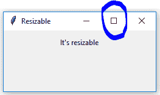
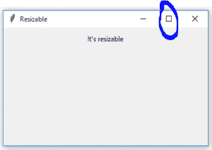
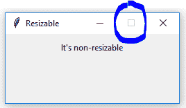

# Tkinter | Python 中的可调整大小()方法

> 原文:[https://www . geesforgeks . org/resizable-method-in-tkinter-python/](https://www.geeksforgeeks.org/resizable-method-in-tkinter-python/)

**`resizable()`** 方法是允许[Tkit](https://www.geeksforgeeks.org/python-gui-tkinter/)根窗口根据用户需要改变大小，我们也可以禁止调整[Tkit](https://www.geeksforgeeks.org/python-gui-tkinter/)窗口的大小。
所以，基本上，如果用户想创建一个固定大小的窗口，可以使用这种方法。

**如何使用:**

```py
-> import tkinter
-> root = Tk()
-> root.resizable(height = None, width = None)

```

**要传递的参数:**

> ->在`resizable()`方法中，用户可以传递正整数或真，以使窗口可调整大小。
> - >要使窗口不可调整大小，用户可以传递 0 或假。

**代码#1:** 允许根窗口改变大小

```py
# importing only  those functions
# which are needed
from tkinter import * 
from tkinter.ttk import * 
from time import strftime

# creating tkinter window
root = Tk()
root.title('Resizable')
root.geometry('250x100')

Label(root, text = 'It\'s resizable').pack(side = TOP, pady = 10)

# Allowing root window to change
# it's size according to user's need
root.resizable(True, True)

mainloop()
```

**输出:**

**初始大小–**您可能会观察到蓝色圆圈内的部分已启用，即窗口可调整大小并可扩展。调整大小后，蓝色区域内的部分仍然启用，因此您仍然可以更改窗口的大小。


**代码#2:** 限制根窗口更改其大小(固定大小的窗口)。

```py
# importing only  those functions
# which are needed
from tkinter import * 
from tkinter.ttk import * 
from time import strftime

# creating tkinter window
root = Tk()
root.title('Resizable')
root.geometry('250x100')

Label(root, text = 'It\'s non-resizable').pack(side = TOP, pady = 10)

# Restricting root window to change
# it's size according to user's need
root.resizable(0, 0)

mainloop()
```

**输出:**

您可能会观察到蓝色圆圈内的部分被禁用，即窗口大小无法更改。