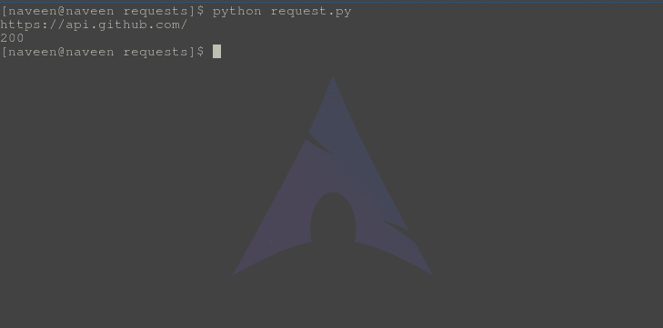
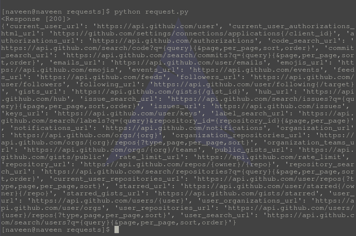
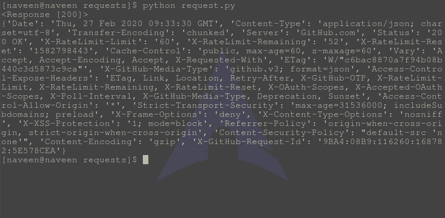
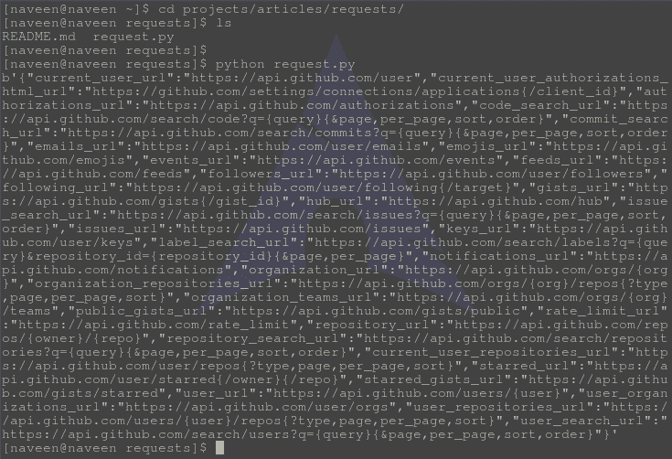

# 响应方法–Python 请求

> 原文:[https://www . geesforgeks . org/response-methods-python-requests/](https://www.geeksforgeeks.org/response-methods-python-requests/)

当一个人向 URI 提出请求时，它会返回一个响应。这个用 python 表示的 Response 对象是由 requests.method()返回的，方法是–get、post、put 等。Response 是一个功能强大的对象，它有许多函数和属性来帮助规范化数据或创建代码的理想部分。例如， **response.status_code** 从报头本身返回状态码，可以检查请求是否被成功处理。
响应对象可以用来暗示许多特征、方法和功能。
**例:**

## 蟒蛇 3

```
# import requests module
import requests

# Making a get request
response = requests.get('https://api.github.com/')

# print request object
print(response.url)

# print status code
print(response.status_code)
```

将该文件保存为 request.py，并使用以下命令
运行

```
Python request.py
```



状态代码 200 表示请求已成功发出。

### 应对方法

<figure class="table">

| 方法 | 描述 |
| --- | --- |
| [响应标题](https://www.geeksforgeeks.org/response-headers-python-requests/) | response.headers 返回响应头的字典。 |
| [响应编码](https://www.geeksforgeeks.org/response-encoding-python-requests/) | response.encoding 返回用于解码 response.content 的编码。 |
| [响应.经过的时间](https://geeksforgeeks.org/response-elapsed-python-requests/) | response . approach 返回一个 timedelta 对象，其中包含从发送请求到响应到达所经过的时间。 |
| [response.close()](https://www.geeksforgeeks.org/response-close-python-requests/) | response.close()关闭与服务器的连接。 |
| [回复内容](https://www.geeksforgeeks.org/response-content-python-requests/) | response.content 返回响应的内容，以字节为单位。 |
| [响应. cookies](https://www.geeksforgeeks.org/response-cookies-python-requests/) | response.cookiess 返回一个 CookieJar 对象，其中包含从服务器发回的 cookie。 |
| [响应历史](https://www.geeksforgeeks.org/response-history-python-requests/) | response.history 返回包含请求历史(url)的响应对象列表。 |
| [response . is _ permanent _ redirect](https://www.geeksforgeeks.org/response-is_permanent_redirect-python-requests/) | 如果响应是永久重定向的 url，response.is_permanent_redirect 返回 True，否则返回 False。 |
| [response.is_redirect](https://www.geeksforgeeks.org/response-is_redirect-python-requests/) | 如果响应被重定向，response.is_redirect 返回 True，否则返回 False。 |
| [response.iter_content()](https://www.geeksforgeeks.org/response-iter_content-python-requests/) | response.iter_content()迭代 response.content。 |
| [response.json()](https://www.geeksforgeeks.org/response-json-python-requests/) | response.json()返回结果的 json 对象(如果结果是用 JSON 格式编写的，如果不是，就会引发错误)。 |
| [response.url](https://www.geeksforgeeks.org/response-url-python-requests/) | response.url 返回响应的 url。 |
| [回应.正文](https://www.geeksforgeeks.org/response-text-python-requests/) | response.text 以 unicode 格式返回响应的内容。 |
| [响应.状态码](https://www.geeksforgeeks.org/response-status_code-python-requests/) | response.status_code 返回一个指示状态的数字(200 表示正常，404 表示未找到)。 |
| [响应.请求](https://www.geeksforgeeks.org/response-request-python-requests/) | response.request 返回请求此响应的请求对象。 |
| [回应原因](https://www.geeksforgeeks.org/response-reason-python-requests/) | response.reason 返回对应于状态代码的文本。 |
| [response . raise _ for _ status()](https://www.geeksforgeeks.org/response-raise_for_status-python-requests/) | response.raise_for_status()如果在过程中出现错误，则返回一个 HTTPError 对象。 |
| [响应. ok](https://www.geeksforgeeks.org/response-ok-python-requests/) | 如果 status_code 小于 200，response.ok 返回 True，否则返回 False。 |
| [响应链接](https://www.geeksforgeeks.org/response-links-python-requests/) | response.links 返回标题链接。 |

</figure>

## 常用的响应方法

有些方法最常用于 response，如 response.json()、response.status_code、response.ok 等。请求主要用于向应用编程接口发出 http 请求。这里讨论了一些常用的响应方法–

### response.json()

**response.json()** 返回结果的一个 json 对象(如果结果是用 JSON 格式写的，如果不是就会引发错误)。

#### 如何使用 Python 请求使用 response.json()？

为了说明 response.json()的用法，让我们 ping 一下 geeksforgeeks.org。要运行这个脚本，您需要在您的电脑上安装 Python 和请求。

示例代码–

## 蟒蛇 3

```
# import requests module
import requests

# Making a get request
response = requests.get('https://api.github.com')

# print response
print(response)

# print json content
print(response.json())
```

示例实现–

按要求保存上述文件，并使用
运行

```
Python request.py
```

输出–



检查终端输出的 **json 内容**。这基本上返回了一个 Python 字典。

### 响应。好的

**响应。如果 status_code 小于 200，ok** 返回 True，否则返回 False。

#### 如何使用 response.ok 使用 Python 请求？

为了说明响应的用法，让我们来看看 geeksforgeeks.org。要运行这个脚本，您需要在您的电脑上安装 Python 和请求。

示例代码–

## 蟒蛇 3

```
# import requests module
import requests

# Making a get request
response = requests.get('https://api.github.com/')

# print response
print(response)

# print if status code is less than 200
print(response.ok)
```

示例实现–

按要求保存上述文件，并使用
运行

```
Python request.py
```

输出–


检查**是否为真**，满足小于等于 200 的请求条件。

### 响应.状态 _ 代码

**响应状态码**返回一个数字，表示状态(200 表示正常，404 表示未找到)。

#### 如何使用 Python 请求使用 response.status_code？

为了说明 response.status_code 的用法，让我们 ping api.github.com。要运行这个脚本，您需要在您的电脑上安装 Python 和请求。

示例代码–

## 蟒蛇 3

```
# import requests module
import requests

# Making a get request
response = requests.get('https://api.github.com/')

# print response
print(response)

# print request status_code
print(response.status_code)
```

示例实现–

按要求保存上述文件，并使用
运行

```
Python request.py
```

输出–


检查输出中的和 **200** 分别指的是 http 响应和状态代码。

### response.headers

**response.headers** 返回响应头的字典。要查看更多关于报头的信息，请访问–[不同的 HTTP 报头](https://www.geeksforgeeks.org/http-headers/)

#### 如何使用 Python 请求使用 response.headers？

为了说明 response.headers 的使用，让我们 ping 一下 Github 的 API。要运行这个脚本，您需要在您的电脑上安装 Python 和请求。

示例代码–

## 蟒蛇 3

```
# import requests module
import requests

# Making a get request
response = requests.get('https://api.github.com')

# print response
print(response)

# print headers of response
print(response.headers)
```

示例实现–

按要求保存上述文件，并使用
运行

```
Python request.py
```

输出–



### 响应.内容

**response.content** 返回响应的内容，以字节为单位。基本上是指二进制响应内容。

#### 如何使用 Python 请求使用 response.content？

为了说明 response.content 的使用，我们来 ping 一下 Github 的 API。要运行这个脚本，您需要在您的电脑上安装 Python 和请求。

示例代码–

## 蟒蛇 3

```
import requests

# Making a get request
response = requests.get('https://api.github.com')

# printing request content
print(response.content)
```

示例实现–

按要求保存上述文件，并使用
运行

```
Python request.py
```

输出–



检查**b’**在输出开始时，表示对字节对象的引用。