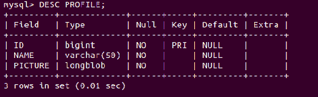
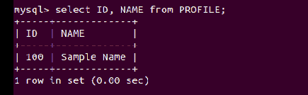
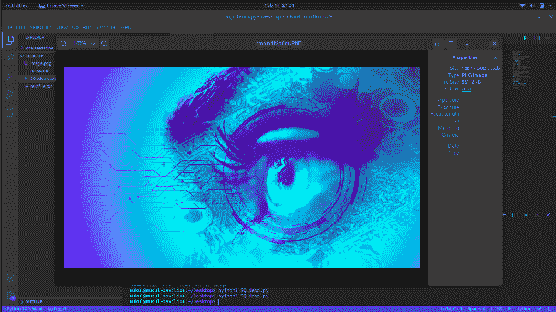

# 使用 Python 从 MySQL 表中检索作为 BLOB 存储的图像和文件

> 原文:[https://www . geesforgeks . org/retrieve-image-and-file-stored-as-blob-from-MySQL-table-use-python/](https://www.geeksforgeeks.org/retrieve-image-and-file-stored-as-a-blob-from-mysql-table-using-python/)

**先决条件:** [应安装 MySQL](https://www.geeksforgeeks.org/mysql-common-mysql-queries/) 服务器

在这篇文章中，我们将讨论如何从 python 脚本中将图像、文本文件和其他文件格式存储到 MySQL 表中。有时，就像其他信息一样，我们需要将图像和文件存储到我们的数据库中，并为其提供与其他数据同等的安全性。

在 MySQL 中，我们可以使用 BLOB 数据类型来存储文件。BLOB 是一个二进制大对象，可以保存可变数量的数据。我们可以用二进制格式表示文件，然后将它们存储在我们的数据库中。这四种 BLOB 类型是 TINYBLOB、BLOB、MEDIUMBLOB 和 LONGBLOB。这些不同之处仅在于它们所能容纳的值的最大长度。

**我们将在 python 脚本中使用 mysql-connect 来使用 mysql 驱动程序。首先**、**安装要求:**

```
python3 -m pip install mysql-connect-python
```

**接下来，创建如下所示的数据库和表格:**

> 创建数据库学生数据库；
> 
> 使用 studentdb
> 
> 创建表配置文件(标识 BIGINT 主键，名称 VARCHAR(50)不为空，图片 LONGBLOB 不为空)；

**我们可以看到数据库模式使用:**

```
DESC PROFILE;
```



**现在，让我们向数据库中添加一些数据:**

## 蟒蛇 3

```
# Import the required modules
import mysql.connector
import base64
from PIL import Image
import io 

# For security reasons, never expose your password
password = open('password','r').readline()

# Create a connection
mydb = mysql.connector.connect(
    host="localhost",
    user="root",
    password=password,
    database="studentdb"  # Name of the database
)

# Create a cursor object
cursor = mydb.cursor()

# Open a file in binary mode
file = open('image.png','rb').read()

# We must encode the file to get base64 string
file = base64.b64encode(file)

# Sample data to be inserted
args = ('100', 'Sample Name', file)

# Prepare a query
query = 'INSERT INTO PROFILE VALUES(%s, %s, %s)'

# Execute the query and commit the database.
cursor.execute(query,args)
mydb.commit()
```

现在回到我们的 MySQL 数据库，我们可以看到插入的行。



### 检索文件:

我们可以进行一个 SQL 查询来检索图像。返回的数据将采用 base64 格式。所以首先我们需要解码数据。我们可以将这些数据传输给用户，或者以其他方式加以利用。在这篇文章中，我们将简单地在屏幕上显示图像。

## 蟒蛇 3

```
# Import the required modules
import mysql.connector
import base64
from PIL import Image
import io 

# For security reasons, never expose your password
password = open('password','r').readline()

# Create a connection
mydb = mysql.connector.connect(
    host="localhost",
    user="root",
    password=password,
    database="studentdb"  # Name of the database
)

# Create a cursor object
cursor = mydb.cursor()

# Prepare the query
query = 'SELECT PICTURE FROM PROFILE WHERE ID=100'

# Execute the query to get the file
cursor.execute(query)

data = cursor.fetchall()

# The returned data will be a list of list
image = data[0][0]

# Decode the string
binary_data = base64.b64decode(image)

# Convert the bytes into a PIL image
image = Image.open(io.BytesIO(binary_data))

# Display the image
image.show()
```

**输出:**

