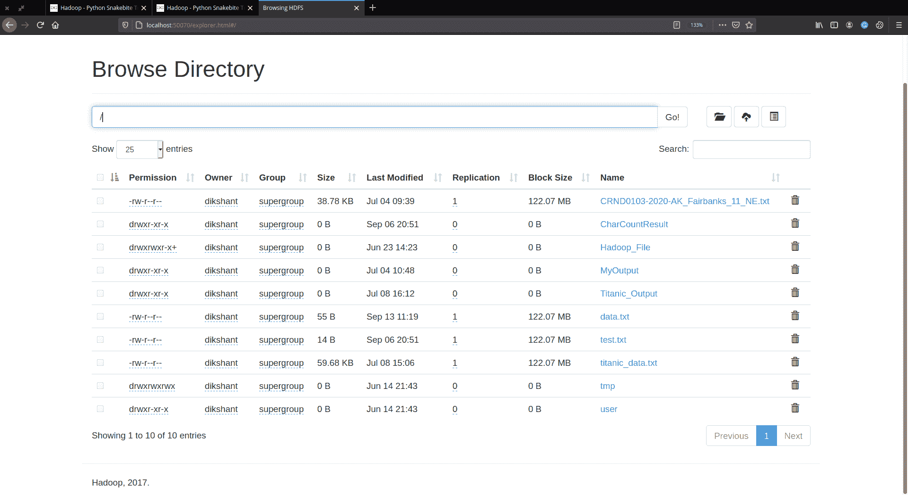
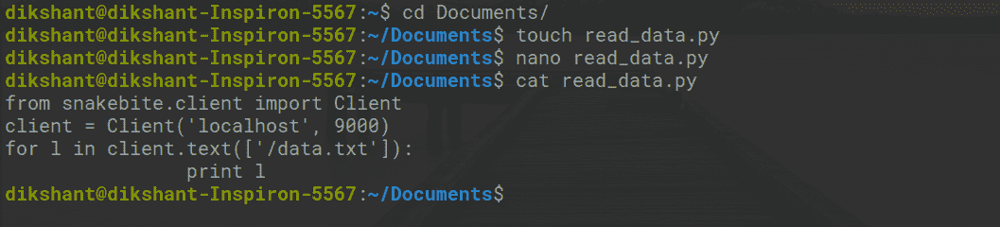
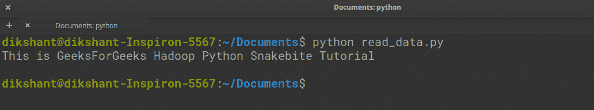
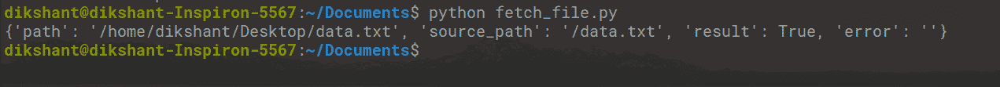

# 使用蟒蛇咬伤从 HDFS 检索文件数据

> 原文:[https://www . geeksforgeeks . org/retrieving-file-data-from-HDFS-using-python-snake bite/](https://www.geeksforgeeks.org/retrieving-file-data-from-hdfs-using-python-snakebite/)

**先决条件:** [Hadoop 安装](https://www.geeksforgeeks.org/how-to-install-hadoop-in-linux/)[HDFS](https://www.geeksforgeeks.org/hadoop-hdfs-hadoop-distributed-file-system/)

**蟒蛇蛇咬**是一个非常流行的蟒蛇库，我们可以用它来和 HDFS 人交流。使用蛇咬包提供的 Python 客户端库，我们可以轻松编写适用于 HDFS 的 Python 代码。它使用**原型**消息直接与名称节点通信。python 客户端库直接与 HDFS 一起工作，无需对 **hdfs dfs** 进行系统调用。蛇咬伤不支持蟒蛇 3。

hdfs dfs 提供了多个命令，通过这些命令我们可以在 hdfs 上执行多个操作。蛇咬提供的客户端库将包含各种方法，允许我们从 HDFS 检索数据。 **text()** 方法用于简单地从我们的 HDFS 上可用的文件中读取数据。因此，让我们执行一项快速任务，了解如何从 HDFS 的文件中检索数据。

**任务:从 HDFS 检索文件数据。**

**第一步:**创建一个名为 **data.txt** 的文本文件，并在其中添加一些数据。

```py
cd Documents/        # Changing directory to Documents(You can choose as per your requirement)

touch data.txt         # touch command is used to create file in linux enviournment

nano data.txt        # nano is a command line text editor for Unix and Linux operating system

cat data.txt         # to see the content of a file 

```


**第二步:**借助 [copyFromLocal](https://www.geeksforgeeks.org/hadoop-copyfromlocal-command/) 命令，将此 **data.txt** 文件发送给 Hadoop HDFS。

**语法:**

```py
hdfs dfs -copyFromLocal /path 1 /path 2 .... /path n /destination

```

使用命令发送 **data.txt** 到 HDFS 的根目录。

```py
hdfs dfs -copyFromLocal /home/dikshant/Documents/data.txt / 

```

现在，使用下面的命令检查文件是否到达 HDFS 的根目录。

```py
hdfs dfs -ls /

```


您可以通过访问 **http://localhost:50070/** 然后**实用程序** - > **浏览文件系统来手动检查。**



**第三步:**现在我们的任务是从 **data.txt** 读取数据，我们发送到我们的 HDFS。因此，在您的本地文件系统中创建一个文件 **data_read.py** ，并在其中添加下面的 python 代码。

## 计算机编程语言

```py
# importing the library
from snakebite.client import Client

# the below line create client connection to the HDFS NameNode
client = Client('localhost', 9000)

# iterate over data.txt file and will show all the content of data.txt
for l in client.text(['/data.txt']):
        print l
```

**客户端()方法说明:**

Client()方法可以接受下面列出的所有参数:

*   **主机(字符串):**名称节点的 IP 地址。
*   **端口(int):**Namenode 的 RPC 端口。
*   **Hadoop _ version(int):**Hadoop 协议版本(默认为:9)
*   **使用 _ 垃圾桶(布尔值):**删除文件时使用垃圾桶。
*   **有效 _ 使用(字符串):**HDFS 操作的有效用户(默认用户为当前用户)。



**第 4 步:**运行 **read_data.py** 文件，观察结果。

```py
python read_data.py

```



在客户端库的帮助下，我们已经成功地从 **data.txt** 中获取了数据。

在蛇咬的帮助下，我们还可以将 HDFS 的任何文件复制到我们的本地文件系统。要从 HDFS 复制一个文件，创建一个文件 **fetch_file.py** 并将下面的 python 代码复制到其中。 **copyToLocal()** 方法就是用来实现这一点的。

## 计算机编程语言

```py
from snakebite.client import Client
client = Client('localhost', 9000)
for a in client.copyToLocal(['/data.txt'], '/home/dikshant/Desktop'):
        print a
```


现在，运行这个 python 文件，您将看到下面的输出。

```py
python fetch_file.py

```



我们可以观察到现在的文件已经复制到我的 **/home/dikshant/desktop** 目录下了。

