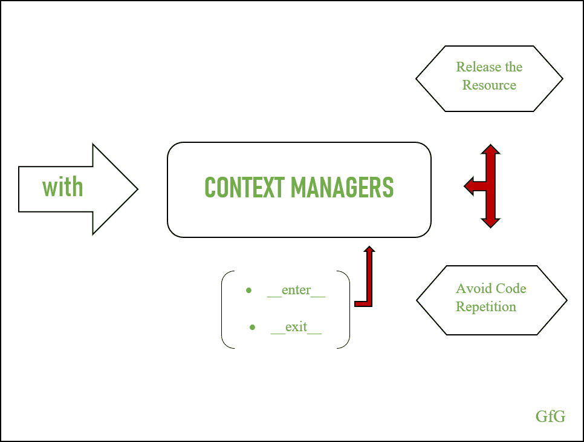

# 用于包装任意代码块的可重用 python 功能:Python 上下文管理器

> 原文:[https://www . geeksforgeeks . org/可重用的 python 片段-包装功能-任意代码块-python-上下文管理器/](https://www.geeksforgeeks.org/reusable-piece-of-python-functionality-for-wrapping-arbitrary-blocks-of-code-python-context-managers/)

上下文管理器是包装任意(自由形式)代码块的工具。使用上下文管理器的主要原因之一是资源清洁。上下文管理器确保进程在进入和退出时稳定运行，并释放资源。即使包装的代码引发异常，上下文管理器也会保证退出。因此，没有任何拖延，让我们潜入并获得资源清洁的新咒语，而不需要代码重复。



上下文管理器

*注:感谢了解[装饰](https://www.geeksforgeeks.org/python-decorators-a-complete-guide/)和[发电机](https://www.geeksforgeeks.org/using-generators-for-substantial-memory-savings-in-python/)的*

## 上下文管理器语法

众所周知，释放资源的正确方法是在资源使用后将其关闭。构建关闭函数最常见的做法是使用异常处理。让我们看看下面的代码。

```
def main():
    try:
        file = open('sample.txt', 'r')
        data = file.read()
        print(data)
    finally:
        file.close()

main()
```

finally 子句确保文件将被关闭，而不管任何情况。但是这个过程会导致代码重复。那么，如何在没有样板设置的情况下使用上下文管理器实现同样的效果呢？让我们逐一查看以下部分:

*   with 语句
*   进入和退出方法
*   异常处理

### with 语句

**有了语句**，内置函数的 python 可以作为上下文管理器。

```
with open (‘filename’, ’r’)  as file:
    data = file.read()
```

这段代码执行与我们使用异常处理开发的功能相同的功能。在这里，with 语句应该用两个神奇的方法返回一个对象:__enter__ 和 __exit__。从 __enter__ 方法返回的结果被分配给在“as”关键字后提到的变量。

它**处理包装代码**中是否引发异常，最重要的是语句**确保资源被释放**。因此，程序员不需要执行关闭操作。这是完整的代码。

```
def main():
    with open('sample.txt', 'r') as file:
        data = file.read()
        print(data)

main()
```

### 进入和退出方法

__enter__ 方法返回一个对象，然后将返回值赋给“as”关键字后面提到的变量。除了自我辩论，不需要其他的辩论。
另一方面，__exit__ 方法除了自身参数外，还接受 3 个位置参数。默认情况下，这三个参数都不是，当包装的代码引发异常时，它们会填充信息。

下面的代码解释了上下文管理器的工作流程。记录内部属性以及属性值在不同场景下的变化。进入上下文管理器后，属性值设置为 true，退出时，属性值设置为 false。一旦 with 语句中的代码块完成执行，就会调用 __exit__ 方法。

```
class ContextCheck(object):

    def __init__(self):
        self.inside = False

    def __enter__(self):
        self.inside = True
        return self

    def __exit__(self, exc_type, exc_instance, traceback):
        self.inside = False

cntCheck = ContextCheck()
print(cntCheck.inside)

with cntCheck:
    print(cntCheck.inside)

print(cntCheck.inside)
```

**输出**

```
False
True
False

```

### 异常处理

如何使用上下文管理器处理异常？
使用 __exit__ 方法，上下文管理器处理包装代码引发的异常。__exit__ 方法有 3 个位置参数:

*   例外的类型
*   异常的一个实例
*   追溯选项

默认情况下，这三个值都是“无”。当 __exit__ 方法收到异常时，该方法可以用两种不同的方式处理异常:

*   重新引发异常
*   抑制异常

#### 重新引发异常

__exit__ 方法可以通过返回 False 的返回语句来重新引发异常。让我们看看下面的代码:

```
class BubbleExc(object):
    def __enter__(self):
        return self

    def __exit__(self, ex_type, ex_instance, traceback):
        if ex_instance:    
            print('Exception: % s.' % ex_instance)
        return False

with BubbleExc():
    1 / 0
```

**输出**

```
Exception: division by zero.
Traceback (most recent call last):
  File "C:\Users\Sonu George\Documents\Python\Context Managers\bubbleExc.py", line 11, in 
    1/0
ZeroDivisionError: division by zero

```

#### 抑制异常

__exit__ 方法可以通过返回 true 来抑制异常。详见下面的例子。

```
class SuppressExc(object):
    def __enter__(self):
        return self

    def __exit__(self, ex_type, ex_instance, traceback):
        if ex_instance:
            print('Suppressing exception: % s.'% ex_instance)
        return True

with SuppressExc():
    1 / 0
```

**输出**T2】

```
Suppressing exception: division by zero.
```

## 您应该何时编写上下文管理器

*   **释放资源**:释放资源通常以样板代码结束。使用上下文管理器，程序员可以在 __enter__ 方法中打开资源，在 __exit__ 方法中关闭资源，并可以按需重用该功能。
*   **避免重复**:使用 except 子句的异常处理会导致代码重复。使用上下文管理器，程序员可以引发或抑制异常，重要的是，它是在一个地方定义的，因此可以避免重复。

## 编写上下文管理器

> 光知道是不够的；我们必须申请。愿意是不够的；我们必须这样做。
> –约翰·沃尔夫冈·冯·歌德

### 将上下文管理器实现为类

使用上下文管理器写入文件的示例方法。这是完整的代码。

```
class FileClass(object):

    def __init__(self, f_name, func):
        self.f_obj = open(f_name, func)

    def __enter__(self):
        return self.f_obj

    def __exit__(self, type, value, traceback):
        self.f_obj.close()

with FileClass('sample.txt', 'w') as f_open:
    f_open.write('Congratulations, Good Work !')
```

**输出**

```
Congratulations, Good Work!
```

### 使用上下文管理器关闭页面

在这里，page.close()将在读取完页面后调用(从 with 块退出时)。

```
from contextlib import closing
from urllib.request import urlopen

with closing(urlopen('https://www.geeksforgeeks.org/')) as page:
    for ln in page:
        print(ln)
```

**输出**

### 将上下文管理器用作函数装饰器和生成器

使用 python*context lib*模块，您可以将上下文管理器实现为装饰器，并且方法中的 *yield* 语句提供了将其用作生成器的灵活性。为了理解这个程序，你应该有关于装饰和发电机的知识。

```
from contextlib import contextmanager

@contextmanager
def open_file(name):
    try:
        print('File Open')
        f = open(name, 'r')
        yield f
    finally:
        print('Close Operation')
        f.close()

def main():
    with open_file('sample.txt') as f:
        data = f.read()
        print(data)
main()
```

这里 *@contextmanager* 包装 *open_file* 方法。当函数 *open_file* 被调用时，上下文管理器的 _ _ enter _ _ 方法执行，并将控制传递给 *open_file* 方法，在该方法中，文件打开并产生对可调用的`with open_file('sample.txt') as f`的文件引用，并且在最终执行*块之前，执行停止。*

*一旦 with 语句中的代码被执行，它会将控制传递回 *open_file* ，并从暂停的地方开始执行。在这种情况下，*最后*块执行并关闭文件。执行完成后，调用 __exit__ 方法，并处理包装代码引发的任何异常。*

### *通过检查异常类的实例来处理异常*

*在这种情况下，我们将检查异常是否是异常类的实例。下面我们将创建一个子类‘typererrorsubclass’，它是从‘typererror’异常类派生的，使用 raise 语句我们将引发‘typererrorsubclass’异常。这是完整的代码。*

```
*class TypeErrorSubClass(TypeError):
    pass

class ExceptionClass(object):
    def __enter__(self):
        return self

    def __exit__(self, ex_type, ex_instance, traceback):
        # Return True if there is no exception
        if not ex_type:
            return True

        # Return True if execution type is
        # equal or a subclass of TypeError
        if issubclass(ex_type, TypeError):
            print('Handling TypeError: % s' % ex_instance)
            return True

        return False

with ExceptionClass():
    raise TypeErrorSubClass('Type Error')*
```

***输出***

```
*Handling ValueError: Type Error*
```

*__exit__ 方法使用`issubclass(ex_type, TypeError)`检查引发的异常是否是“类型错误”类的实例，如果是实例，则通过返回真来抑制异常。*

## *摘要*

*上下文管理器确保资源被适当地释放，并且它的结构方式提供了在不同地方重用异常处理代码的灵活性，因此避免了代码重复。上下文管理器用于包装任意代码块。然而，上下文管理器可以用作装饰器，这避免了为某些任务分别编写上下文管理器和装饰器的需要。*