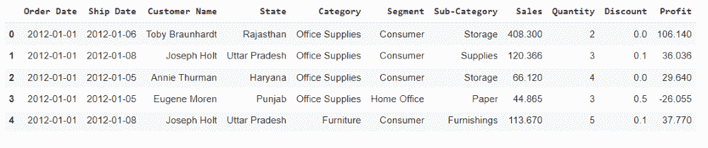
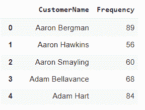
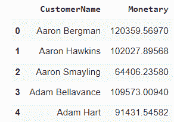
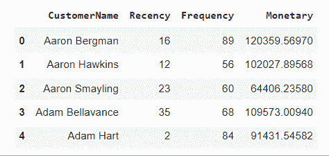

# 使用 Python 进行 RFM 分析

> 原文:[https://www . geesforgeks . org/RFM-analysis-analysis-use-python/](https://www.geeksforgeeks.org/rfm-analysis-analysis-using-python/)

在本文中，我们将看到使用 Python 进行的最近、频率、货币价值分析。但首先，让我们简单了解一下 RFM 的分析。

## 什么是 RFM 分析？

RFM 代表最近，频率，货币价值。在业务分析中，我们经常使用这一概念将客户分为不同的细分市场，如高价值客户、中等价值客户或低价值客户，以及类似的许多其他客户。

假设我们是一家公司，我们的公司名称是 geek，让我们对客户进行 RFM 分析

1.  最近:客户最近一次与我们进行交易是什么时候
2.  频率:客户向我们订购/购买产品的频率如何
3.  货币:客户花多少钱从我们这里购买产品。

## 入门指南

### 加载必要的库和数据

在这里，我们将导入所需的模块(pandas、DateTime 和 NumPy)，然后读取数据框中的数据。

**使用的数据集:** [rfm](https://media.geeksforgeeks.org/wp-content/cdn-uploads/20211019133055/rfm.csv)

## 蟒蛇 3

```
# importing necessary libraries
import pandas as pd
import datetime as dt
import numpy as np

# importing the data
df = pd.read_excel( < my excel file location > )
df.head()
```



### 计算摄政

在这里，我们计算了向一家公司购买的客户的最近时间。

## 蟒蛇 3

```
df_recency = df.groupby(by='Customer Name',
                        as_index=False)['Order Date'].max()
df_recency.columns = ['CustomerName', 'LastPurchaseDate']
recent_date = df_recency['LastPurchaseDate'].max()
df_recency['Recency'] = df_recency['LastPurchaseDate'].apply(
    lambda x: (recent_date - x).days)
df_recency.head()
```


### 计算频率

我们在这里计算客户在向公司订购/购买某些产品时频繁交易的频率。

## 蟒蛇 3

```
frequency_df = df.drop_duplicates().groupby(
    by=['Customer Name'], as_index=False)['Order Date'].count()
frequency_df.columns = ['CustomerName', 'Frequency']
frequency_df.head()
```



### 计算货币价值

这里我们计算的是客户从公司购买产品的货币价值。

## 蟒蛇 3

```
df['Total'] = df['Sales']*df['Quantity']
monetary_df = df.groupby(by='Customer Name', as_index=False)['Total'].sum()
monetary_df.columns = ['CustomerName', 'Monetary']
monetary_df.head()
```



### 将所有三列合并到一个数据框中

这里，我们使用合并功能将所有数据框列合并到一个实体中，以显示最近、频率和货币价值。

## 蟒蛇 3

```
rf_df = df_recency.merge(frequency_df, on='CustomerName')
rfm_df = rf_df.merge(monetary_df, on='CustomerName').drop(
    columns='LastPurchaseDate')
rfm_df.head()
```



### 根据客户的最近程度、频率和货币评分对其进行排名

这里，我们对公司内的客户排名进行标准化，以分析排名。

## 蟒蛇 3

```
rfm_df['R_rank'] = rfm_df['Recency'].rank(ascending=False)
rfm_df['F_rank'] = rfm_df['Frequency'].rank(ascending=True)
rfm_df['M_rank'] = rfm_df['Monetary'].rank(ascending=True)

# normalizing the rank of the customers
rfm_df['R_rank_norm'] = (rfm_df['R_rank']/rfm_df['R_rank'].max())*100
rfm_df['F_rank_norm'] = (rfm_df['F_rank']/rfm_df['F_rank'].max())*100
rfm_df['M_rank_norm'] = (rfm_df['F_rank']/rfm_df['M_rank'].max())*100

rfm_df.drop(columns=['R_rank', 'F_rank', 'M_rank'], inplace=True)

rfm_df.head()
```