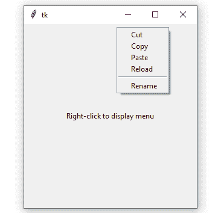

# 使用 Tkit

右键菜单

> 原文:[https://www . geesforgeks . org/右键-菜单-使用-tkinter/](https://www.geeksforgeeks.org/right-click-menu-using-tkinter/)

Python 3.x 附带了**Tkit**模块，这对于制作基于图形用户界面的应用程序非常有用。在 Python 支持的所有其他框架中，Tkinter 是最简单、最快的。Tkinter 提供了大量的小部件，可以用来构建图形用户界面应用程序以及主事件循环，该循环一直在后台运行，直到应用程序被手动关闭。

**注意:**更多信息请参考[Python GUI–tkinter](https://www.geeksforgeeks.org/python-gui-tkinter/)

Tkinter 提供了一种处理事件的机制。事件是必须由程序中的一段代码处理的任何操作。事件包括鼠标点击、鼠标移动或用户击键。Tkinter 使用事件序列，允许用户将事件绑定到每个小部件的处理程序。
**语法:**

```
widget.bind(event, handler)
```

Tkinter 小部件能够捕捉各种事件，如按钮、按钮释放、运动、双按钮、焦点输入、焦点输出、按键等。本文中的代码主要处理事件处理，在该事件处理中，只要在父小部件上遇到右键单击，就会显示带有各种选项的弹出菜单。Tkinter 的菜单小部件用于实现顶层、下拉和弹出菜单。

1.  **导入 tkinter 模块**

    ```
    import tkinter
    ```

2.  **导入 tkinter 子模块**

    ```
    from tkinter import *
    ```

3.  **Creating the parent widget**

    ```
    root = Tk()
    ```

    **语法:** Tk(screenName=None，baseName=None，className='Tk '，useTk=1)
    **参数:**在本例中，Tk 类是不带参数实例化的。
    **解释:**
    Tk()方法创建一个空白的父小部件，顶部有关闭、最大化和最小化按钮。

4.  **Creating the label to be displayed**

    ```
    L = Label(root, text="Right-click to display menu", width=40, height=20)
    ```

    **语法:**标签(主，* *选项)
    **参数:**

    *   **主控:**父窗口(根)充当主控。
    *   **选项:** Label()方法支持以下选项–文本、锚点、bg、位图、bd、光标、字体、fg、高度、宽度、图像、对齐、浮雕、padx、pady、textvariable、下划线和 wraplength。这里，文本选项用于向用户显示信息文本，宽度和高度指定标签小部件在父窗口中的位置。

    **说明:**
    标签小部件用于显示小部件对应的文本或图像。屏幕上显示的文本可以使用标签小部件下的其他选项进一步格式化。

5.  **Positioning the label**

    ```
    L.pack()
    ```

    **语法:**包(选项)
    **参数:**

    *   **选项:**pack()方法支持的选项有展开、填充和侧边，用于将小部件定位在父窗口上。但是，pack()方法在这里被起诉，没有任何选择。

    **说明:**
    pack()方法用于在父小部件中定位子小部件。

6.  **Creating the menu**

    ```
    m = Menu(root, tearoff=0)
    ```

    **语法:**菜单(主菜单，选项)
    **参数:**

    *   **master:** root 是主小部件或父小部件。
    *   **选项:**Menu widget 支持的选项有标题、撕下、选择颜色、字体、fg、后置命令、浮雕、图像、bg、bd、光标、活动前景、活动边框和活动背景。这里使用了“撕掉”选项。

    **解释:**
    撕裂用于从主窗口分离菜单，创建浮动菜单。如果撕裂=1，它会创建一个顶部有虚线的菜单，当单击该菜单时，它会撕裂父窗口并变成浮动的。在此限制主窗口中的菜单撕裂=0。

7.  **Adding options to the menu**

    ```
    m.add_command(label="Cut")
    m.add_command(label="Copy")
    m.add_command(label="Paste")
    m.add_command(label="Reload")
    m.add_separator()
    m.add_command(label="Rename")
    ```

    **语法:** add_command(选项)
    **参数:**

    *   **选项:**可用选项有标签、命令、下划线和加速器。标签选项用于指定菜单项的名称。

    **说明:**
    add _ command()方法将菜单项添加到菜单中。add_separator()在菜单项之间创建一条细线。

8.  **```
    def do_popup(event):
        try:
            m.tk_popup(event.x_root, event.y_root)
        finally:
            m.grab_release()

    ```

    **语法:** tk_popup(x_root，y_root)
    **参数:**此过程在屏幕上给定的位置发布菜单，x_root 和 y_root 是相对于屏幕左上角的当前鼠标位置。
    **说明:**
    这个方法就是事件处理程序。当事件(右键单击)发生时，方法被调用，菜单出现在父小部件上事件发生的位置。finally 块确保 grab_release()方法释放事件抓取。** 
9.  ****```
    L.bind("<Button-3>", do_popup)
    ```

    **语法:**绑定(事件，处理程序)
    **参数:**

    *   **事件:**这里右键是事件，用<按钮-3 >表示。
    *   **处理程序:**处理程序是一段代码，当事件被触发时，它会执行一些特定的任务。

    **解释:**
    鼠标指针在小部件上按下鼠标右键，这将触发由事件处理程序(do_popup()函数)处理的事件。do_popup()函数显示菜单。**** 
10.  ******Run the application**

    ```
    mainloop()
    ```

    **语法:** mainloop()
    **参数:**不接受参数。
    **解释:**
    它的作用就像一个无限循环，让应用程序一直运行，直到主窗口被手动关闭。**** 

```
**import tkinter
from tkinter import *

root = Tk()

L = Label(root, text ="Right-click to display menu",
          width = 40, height = 20)
L.pack()

m = Menu(root, tearoff = 0)
m.add_command(label ="Cut")
m.add_command(label ="Copy")
m.add_command(label ="Paste")
m.add_command(label ="Reload")
m.add_separator()
m.add_command(label ="Rename")

def do_popup(event):
    try:
        m.tk_popup(event.x_root, event.y_root)
    finally:
        m.grab_release()

L.bind("<Button-3>", do_popup)

mainloop()**
```

******输出**
****

******解释**
当右键单击父窗口时，弹出菜单出现并显示选项列表。****