# Python 中的机器人框架

> 原文:[https://www.geeksforgeeks.org/robot-framework-in-python/](https://www.geeksforgeeks.org/robot-framework-in-python/)

在这篇文章中，我们将看到机器人框架，我们将涵盖标准库和底层函数，接下来我们还将涵盖测试用例、关键词、变量，并最终组织测试用例。

**机器人框架**是验收测试、验收测试驱动开发(ATTD)和机器人过程自动化(RPA)的通用开源自动化框架。它使用关键字驱动的测试技术方法，并且可以通过可以用 Python 或 Java 实现的测试库来扩展功能。

先来说说**验收技术**，其中对系统的能力进行测试，验收技术的目的是根据业务需求对系统的能力进行评估。

## **验收测试驱动开发(ATDD)**

这是一种根植于客户、开发人员和测试人员之间业务交流的高级方法。他们协同工作，并在实现功能之前进行验收测试。

## **机器人过程自动化(RPA)**

这是一个通过使用机器学习和人工智能功能的软件来方便地减少人类努力的过程。RPA 处理高级别的可重复任务。

## 机器人框架的结构

测试数据很容易在机器人框架启动时编辑表格格式。它执行过程数据并生成日志和报告。核心框架对被测目标一无所知，与它的交集由库处理。库可以直接使用应用程序接口，也可以使用低级测试工具作为驱动程序。机器人框架有一个模块化的架构，可以捆绑和扩展与自我声明的库。当执行开始时，框架分析它之前的数据。然后，它使用库提供的关键字与目标系统进行交互。库可以有序地与系统交互或使用其他工具作为驱动程序。测试或任务执行从命令行开始。结果，我们得到了一个 HTML 格式的报告和日志，以及一个 XML 输出。

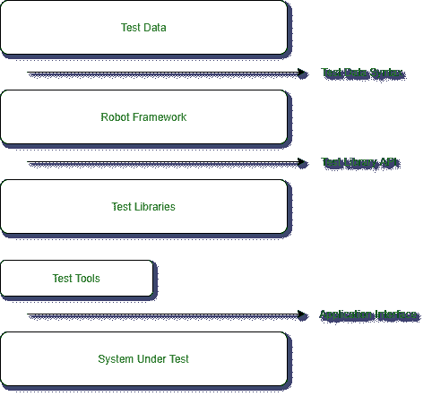

## 装置

**第一步:** [Python 安装](https://www.geeksforgeeks.org/download-and-install-python-3-latest-version/)

检查您的系统上是否安装了 Python。

```
python --version
pip --version
```

**步骤 2:** 安装机器人框架

在 Python 上安装机器人框架的建议路线是使用 pip。我们可以使用下面提到的命令来安装框架。

```
pip install robotframework
```

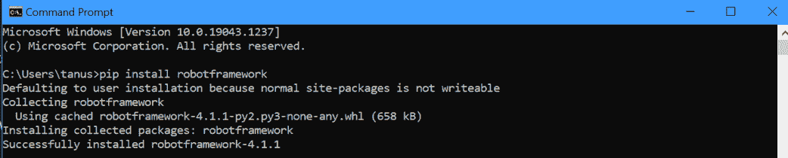

**步骤 3:** 验证安装

在良好的安装之后，我们应该能够看到使用–version 选项的解释器和机器人框架版本。

```
robot --version
rebot --version
```

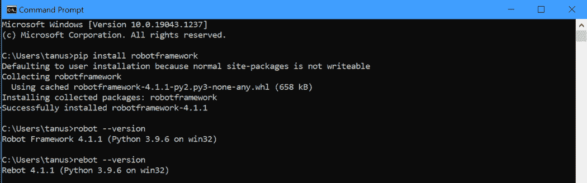

**步骤 4:** 检查机器人框架安装是否正确

```
pip show robotframework
```

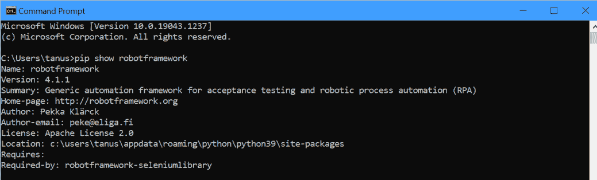

## 机器人框架中的标准库

机器人框架中有一堆标准库。让我们一个一个讨论

*   **内建**是一个 Robot Framework 标准库，它提供了一组经常需要的常用关键词，因此可以自动导入并始终可用。
*   **Collection** 是一个标准库，提供一组关键词来处理 python 列表和字典。该库有关键字来修改列表和字典中的值。
*   **DateTime** 是一个支持日期和时间值的创建和转换的机器人框架。
*   **对话框**是一个机器人框架标准库，提供了暂停执行和接收用户输入的方法。对话框有点不一致，这取决于测试是否在运行。
*   **操作系统**启用机器人框架运行时将在系统中执行的各种操作系统相关任务。它可以执行命令，也可以直接创建和删除文件。
*   **Process** 用于运行进程，该库利用 python 子模块及其开放类。该库的主要用途是等待系统中正在运行的进程，并使用 run process 关键字进行编译。我们在后台使用 start process 启动流程，然后使用 wait for process 启动流程或结束流程或终止所有流程。
*   **截图**是一个测试库，用于在运行测试的机器上截图。
*   **字符串**是一个用于字符串操作和验证的库。
*   **远程登录**通过远程登录连接提供通信。telnet 库使连接到 telnet 服务器和通过开放连接执行命令成为可能。
*   **XML** 也是一个用于验证和修改 XML 文档的机器人框架文本库。

## 内置工具

机器人框架中使用的内置工具主要有四种:

*   **Testdoc**–机器人框架基于测试用例生成高级 HTML 文档。
*   **Rebot**–基于 XML 输出生成日志和报告并同时合并多个输出的工具。
*   **整理**–用于清理和更改数据文件格式的机器人框架工具。
*   **Libdoc**–为库和资源文件生成关键字文档的工具。

## 测试用例

机器人框架中的测试用例被允许用简单的英语编写，而不是自动测试用例。它遵循一种关键字测试驱动的方法，这种方法在行动方面与自然语言产生共鸣，而不是期望。测试用例是从测试用例表中的可用关键字创建的，关键字可以从测试库或资源文件中导入，或者我们也可以为测试用例文件创建一个关键字表。

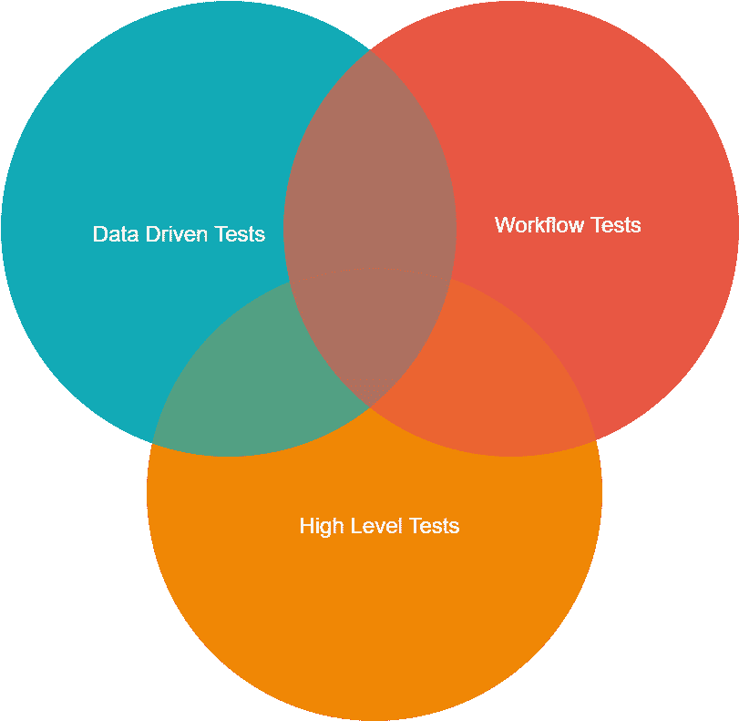

### **工作流程测试**

测试用例表中的第一列有测试名称，测试用例以该列中的某个内容开始，并与下一个测试用例名称或表的结尾连续。

### **高级测试**

第二列通常包含一个关键字名称，这个规则的例外是用关键字写的值设置变量。

### **数据驱动测试**

数据驱动测试允许在不模仿工作流程的情况下隔离测试数据。机器人框架中的[模板]设置为数据驱动测试设置测试用例。

## 关键词

机器人框架中的测试用例是用来自两个来源的关键字创建的。

*   **库关键字:**所有最低级别的关键字都是在标准库中定义的，可以使用 Java、Python 等编程语言实现。Robot Framework 自带测试库，可以分为标准库和自定义库，所以标准库在主框架中，比如内置截图，外部库像 Selenium 库一样单独安装。
*   **用户关键词:**机器人框架的强大功能之一是，我们可以使用其他关键词创建自定义高级关键词。

## 组织测试用例

机器人测试用例是在测试用例文件中创建的，但是我们可以将它们组织在组成测试套件层次结构的目录中。测试用例的集合被称为测试套件。每个包含测试用例的文件也形成了一个测试套件。可以通过使用目录将测试用例组织成一个层次结构，所有这些都形成了一个更高级别的测试套件，该套件的名称来自目录名。

## 创建第一个机器人测试

**步骤 1:** 检查机器人框架是否安装

**第二步:**前往项目 Eclipse >机器人项目>新测试套件

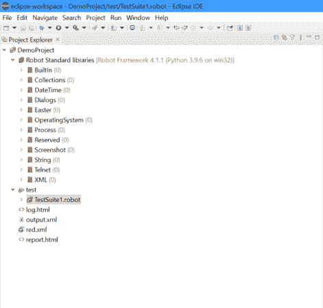

**机器人的简单测试:**

```
*** Test Cases ***
MyFirstTest
    Log     Hello World!!!
```

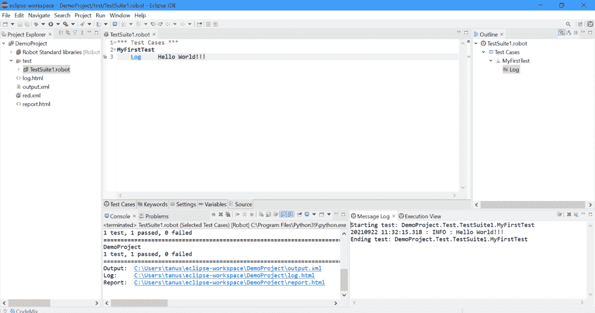

要运行我们的测试用例，只需右击屏幕并选择**运行测试:“我的测试”**，控制台将会打开

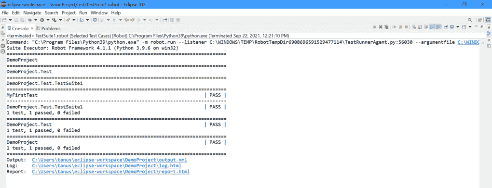

因为我们可以看到关于测试的所有细节，并且我们可以通过遵循给定的地址链接来看到输出、日志和报告

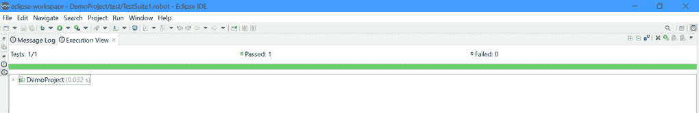 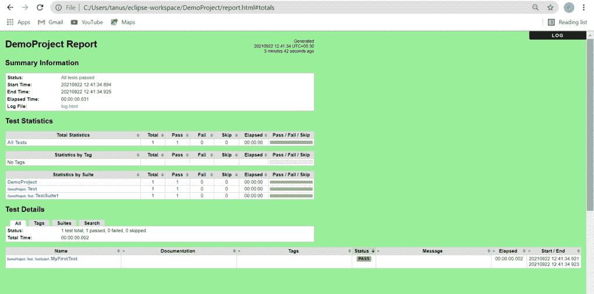

在这里我们可以清楚地看到项目报告，它给出了报告创建的时间。它提供了一些关于测试的概要信息，如状态、开始时间、结束时间、运行时间和日志文件。

**我们通过点击给定的链接来访问日志文件:**

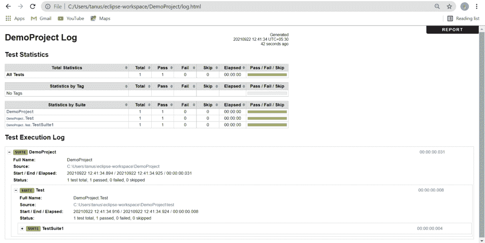

在这里，我们可以看到统计数据，还可以检查测试用例的通过/失败/跳过数量。我们可以检查测试执行日志和测试套件状态。

## 机器人框架的优势

1.  使用和安装都很方便。
2.  它是一个开源框架，任何有或没有编程经验的人都可以驱动。
3.  它适用于各种操作系统和外部库，如硒库。
4.  机器人框架支持行为驱动、关键字驱动和数据驱动的构建测试用例的风格。
5.  我们可以使用任何机器人集成开发环境(RIDE)或任何文本编辑器来编写测试用例。

## 机器人框架的缺点

1.  并行测试执行的稀缺。
2.  自定义 HTML 报告并不简单。

## 机器人框架的局限性

Robot 缺乏对 if-else、嵌套循环的支持，当代码变得复杂时，这是必需的。

## 结论

机器人框架是一个开源的测试自动化框架，用于验收测试和验收测试驱动的开发。机器人框架中的测试用例基于以表格格式编写的关键字，这使得它清晰可读，并揭示了关于测试用例意图的真实信息。例如，要打开浏览器，使用的关键字是“打开浏览器”。