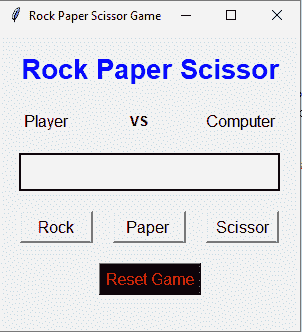

# 使用 Tkinter 的石头纸和剪刀游戏

> 原文:[https://www . geesforgeks . org/rock-paper-and-剪刀-game-using-tkinter/](https://www.geeksforgeeks.org/rock-paper-and-scissor-game-using-tkinter/)

**先决条件:**[**Tkinter**](https://www.geeksforgeeks.org/python-gui-tkinter/)**[**随机**](https://www.geeksforgeeks.org/random-numbers-in-python/)**

**Python 为开发图形用户界面提供了多种选择。在所有的 GUI 方法中，Tkinter 是最常用的方法。它是 Python 附带的 Tk 图形用户界面工具包的标准 Python 接口。Python 搭配 Tkinter 是创建 GUI 应用程序最快最简单的方法。**

**在本文中，我们将看到如何使用 Tkinter 创建一个石头纸和剪刀游戏。**岩纸剪刀**是一种通常在两个人之间进行的手游，其中每个玩家同时用伸出的手形成三种形状中的一种。这些形状是“岩石”、“纸”和“剪刀”。**

****游戏赢家条件:****

*   ****纸张**和**剪刀**=>T4】剪刀获胜**
*   ****岩石**和**剪刀**=>T4】岩石获胜**
*   ****纸**和**岩石**=>T4 纸赢**

****下面是 GUI 的样子:-****

****

****GUI 实现步骤(添加按钮、标签、框架)****

*   **创建一个显示游戏标题的标题标签，设置它的字体和属性**
*   **在头部下方，标签创建一个用户标签，显示用户选择的手势**
*   **创建一个计算机标签，显示由计算机挑选的手形标志**
*   **在用户和计算机标签之间创建一个标签来显示文本“vs”**
*   **创建一个结果标签，向其显示结果集字体和其他属性**
*   **分别为石头、纸张和剪刀创建三个按钮**
*   **创建一个重置按钮来重置游戏**

****后端实现步骤:****

*   **我们将创建五个功能；一个用于重置游戏，第二个用于禁用按钮，另一个用于游戏赢家**

****下面是实现:-****

## **蟒蛇 3**

```py
# Import Required Library
from tkinter import *
import random

# Create Object
root = Tk()

# Set geometry
root.geometry("300x300")

# Set title
root.title("Rock Paper Scissor Game")

# Computer Value
computer_value = {
    "0":"Rock",
    "1":"Paper",
    "2":"Scissor"
}

# Reset The Game
def reset_game():
    b1["state"] = "active"
    b2["state"] = "active"
    b3["state"] = "active"
    l1.config(text = "Player              ")
    l3.config(text = "Computer")
    l4.config(text = "")

# Disable the Button
def button_disable():
    b1["state"] = "disable"
    b2["state"] = "disable"
    b3["state"] = "disable"

# If player selected rock
def isrock():
    c_v = computer_value[str(random.randint(0,2))]
    if c_v == "Rock":
        match_result = "Match Draw"
    elif c_v=="Scissor":
        match_result = "Player Win"
    else:
        match_result = "Computer Win"
    l4.config(text = match_result)
    l1.config(text = "Rock            ")
    l3.config(text = c_v)
    button_disable()

# If player selected paper
def ispaper():
    c_v = computer_value[str(random.randint(0, 2))]
    if c_v == "Paper":
        match_result = "Match Draw"
    elif c_v=="Scissor":
        match_result = "Computer Win"
    else:
        match_result = "Player Win"
    l4.config(text = match_result)
    l1.config(text = "Paper           ")
    l3.config(text = c_v)
    button_disable()

# If player selected scissor
def isscissor():
    c_v = computer_value[str(random.randint(0,2))]
    if c_v == "Rock":
        match_result = "Computer Win"
    elif c_v == "Scissor":
        match_result = "Match Draw"
    else:
        match_result = "Player Win"
    l4.config(text = match_result)
    l1.config(text = "Scissor         ")
    l3.config(text = c_v)
    button_disable()

# Add Labels, Frames and Button
Label(root,
      text = "Rock Paper Scissor",
      font = "normal 20 bold",
      fg = "blue").pack(pady = 20)

frame = Frame(root)
frame.pack()

l1 = Label(frame,
           text = "Player              ",
           font = 10)

l2 = Label(frame,
           text = "VS             ",
           font = "normal 10 bold")

l3 = Label(frame, text = "Computer", font = 10)

l1.pack(side = LEFT)
l2.pack(side = LEFT)
l3.pack()

l4 = Label(root,
           text = "",
           font = "normal 20 bold",
           bg = "white",
           width = 15 ,
           borderwidth = 2,
           relief = "solid")
l4.pack(pady = 20)

frame1 = Frame(root)
frame1.pack()

b1 = Button(frame1, text = "Rock",
            font = 10, width = 7,
            command = isrock)

b2 = Button(frame1, text = "Paper ",
            font = 10, width = 7,
            command = ispaper)

b3 = Button(frame1, text = "Scissor",
            font = 10, width = 7,
            command = isscissor)

b1.pack(side = LEFT, padx = 10)
b2.pack(side = LEFT,padx = 10)
b3.pack(padx = 10)

Button(root, text = "Reset Game",
       font = 10, fg = "red",
       bg = "black", command = reset_game).pack(pady = 20)

# Execute Tkinter
root.mainloop()
```

****输出:****

**<video class="wp-video-shortcode" id="video-544258-1" width="640" height="360" preload="metadata" controls=""><source type="video/mp4" src="https://media.geeksforgeeks.org/wp-content/uploads/20210118125256/FreeOnlineScreenRecorderProject2.mp4?_=1">[https://media.geeksforgeeks.org/wp-content/uploads/20210118125256/FreeOnlineScreenRecorderProject2.mp4](https://media.geeksforgeeks.org/wp-content/uploads/20210118125256/FreeOnlineScreenRecorderProject2.mp4)</video>**