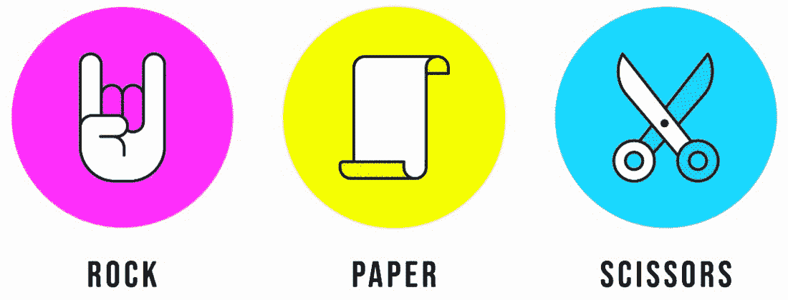

# 岩石、纸张、剪刀游戏–Python 项目

> 原文:[https://www . geesforgeks . org/rock-paper-剪刀-game-python-project/](https://www.geeksforgeeks.org/rock-paper-scissor-game-python-project/)

在本文中，我们将看到如何使用 Tkinter 创建一个石头纸和剪刀游戏。石头纸剪刀是一种通常在两个人之间玩的手游，其中每个玩家同时用伸出的手形成三种形状中的一种。这些形状是“岩石”、“纸”和“剪刀”。

## **游戏赢家条件**

让一个玩家作为对手玩电脑。现在，

*   如果玩家选择纸张，电脑选择剪刀，电脑获胜
*   如果玩家选择摇滚，电脑选择剪刀-玩家 1 获胜
*   如果玩家选择纸，电脑选择石头，玩家 1 获胜
*   如果玩家选择纸，电脑选择纸-画
*   如果玩家选择摇滚，电脑选择摇滚-抽奖
*   如果玩家选择剪刀，电脑选择剪刀-画

## 使用的工具和技术

*   [**Tkinter:**](https://www.geeksforgeeks.org/python-gui-tkinter/) 它是一个标准的 Python 接口，对应于 Python 附带的 Tk GUI 工具包。Python 和 tkinter 是创建图形用户界面应用程序最快最简单的方法。
*   [**【随机:**](https://www.geeksforgeeks.org/random-numbers-in-python/) Python 定义了一组函数，用于通过随机模块生成或操纵随机数。
*   [**PIL:**](https://www.geeksforgeeks.org/python-pillow-a-fork-of-pil/) Python 图像库(PIL 的扩展)是 Python 语言事实上的图像处理包。它集成了轻量级图像处理工具，有助于编辑、创建和保存图像。

## **图形用户界面实现**

### **第 1 部分:** **图像处理和处理**

1)导入 Python 模块 Tkinter 执行 GUI 应用。

2)来自 PIL 导入图像 Tk，用于图像处理的图像。

3)导入随机，这将有助于计算机随机选择选项岩石、纸张或剪刀。

4)现在创建了一个根对象，它是主窗口对象。

*   这个窗口的标题->石头纸剪刀
*   此窗口的尺寸->“800×680”

5)创建宽度=800，高度=680 的画布

6)现在我们在图形用户界面窗口上创建标签

*   l1 =Player-> font= '阿尔及利亚'，size=25
*   l2 =计算机-> font= '阿尔及利亚'，size=25
*   l3 =Vs font= '阿尔及利亚'，size=40

7)现在标签放在窗口上

*   x=80，y=20 时的 l1
*   x=560，y=20 时的 l2
*   x=370，y=230 时的 l3

**默认图像:**

1)一个名为 img_p 的变量用于打开默认的手形图像，并将其大小调整为(300，300)。这将在游戏中默认情况下显示在玩家的位置。

2)一个名为 img_c 的变量用于使用转置函数从左到右存储翻转的默认图像，并将其保存在变量中。这将在游戏中默认情况下显示在电脑旁边。

3)现在使用 Tk 将图像 img_p 和 img_c 加载到画布上。照片图像

**岩石图像:**

1)一个名为 rock_p 的变量用于打开岩石手形图像，并将其大小调整为(300，300)。当玩家在游戏中选择摇滚时，这将显示在玩家的身边。

2)一个名为 rock_c 的变量用于存储使用转置功能从左到右翻转的岩石手图像，当计算机在游戏中随机选择岩石时，该变量将显示在计算机侧。

3)图像 rock_p 和 rock_c 现在使用 Tk.PhotoImage 加载到画布上。

**用于纸张图像**

1)名为 paper_p 的变量用于打开纸张手形图像，并将其大小调整为(300，300)。当玩家在游戏中选择纸张时，这将显示在玩家的身边。

2)一个名为 paper_c 的变量用于存储使用转置功能从左到右翻转的纸张手图像，当计算机在游戏中随机选择纸张时，该变量将显示在计算机侧。

3) Images paper_p 和 paper_c 现在使用 Tk.PhotoImage 加载到画布上。

**剪刀图像**

1)一个名为剪刀 _p 的变量用于打开剪刀手图像，并将其大小调整为(300，300)。当玩家在游戏中选择剪刀时，这将显示在玩家的身边。

2)一个名为剪刀 _c 的变量用于使用转置功能从左到右存储翻转的剪刀手图像，当计算机在游戏中随机选择剪刀时，该变量将显示在计算机侧。

3)现在使用 Tk.PhotoImage 将图像剪刀 p 和剪刀 c 加载到画布上。

**选择图像:**

1)一个名为 img_s 的变量用于打开手图像的选择，即岩石、纸张和剪刀的组合图像，并将其大小调整为(300，130)。

2)现在使用 Tk.PhotoImage 将图像 img_s 加载到画布上。

### **第二部分:游戏实现**

1)定义了一个游戏函数，其中我们有一个名为 select 的列表，值为 1、2、3，分别代表石头、纸和剪刀。

2)这里[随机选择](https://www.geeksforgeeks.org/python-numbers-choice-function/)为电脑随机选择选项 1-3

3)在画布上为播放器设置图像

*   如果玩家选择 1(摇滚)，使用 create_image 在画布上显示摇滚图像。
*   如果玩家选择 2(纸张)，使用 create_image 在画布上显示纸张图像。
*   如果玩家选择 3(剪刀)，使用 create_image 在画布上显示剪刀图像。

4)在画布上为计算机设置图像

*   如果计算机选择 1(岩石)，使用 create_image 在画布上显示岩石图像。
*   如果计算机选择 2(纸张)，使用 create_image 在画布上显示纸张图像。
*   如果计算机选择 3(剪刀)，使用 create_image 在画布上显示剪刀图像。

5)获得结果

*   如果玩家选择摇滚，电脑选择摇滚，或者如果玩家选择纸，电脑选择纸，或者如果玩家选择剪刀，电脑选择剪刀。显示的结果->绘制
*   如果玩家选择岩石和电脑选择剪刀或如果玩家选择纸张和电脑选择岩石或如果玩家选择剪刀和电脑选择纸张。显示的结果->玩家获胜
*   显示的其他结果->计算机获胜

**注:**该结果以文本形式显示在画布上，尺寸(390，600)，字体= '阿尔及利亚语'，标签= '结果'。

6)按钮

*   清除按钮->删除当前结果，并将两侧的图形切换到默认状态。
*   岩石按钮->选择功能游戏中的选项 1，并显示一个手的图像，显示玩家一侧的岩石。
*   纸张按钮->在功能游戏中选择选项 2，并在玩家侧显示纸张的手图像
*   剪刀按钮->在功能游戏中选择选项 3，并在玩家一侧显示一个显示剪刀的手的图像。

**使用的图像:**


default.jpg


paper.jpg


rock.jpg


scissor.jpg



Selection.jpg

**main.py**

## 蟒蛇 3

```py
from tkinter import *
from PIL import ImageTk, Image
import random

# main window object
root = Tk()

# Title of GUI window
root.title('Rock Paper Scissor')

# Size of window
root.geometry('800x680')

# Creating canvas
canvas = Canvas(root, width=800, height=680)
canvas.grid(row=0, column=0)

# Creating labels on GUI window
l1 = Label(root, text='Player', font=('Algerian', 25))
l2 = Label(root, text='Computer', font=('Algerian', 25))
l3 = Label(root, text='Vs', font=('Algerian', 40))

# Placing all the labels on window
l1.place(x=80, y=20)
l2.place(x=560, y=20)
l3.place(x=370, y=230)

# Default image
img_p = Image.open("default.jpeg")
img_p = img_p.resize((300, 300))

# Flipping image from left to right
img_c = img_p.transpose(Image.FLIP_LEFT_RIGHT)

# Loading images to put on canvas
img_p = ImageTk.PhotoImage(img_p)
img_c = ImageTk.PhotoImage(img_c)

# Rock image
rock_p = Image.open('rock.jpeg')
rock_p = rock_p.resize((300, 300))

# Flipping image from left to right
rock_c = rock_p.transpose(Image.FLIP_LEFT_RIGHT)

# Loading images to put on canvas
rock_p = ImageTk.PhotoImage(rock_p)
rock_c = ImageTk.PhotoImage(rock_c)

# Paper image
paper_p = Image.open('paper.jpeg')
paper_p = paper_p.resize((300, 300))

# Flipping image from left to right
paper_c = paper_p.transpose(Image.FLIP_LEFT_RIGHT)

# Loading images to put on canvas
paper_p = ImageTk.PhotoImage(paper_p)
paper_c = ImageTk.PhotoImage(paper_c)

# Scissor image
scissor_p = Image.open('scissor.jpeg')
scissor_p = scissor_p.resize((300, 300))

# Flipping image from left to right
scissor_c = scissor_p.transpose(Image.FLIP_LEFT_RIGHT)

# Loading images to put on canvas
scissor_p = ImageTk.PhotoImage(scissor_p)
scissor_c = ImageTk.PhotoImage(scissor_c)

# Selection image
img_s = Image.open("Selection.jpeg")
img_s = img_s.resize((300, 130))
img_s = ImageTk.PhotoImage(img_s)

# Putting image on canvas on specific coordinates
canvas.create_image(0, 100, anchor=NW, image=img_p)
canvas.create_image(500, 100, anchor=NW, image=img_c)
canvas.create_image(0, 400, anchor=NW, image=img_s)
canvas.create_image(500, 400, anchor=NW, image=img_s)

# game function
def game(player):
    select = [1, 2, 3]

    # Randomly selects option for computer
    computer = random.choice(select)

    # Setting image for player on canvas
    if player == 1:

        # Puts rock image on canvas
        canvas.create_image(0, 100, anchor=NW, image=rock_p)
    elif player == 2:

        # Puts paper image on canvas
        canvas.create_image(0, 100, anchor=NW, image=paper_p)
    else:

        # Puts scissor image on canvas
        canvas.create_image(0, 100, anchor=NW, image=scissor_p)

    # Setting image for computer on canvas
    if computer == 1:

        # Puts rock image on canvas
        canvas.create_image(500, 100, anchor=NW, image=rock_c)
    elif computer == 2:

        # Puts paper image on canvas
        canvas.create_image(500, 100, anchor=NW, image=paper_c)
    else:

        # Puts scissor image on canvas
        canvas.create_image(500, 100, anchor=NW, image=scissor_c)

    # Obtaining result by comparison
    if player == computer:  # Case of DRAW
        res = 'Draw'

    # Case of player's win
    elif (player == 1 and computer == 3) or (player == 2 and computer == 1) or
    (player == 3 and computer == 2):
        res = 'You won'

    # Case of computer's win
    else:
        res = 'Computer won'

    # Putting result on canvas
    canvas.create_text(390, 600, text='Result:- ' + res,
                       fill="black", font=('Algerian', 25), tag='result')

# Function for clear button
def clear():

    # Removes result from canvas
    canvas.delete('result')

    # Puts default image on canvas
    canvas.create_image(0, 100, anchor=NW, image=img_p)
    canvas.create_image(500, 100, anchor=NW, image=img_c)

# Button for selecting rock
rock_b = Button(root, text='Rock', command=lambda: game(1))
rock_b.place(x=35, y=487)

# Button for selecting paper
paper_b = Button(root, text='Paper', command=lambda: game(2))
paper_b.place(x=128, y=487)

# Button for selecting scissor
scissor_b = Button(root, text='Scissor', command=lambda: game(3))
scissor_b.place(x=220, y=487)

# Button for clear
clear_b = Button(root, text='CLEAR', font=('Times', 10, 'bold'),
                 width=10, command=clear).place(x=370, y=28)

root.mainloop()
```

**输出**

<video class="wp-video-shortcode" id="video-638737-1" width="640" height="360" preload="metadata" controls=""><source type="video/mp4" src="https://media.geeksforgeeks.org/wp-content/uploads/20210628192354/Rock-Paper-Scissor-2021-06-28-19-20-24_Trim.mp4?_=1">[https://media.geeksforgeeks.org/wp-content/uploads/20210628192354/Rock-Paper-Scissor-2021-06-28-19-20-24_Trim.mp4](https://media.geeksforgeeks.org/wp-content/uploads/20210628192354/Rock-Paper-Scissor-2021-06-28-19-20-24_Trim.mp4)</video>

### 团队成员

1.  [Utkarsh Shaw](https://auth.geeksforgeeks.org/user/utkarshshaw/profile)
2.  [奇拉·巴蒂亚](https://auth.geeksforgeeks.org/user/chi251201/profile)