# KL-散度在变分自动编码器中的作用

> 原文:[https://www . geesforgeks . org/role-of-KL-diversion-in-variable-auto encoders/](https://www.geeksforgeeks.org/role-of-kl-divergence-in-variational-autoencoders/)

### 可变自动编码器

谷歌和高通的 Knigma 和 Welling 于 2013 年提出了变分自动编码器。变分自动编码器(VAE)为描述潜在空间中的观测提供了一种概率方式。因此，我们不是构建一个输出单个值来描述每个潜在状态属性的编码器，而是公式化我们的编码器来描述每个潜在属性的概率分布。

#### 架构:

自动编码器基本上包含两个部分:

*   第一个是编码器，除了最后一层，它类似于卷积神经网络。编码器的目的是从数据集中学习高效的数据编码，并将其传递到瓶颈架构中。
*   自动编码器的另一部分是解码器，它使用瓶颈层中的潜在空间来重新生成类似于数据集的图像。这些结果以损失函数的形式从神经网络反向传播。

变分自动编码器与自动编码器的不同之处在于，它提供了一种描述潜在空间中数据集样本的统计方式。因此，在变分自动编码器中，编码器输出瓶颈层中的概率分布，而不是单个输出值。

<center>
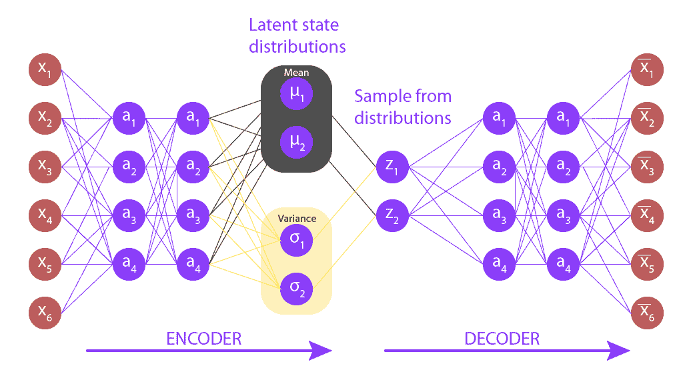

### 解释:

</center>

可变自动编码器潜在空间是连续的。它提供随机采样和插值。编码器输出两个矢量，而不是输出大小为 n 的矢量:

*   向量？？？？平均值(向量大小 n)
*   向量？？？？标准差(向量大小 n)

输出是一个近似的后验分布 q(z|x)。从这个分布中进行采样以获得 z。让我们来看看采样的更多细节:

*   让我们取一些平均值和标准差，
    *   ![\mu = [0.15, 1.1, 0.2, 0.7, ...] \\ \sigma =[0.2, 0.4, 0.5, 2.4, ...]](img/1a9ede6db82de3ab1090b54d72bce0c6.png "Rendered by QuickLaTeX.com")
*   从中产生的中间分布:
    *   ![X =[X_1 \sim \bold{N} (0.15, 0.2^2), X_2 \sim \bold{N} (1.1, 0,4^2), X_3 \sim \bold{N} (0.2, 0,5^2), X_4 \sim \bold{N} (0.7, 1.5^2), ...]](img/8f44c633b4ef47118dc489cf3806cd67.png "Rendered by QuickLaTeX.com")
*   现在，让我们由此生成采样向量:
    *   ![[0.32, 1.25, 0.8,2.0]](img/727db12e7e94b4a1e1ff546d9d1ec7e1.png "Rendered by QuickLaTeX.com")
*   虽然一个输入的平均值和标准偏差相同，但由于采样原因，结果可能不同。
*   最终，我们的目标是让编码器学会不同的生成方式？？？？对于不同的类，对它们进行聚类并生成编码，这样它们就不会有太大的变化。对此，我们使用 KL-散度。

### KL-散度:

KL 散度代表 Kullback Leibler 散度，它是两个分布之间散度的度量。我们的目标是最小化 KL 发散并优化？？？？然后呢。？？？一个分布类似于所需的分布。关于

对于多重分布，KL-散度可以通过以下公式计算:

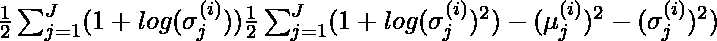

其中 X_j \sim N(\mu_j，\sigma_j^{2})是标准正态分布。

### VAE 损失:

假设我们有一个分布 z，我们想从中生成观测值 x。换句话说，我们要计算

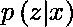

我们可以通过以下方式做到这一点:

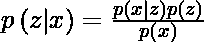

但是，p(x)的计算可能相当困难

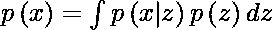

这通常会使它成为一个难以处理的分布。因此，我们需要将 p(z|x)近似为 q(z|x)以使其成为易处理的分布。为了更好地将 p(z|x)近似为 q(z|x)，我们将最小化 KL-散度损失，KL-散度损失计算两个分布有多相似:

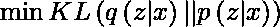

通过简化，上面的最小化问题等价于下面的最大化问题:

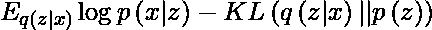

第一项表示重构可能性，另一项确保我们学习的分布 q 类似于真实的先验分布 p。

因此，我们的总损失由两项组成，一项是重构误差，另一项是 KL-散度损失:
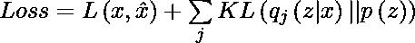

### 实施:

在这个实现中，我们将使用 MNIST 数据集，这个数据集已经在 *keras.datasets* API 中可用，所以我们不需要手动添加或上传。

*   首先，我们需要将必要的包导入到 python 环境中。我们将使用带有 TensorFlow 的 Keras 包作为后端。

## 蟒蛇 3

```py
# code
import numpy as np
import tensorflow as tf
from tensorflow import keras
from tensorflow.keras import Input, Model
from tensorflow.keras.layers import Layer, Conv2D, Flatten, Dense, Reshape, Conv2DTranspose
import matplotlib.pyplot as plt
```

*   对于可变自动编码器，我们需要定义编码器和解码器两部分的架构，但是首先，我们将定义架构的瓶颈层，采样层。

## 蟒蛇 3

```py
# this sampling layer is the bottleneck layer of variational autoencoder,
# it uses the output from two dense layers z_mean and z_log_var as input, 
# convert them into normal distribution and pass them to the decoder layer
class Sampling(Layer):

    def call(self, inputs):
        z_mean, z_log_var = inputs
        batch = tf.shape(z_mean)[0]
        dim = tf.shape(z_mean)[1]
        epsilon = tf.keras.backend.random_normal(shape =(batch, dim))
        return z_mean + tf.exp(0.5 * z_log_var) * epsilon
```

*   现在，我们定义了我们的自动编码器的编码器部分的体系结构，该部分将图像作为输入，并在采样层对它们的表示进行编码。

## 蟒蛇 3

```py
# Define Encoder Model
latent_dim = 2

encoder_inputs = Input(shape =(28, 28, 1))
x = Conv2D(32, 3, activation ="relu", strides = 2, padding ="same")(encoder_inputs)
x = Conv2D(64, 3, activation ="relu", strides = 2, padding ="same")(x)
x = Flatten()(x)
x = Dense(16, activation ="relu")(x)
z_mean = Dense(latent_dim, name ="z_mean")(x)
z_log_var = Dense(latent_dim, name ="z_log_var")(x)
z = Sampling()([z_mean, z_log_var])
encoder = Model(encoder_inputs, [z_mean, z_log_var, z], name ="encoder")
encoder.summary()
```

```py
Model: "encoder"
__________________________________________________________________________________________________
Layer (type)                    Output Shape         Param #     Connected to                     
==================================================================================================
input_3 (InputLayer)            [(None, 28, 28, 1)]  0                                            
__________________________________________________________________________________________________
conv2d_2 (Conv2D)               (None, 14, 14, 32)   320         input_3[0][0]                    
__________________________________________________________________________________________________
conv2d_3 (Conv2D)               (None, 7, 7, 64)     18496       conv2d_2[0][0]                   
__________________________________________________________________________________________________
flatten_1 (Flatten)             (None, 3136)         0           conv2d_3[0][0]                   
__________________________________________________________________________________________________
dense_2 (Dense)                 (None, 16)           50192       flatten_1[0][0]                  
__________________________________________________________________________________________________
z_mean (Dense)                  (None, 2)            34          dense_2[0][0]                    
__________________________________________________________________________________________________
z_log_var (Dense)               (None, 2)            34          dense_2[0][0]                    
__________________________________________________________________________________________________
sampling_1 (Sampling)           (None, 2)            0           z_mean[0][0]                     
                                                                 z_log_var[0][0]                  
==================================================================================================
Total params: 69, 076
Trainable params: 69, 076
Non-trainable params: 0
__________________________________________________________________________________________________
```

*   现在，我们定义我们的自动编码器的解码器部分的架构，该部分以采样层的输出作为输入，并输出大小为(28，28，1)的图像。

## 蟒蛇 3

```py
# Define Decoder Architecture
latent_inputs = keras.Input(shape =(latent_dim, ))
x = Dense(7 * 7 * 64, activation ="relu")(latent_inputs)
x = Reshape((7, 7, 64))(x)
x = Conv2DTranspose(64, 3, activation ="relu", strides = 2, padding ="same")(x)
x = Conv2DTranspose(32, 3, activation ="relu", strides = 2, padding ="same")(x)
decoder_outputs = Conv2DTranspose(1, 3, activation ="sigmoid", padding ="same")(x)
decoder = Model(latent_inputs, decoder_outputs, name ="decoder")
decoder.summary()
```

```py
Model: "decoder"
_________________________________________________________________
Layer (type)                 Output Shape              Param #   
=================================================================
input_4 (InputLayer)         [(None, 2)]               0         
_________________________________________________________________
dense_3 (Dense)              (None, 3136)              9408      
_________________________________________________________________
reshape_1 (Reshape)          (None, 7, 7, 64)          0         
_________________________________________________________________
conv2d_transpose_3 (Conv2DTr (None, 14, 14, 64)        36928     
_________________________________________________________________
conv2d_transpose_4 (Conv2DTr (None, 28, 28, 32)        18464     
_________________________________________________________________
conv2d_transpose_5 (Conv2DTr (None, 28, 28, 1)         289       
=================================================================
Total params: 65, 089
Trainable params: 65, 089
Non-trainable params: 0
_________________________________________________________________
```

*   在这一步中，我们结合模型，用损失函数定义训练过程。

## 蟒蛇 3

```py
# this class takes encoder and decoder models and
# define the complete variational autoencoder architecture
class VAE(keras.Model):
    def __init__(self, encoder, decoder, **kwargs):
        super(VAE, self).__init__(**kwargs)
        self.encoder = encoder
        self.decoder = decoder

    def train_step(self, data):
        if isinstance(data, tuple):
            data = data[0]
        with tf.GradientTape() as tape:
            z_mean, z_log_var, z = encoder(data)
            reconstruction = decoder(z)
            reconstruction_loss = tf.reduce_mean(
                keras.losses.binary_crossentropy(data, reconstruction)
            )
            reconstruction_loss *= 28 * 28
            kl_loss = 1 + z_log_var - tf.square(z_mean) - tf.exp(z_log_var)
            kl_loss = tf.reduce_mean(kl_loss)
            kl_loss *= -0.5
            # beta =10
            total_loss = reconstruction_loss + 10 * kl_loss
        grads = tape.gradient(total_loss, self.trainable_weights)
        self.optimizer.apply_gradients(zip(grads, self.trainable_weights))
        return {
            "loss": total_loss,
            "reconstruction_loss": reconstruction_loss,
            "kl_loss": kl_loss,
        }
```

*   现在是训练我们的可变自动编码器模型的时候了，我们将为 100 个时代训练它。但是首先我们需要导入 MNIST 数据集。

## 蟒蛇 3

```py
# load fashion mnist dataset  from  keras.dataset API
(x_train, _), (x_test, _) = keras.datasets.fashion_mnist.load_data()
fmnist_images = np.concatenate([x_train, x_test], axis = 0)
# expand dimension to add  a color map dimension
fmnist_images = np.expand_dims(fmnist_images, -1).astype("float32") / 255

# compile and train the model
vae = VAE(encoder, decoder)
vae.compile(optimizer ='rmsprop')
vae.fit(fmnist_images, epochs = 100, batch_size = 128)
```

*   在这一步中，我们显示训练结果，我们将根据潜在空间向量中的值显示这些结果。

## 蟒蛇 3

```py
def plot_latent(encoder, decoder):
    # display a n * n 2D manifold of imagess
    n = 10
    img_dim = 28
    scale = 2.0
    figsize = 15
    figure = np.zeros((img_dim * n, img_dim * n))
    # linearly spaced coordinates corresponding to the 2D plot
    # of images classes in the latent space
    grid_x = np.linspace(-scale, scale, n)
    grid_y = np.linspace(-scale, scale, n)[::-1]

    for i, yi in enumerate(grid_y):
        for j, xi in enumerate(grid_x):
            z_sample = np.array([[xi, yi]])
            x_decoded = decoder.predict(z_sample)
            images = x_decoded[0].reshape(img_dim, img_dim)
            figure[
                i * img_dim : (i + 1) * img_dim,
                j * img_dim : (j + 1) * img_dim,
            ] = images

    plt.figure(figsize =(figsize, figsize))
    start_range = img_dim // 2
    end_range = n * img_dim + start_range + 1
    pixel_range = np.arange(start_range, end_range, img_dim)
    sample_range_x = np.round(grid_x, 1)
    sample_range_y = np.round(grid_y, 1)
    plt.xticks(pixel_range, sample_range_x)
    plt.yticks(pixel_range, sample_range_y)
    plt.xlabel("z[0]")
    plt.ylabel("z[1]")
    plt.imshow(figure, cmap ="Greys_r")
    plt.show()

plot_latent(encoder, decoder)
```

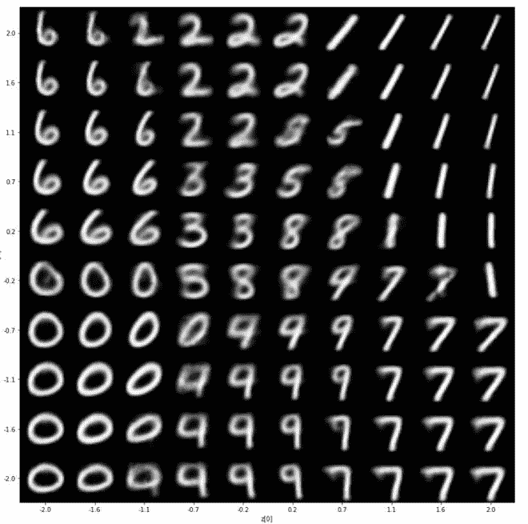

编码器输出

*   为了更清楚地了解我们的代表性潜在向量值，我们将根据从编码器生成的相应潜在维度的值绘制训练数据的散点图

## 蟒蛇 3

```py
def plot_label_clusters(encoder, decoder, data, test_lab):
    z_mean, _, _ = encoder.predict(data)
    plt.figure(figsize =(12, 10))
    sc = plt.scatter(z_mean[:, 0], z_mean[:, 1], c = test_lab)
    cbar = plt.colorbar(sc, ticks = range(10))
    cbar.ax.set_yticklabels([i for i in range(10)])
    plt.xlabel("z[0]")
    plt.ylabel("z[1]")
    plt.show()

(x_train, y_train), _ = keras.datasets.mnist.load_data()
x_train = np.expand_dims(x_train, -1).astype("float32") / 255
plot_label_clusters(encoder, decoder, x_train, y_train)
```

<center>
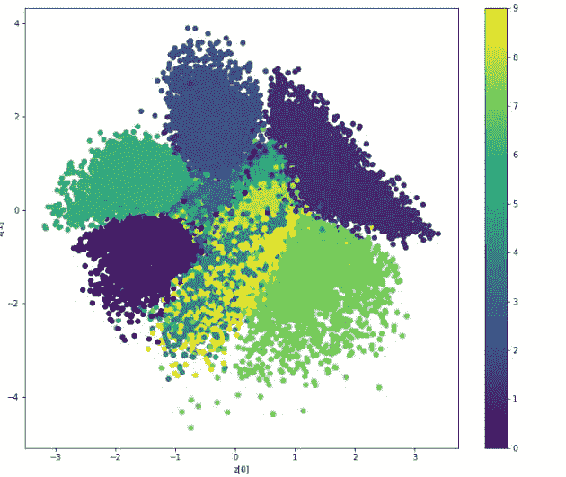

贝塔分布= 10

</center>

*   为了比较差异，我还针对β= 0 训练了上述自动编码器，即我们去除了 Kl 发散损失，它生成了以下分布:

<center>
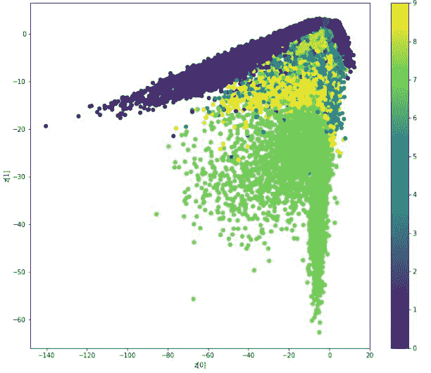

贝塔分布= 0

</center>

在这里，我们可以看到，对于不同的值，分布是不可分离的，并且非常偏斜，这就是为什么我们在上面的变分自动编码器中使用 KL-散度损失。

**参考文献:**

*   [可变自动编码器纸](https://arxiv.org/abs/1312.6114)
*   [硬变分自动编码器](https://keras.io/examples/generative/vae/)