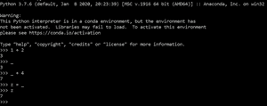

# 下划线“_”在 Python 中的作用

> 原文:[https://www . geesforgeks . org/下划线的作用-_-in-python/](https://www.geeksforgeeks.org/role-of-underscores-_-in-python/)

下划线 *(_)* 是 Python 中的一个古怪字符。它可以在 Python 程序中以多种方式使用。

### Python 中下划线 *(_)* 的各种用法有:

**1)在解释器中的使用:**

Python 会立即将解释器中最后一个表达式的值保存在这个唯一的变量中。下划线(_)也可以用于任何其他变量的值。

**例 1:**



下划线 *(_)* 也可以作为正态变量。

**例 2:**

## 蟒蛇 3

```
# Storing value in _
_ = 2 + 8

print(_)
```

**输出:**

```
10
```

**2)循环使用:**

在 Python 中，下划线 *(_)* 可以用作循环中的变量。它将访问数据结构的每个元素。

**例 1:**

## 蟒蛇 3

```
# Creating tuple
Tuple = (50, 40, 30)

# Using _ to access index of each element
for _ in range(3):
    print(Tuple[_])
```

**输出:**

```
50
40
30
```

**例 2:**

## 蟒蛇 3

```
# Creating list
List = ['Geeks', 4, 'Geeks!']

# Using _ to access elements of list
for _ in List:
    print(_)
```

**输出:**

```
Geeks
4
Geeks!
```

**3)** **用于忽略变量:**

在 Python 中，下划线 *(_)* 通常用于忽略一个值。如果开箱时不使用某些值，只需将值设置为下划线 *(_)* 。忽略包括给特定的向量下划线赋值 *(_)* 。如果在未来的代码中不使用下划线 *(_)* ，我们将为其添加值。

**例 1:**

## 蟒蛇 3

```
# Using _ to ignore values
p, _, r = 'Geeks', 4, 'Geeks!'

print(p, r)
```

**输出:**

```
Geeks Geeks!
```

**例 2:**

## 蟒蛇 3

```
# Using _ to ignore multiple values
p, q, *_, r = 'Geeks', 4, 'randomText', 1234, '3.14', "Geeks!"

print(p, q, r)

print(_)
```

**输出:**

```
Geeks 4 Geeks!
['randomText', 1234, '3.14']
```

**4)分隔数字:**

下划线 *(_)* 也可以用来表示长位数，它把这组数字分开是为了更好的理解。

## 蟒蛇 3

```
# Using _ to separate digits
Crore = 10_00_000

print(Crore)
```

**输出:**

```
1000000
```

**5)** **用于定义类中数据成员和方法的访问:**

下划线 *(_)* 用作类中方法或数据成员的前缀，定义其[访问说明符](https://www.geeksforgeeks.org/access-modifiers-in-python-public-private-and-protected/)，使用双下划线 *(__)* 作为后缀和前缀引用[构造函数](https://www.geeksforgeeks.org/constructors-in-python/)。

**例 1:**

## 蟒蛇 3

```
class Gfg:
    a = None
    _b = None
    __c = None

    # Constructor
    def __init__(self, a, b, c):

        # Data members
        # Public
        self.a = a

        # Protected
        self._b = b

        # Private
        self.__c = c

    # Methods
    # Private method
    def __display(self):
        print(self.a)
        print(self._b)
        print(self.__c)
    # Public method
    def accessPrivateMethod(self):
        self.__display()

# Driver code
# Creating object
Obj = Gfg('Geeks', 4, "Geeks!")

# Calling method
Obj.accessPrivateMethod()
```

**输出:**

```
Geeks
4
Geeks!
```