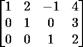
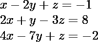
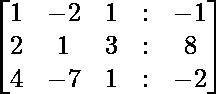
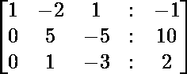
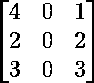
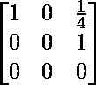

# 排梯队形式

> 原文:[https://www.geeksforgeeks.org/row-echelon-form/](https://www.geeksforgeeks.org/row-echelon-form/)

如果矩阵具有以下属性，则该矩阵为“行梯队”形式:

*   任何完全由零组成的行都出现在矩阵的底部。
*   对于不完全包含零的每一行，第一个非零条目是 1(称为前导 1)。
*   对于连续的两行(非零)，较高行中的前导 1 比较低行中的前导 1 更靠左。

对于缩减行梯队形式，每行的前导 1 在该列中包含 0。

下面是一个行列形式的例子:



和简化的行列形式:


使用一种称为高斯消去法的技术，任何矩阵都可以转化为简化的行梯队形式。这对于求解线性方程组特别有用。

#### **高斯消去**

高斯消去法是一种将矩阵转换成简化行梯次形式的方法。它也可以作为一种寻找线性方程组解的方法。这背后的想法是，我们对行执行一些数学运算，并继续进行，直到只剩下一个变量。

以下是我们可以执行的一些操作:

*   交换任意两行
*   将两行加在一起。
*   将一行乘以非零常数(即 1/3，-1/5，2)。

给定以下线性方程:



和上面的增广矩阵



现在，我们需要把它转换成行列形式。要将其转换为行梯队形式，我们需要执行高斯消去。

*   首先，我们需要从 r <sub>2</sub> 中减去 2*r <sub>1</sub> ，从 r <sub>3</sub> 中减去 4*r <sub>1</sub> ，得到 r <sub>2</sub> 和r <sub>3</sub> 第一位的 0。



*   接下来，我们将交换行 r2 和 r3，然后从 r <sub>3</sub> 中减去 5*r <sub>2</sub> ，得到第三行的第二个 0。


*   现在，我们可以从 r <sub>3、</sub>推导出值 *z* ，即 10 z =0 ⇾ z=0。借助 z =0 的值，我们可以把它代入 r2，y = 2。同样，我们可以将 y 和 z 的值放入 r <sub>1</sub> 中，我们得到 x=3 的值

#### **矩阵的秩**

矩阵的秩是行梯次形式的非零行数。要找到排名，我们需要执行以下步骤:

*   找出给定矩阵的行梯队形式
*   计算非零行数。

让我们以矩阵为例:



现在，我们将上面的矩阵简化为行列形式



这里，只有一行包含非零元素。因此，矩阵的秩是 2。

#### 履行

*   为了将矩阵转换成简化的行梯队形式，我们使用了 python 中的 Sympy 包，首先，我们需要安装它。

```
# install sympy
! pip install sympy

# import sympy
import sympy

# find the reduced row echelon form
sympy.Matrix([[4,0,1],[2,0,2],[3,0,3]]).rref()

# find the rank of matrix
print("Rank of matrix :",sympy.Matrix([[4,0,1],[2,0,2],[3,0,3]]).rank())
```

**输出:**

```
(Matrix([
 [1, 0, 0],
 [0, 0, 1],
 [0, 0, 0]]), (0, 2))

 Rank of matrix : 2
```