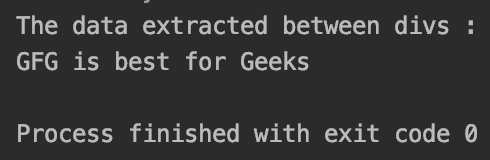
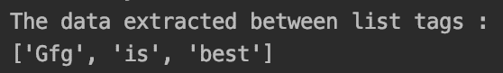
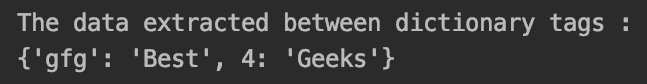

# 使用 Python textminer 模块进行基于规则的 HTML 数据提取

> 原文:[https://www . geesforgeks . org/基于规则的数据提取-html-使用-python-textminer-module/](https://www.geeksforgeeks.org/rule-based-data-extraction-in-html-using-python-textminer-module/)

在使用 HTML 时，有各种各样的要求，以 python 数据容器的形式，如列表、字典、整数等，以有序的方式从普通的 HTML 标签中提取数据。本文讨论了一个使用基于规则的方法来帮助实现这一点的库。

### Python-text miner 的特性:

*   从 HTML 中提取列表、字典和文本形式的数据。
*   使用 YAML 格式的基于规则的系统。
*   支持抓取形式的网址提取。

### 安装:

使用以下命令安装 Python textminer:

```py
pip install textminer
```

### **功能描述:**

从 HTML 中提取数据时，以下函数会派上用场:

**语法:**

```py
extract(html, rule) 
```

**参数:**

*   **html:** 从中提取数据的 html。
*   **规则:**YAML 格式的规则，应用在 HTML 上提取数据。

**语法:**

```py
extract_from_url(url, rule)  
```

**参数:**

*   **规则:**YAML 格式的规则，应用在 HTML 上提取数据。
*   **url:** 必须从中提取 HTML 的 HTML URL。

**示例 1:** 从 HTML 中提取数据

这个 YAML 格式的基本规则是用来提取后缀和前缀之间的数据的。

## 蟒蛇 3

```py
import textminer

# input html
inp_html = '<html><body><div>GFG is best for Geeks</div></body></html>'

# yaml rule string
rule = '''
value:
  prefix: <div>
  suffix: </div>
'''

# using extract() to get required data
res = textminer.extract(inp_html, rule)

print("The data extracted between divs : ")
print(res)
```

**输出:**



div 之间提取的数据

**示例 2:** 从 HTML 中提取列表

基于 python 的列表可以通过使用

*   and作为规则的前缀和后缀，从通常称为使用列表标签的 Html 中提取出来。此外，需要添加“list”关键字来实现这一点。

## 蟒蛇 3

```py
import textminer

# input html
inp_html = """<html>
<body>
<ul>
    <li>Gfg</li>
    <li>is</li>
    <li>best</li>
</ul>
</body>
</html>"""

# yaml rule string
# extracting list using <li>
# using "list" keyword
rule = '''
list:
  prefix: <li>
  suffix: </li>
'''

# using extract() to get required data
res = textminer.extract(inp_html, rule)

print("The data extracted between list tags : ")
print(res)
```

**输出:**



提取列表

**示例 3:** 使用定义的数据类型从 HTML 中提取字典。

类似于上面的例子，可以使用“dic”关键字提取字典，并提及需要将关键字映射到的“key ”,使用定义具有特定 id 的前缀和后缀标签提取值。使用“type”关键字可以提到数据类型。

## 蟒蛇 3

```py
import textminer

# input html
inp_html = """<html>
<body>
<div id="Gfg">Best</div>
<div id="4">Geeks</div>
</body>
</html>"""

# yaml rule string
# extracting dict. using dict
# using int to extract key in integer format
rule = '''
dict:
- key: gfg
  prefix: <div id="Gfg">
  suffix: </div>
- key: 4
  prefix: <div id="4">
  suffix: </div>
  type: int
'''

# using extract() to get required data
res = textminer.extract(inp_html, rule)

print("The data extracted between dictionary tags : ")
print(res)
```

**输出:**



提取词典

**示例 4:** 从 URL 中提取 HTML

除了给 HTML 一个字符串之外，HTML 还可以通过使用***extract _ from _ url*****()**的 URL 来提供。

## 蟒蛇 3

```py
import textminer

# required url
target_url = "https://www.geeksforgeeks.org/"

# extracting title from url
rule = '''
value:
  prefix: <title>
  suffix: </title>
'''

# using extract() to get required data
res = textminer.extract_from_url(target_url, rule)

print("The data extracted between title tags from url : ")
print(res)
```

**输出:**


从网址提取。