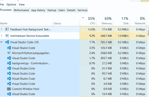

# 后台运行 Python 程序

> 原文:[https://www . geesforgeks . org/running-python-后台程序/](https://www.geeksforgeeks.org/running-python-program-in-the-background/)

让我们看看如何在后台运行 Python 程序或项目，即程序将从设备打开的那一刻开始运行，并在关闭或您关闭它时停止。只需运行一次，以确保程序没有错误

一种方式是使用 **pythonw** ，pythonw 是 python+无终端窗口的拼接，即运行 python 无终端窗口。您可以通过在终端上运行以下代码来使用它:

> pythow〔t0〕

这是背景。py 是文件:

在 Linux 和 mac 中，要在后台运行 py 文件，您只需要在使用命令后添加& sign，它会告诉解释器在后台运行程序

> python filename.py &

它将在后台运行程序，同时你可以使用一个终端。后台进程会有进程 id，如果你愿意，你也可以使用来终止进程，因为你不能只通过 CTRL+C 来终止它，要终止它，打开另一个终端会话并使用命令

> kill-9 { { id get after } } &

kill 是 killing process 的缩写，而-9 用来告诉立即杀死它，相应的状态会更新。为了获得输出，您可以使用

> python filename . py > filename to flush &

它将生成输出，即刷新文件中的输出，但它在缓冲存储器中更新，您必须等待程序的终止，以反映硬盘文件中的输出。要解决这个问题，您只需要告诉 python 解释器不要使用缓冲内存步骤:

结束/终止当前正在运行的文件

现在使用实用程序

> python-u filename . py > FileToFlush &

它会直接把输出放到你选择的文件中。

如果你在程序结束前关闭终端，终端执行的所有进程都将停止，出现挂机情况为了解决问题你需要使用如下所示的 **nohup** 命令 nohup 将确保进程一直运行到结束无论你是否关闭父终端。nohup 代表不挂机

> nohup python -u filename.py

现在，您不需要刷新任何文件中的输出，因为 nohup 实用程序在执行时会生成一个名为 nohup.out 的文件。它将像日志文件。由 nohup 生成的输出填充的名称将反映在。要终止此执行，您将需要 ID 进程，如果您能记住或者不能，没有问题，您需要搜索文件只需使用以下命令

> ps ax | grep filename.py

grep 用于模式搜索，它将在终端上反映进程 id，只需使用 kill -9 ID 将其杀死。现在该过程终止