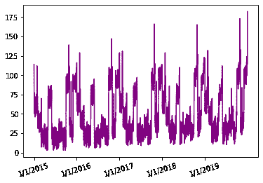
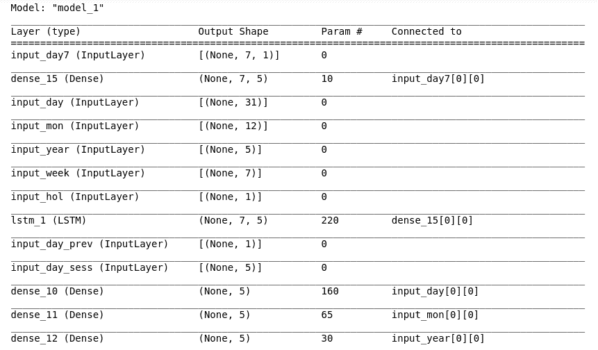
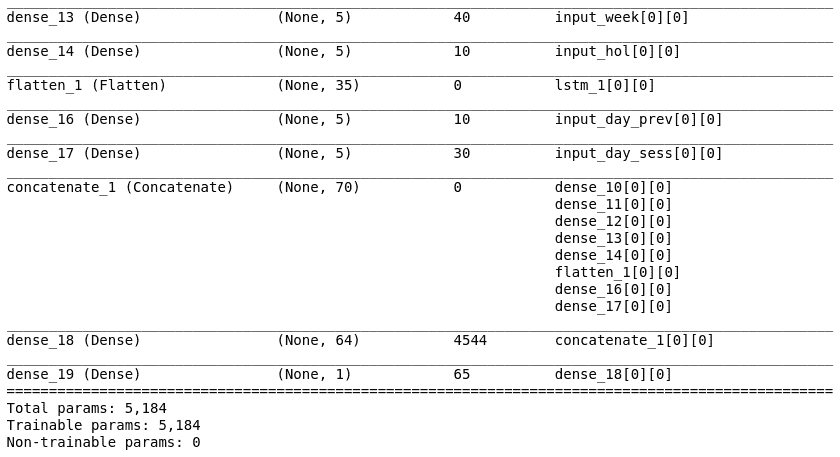
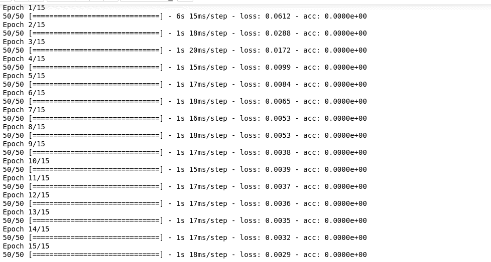
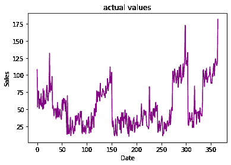
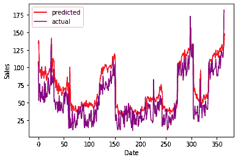

# 销售预测预测–Python

> 原文:[https://www . geesforgeks . org/sales-forecast-prediction-python/](https://www.geeksforgeeks.org/sales-forecast-prediction-python/)

预测预测是使用过去的值和许多其他因素来预测未来的值。在本教程中，我们将使用 Keras 功能 API 创建一个销售预测模型。

## 销售预测

它使用过去的销售额、季节性、节日、经济状况等数据来确定当前或未来的销售额。

所以，这个模型在提供了一定的输入后，会预测某一天的销售额。

在该模型中，8 个参数用作输入:

1.  过去七天的销售额
2.  一周中的某一天
3.  日期–日期被转换为 3 种不同的输入
4.  季节
5.  节日与否
6.  上一年同一天的销售额

### 它是如何工作的？

首先，所有输入都经过预处理，以便机器能够理解。这是一个基于监督学习的线性回归模型，因此输出将与输入一起提供。然后，输入连同期望的输出一起被馈送到模型。该模型将绘制(学习)输入和输出之间的关系(函数)。然后，该函数或关系用于预测特定输入集的输出。在这种情况下，像日期和以前的销售额这样的输入参数被标记为输入，销售额被标记为输出。该模型将预测 0 到 1 之间的一个数字，因为 sigmoid 函数用于最后一层。这个输出可以乘以一个特定的数字(在这种情况下是最大销售额)，这将是我们某一天对应的销售额。然后，该输出作为输入提供，以计算第二天的销售数据。这一系列步骤将持续到某一天到来。

## 所需的包和安装

1.  numpy
2.  熊猫
3.  硬
4.  张流
5.  战斗支援车
6.  matplotlib.pyplot

## 蟒蛇 3

```
import pandas as pd                     # to extract data from dataset(.csv file)
import csv                              #used to read and write to csv files
import numpy as np                      #used to convert input into numpy arrays to be fed to the model
import matplotlib.pyplot as plt         #to plot/visualize sales data and sales forecasting
import tensorflow as tf                 # acts as the framework upon which this model is built
from tensorflow import keras            #defines layers and functions in the model

#here the csv file has been copied into three lists to allow better availability
list_row,date,traffic = get_data('/home/abh/Documents/Python/Untitled Folder/Sales_dataset')
```

外部库的使用已经保持在最低限度，以提供一个更简单的界面，您可以用已经存在于已建立的库中的函数替换本教程中使用的函数。

#### **5 年销售数据原始数据集:**



2015 年 1 月至 2019 年 12 月的销售数据

如您所见，销售数据似乎每年都遵循类似的模式，峰值销售值似乎在 5 年的时间框架内随着时间的推移而增加。

在这 5 年的时间框架内，前 4 年将用于训练模型，最后一年将用作测试集。

现在，一些辅助函数用于处理数据集和创建所需形状和大小的输入。它们如下:

1.  get _ data–用于使用指向数据集位置的路径加载数据集。
2.  date _ to _ day–提供每天的日期。例如，2/2/16 是星期六，9/5/15 是星期一。
3.  date _ to _ enc–将数据编码成一个热点向量，这为模型提供了更好的学习机会。

这里无法解释这些函数和一些其他函数的所有属性，因为这会花费太多时间。如果您想查看整个代码，请访问此链接。

### **预处理:**

最初，数据集只有两列:日期和流量(销售额)。

在添加不同的列并对值进行处理/标准化之后，数据包含了所有这些值。

1.  日期
2.  交通
3.  假期与否
4.  一天

所有这些参数都必须转换成机器可以理解的形式，这将使用下面的这个函数来完成。

它不是将日期、月份和年份作为一个单独的实体，而是被分成三个不同的输入。原因是这些输入中的年份参数在大多数情况下是相同的，这将导致模型变得自满，即它将开始过度拟合当前数据集。为了增加不同输入之间的可变性，日期和月份被分别标记。下面的函数转换()将创建六个列表，并向它们追加适当的输入。这就是 2015 年到 2019 年的编码

*{2015:数组([1。, 0., 0., 0., 0.]，dtype=float32)，2016: array([0。, 1., 0., 0., 0.]，dtype=float32)，2017: array([0。, 0., 1., 0., 0.]，dtype=float32)，2018: array([0。, 0., 0., 1., 0.]，dtype=float32)，2019: array([0。, 0., 0., 0., 1.]，dtype=float32)*

每一个都是长度为 5 的 NumPy 数组，1 和 0 表示它的值

## 蟒蛇 3

```
def conversion(week,days,months,years,list_row):
  #lists have been defined to hold different inputs
  inp_day = []
  inp_mon = []
  inp_year = []
  inp_week=[]
  inp_hol=[]
  out = []
  #converts the days of a week(monday,sunday,etc.) into one hot vectors and stores them as a dictionary
  week1 = number_to_one_hot(week)
  #list_row contains primary inputs
  for row in list_row:
        #Filter out date from list_row
        d = row[0]
        #the date was split into three values date, month and year.
        d_split=d.split('/')
        if d_split[2]==str(year_all[0]):
          #prevents use of the first year data to ensure each input contains previous year data as well.
          continue
        #encode the three parameters of date into one hot vectors using date_to_enc function.
        d1,m1,y1 = date_to_enc(d,days,months,years) #days, months and years and dictionaries containing the one hot encoding of each date,month and year.
        inp_day.append(d1) #append date into date input
        inp_mon.append(m1) #append month into month input
        inp_year.append(y1) #append year into year input
        week2 = week1[row[3]] #the day column from list_is converted into its one-hot representation and saved into week2 variable
        inp_week.append(week2)# it is now appended into week input.
        inp_hol.append([row[2]])#specifies whether the day is a holiday or not
        t1 = row[1] #row[1] contains the traffic/sales value for a specific date
        out.append(t1) #append t1(traffic value) into a list out
  return inp_day,inp_mon,inp_year,inp_week,inp_hol,out #all the processed inputs are returned

inp_day,inp_mon,inp_year,inp_week,inp_hol,out = conversion(week,days,months,years,list_train)
#all of the inputs must be converted into numpy arrays to be fed into the model
inp_day = np.array(inp_day)
inp_mon = np.array(inp_mon)
inp_year = np.array(inp_year)
inp_week = np.array(inp_week)
inp_hol = np.array(inp_hol)
```

**我们现在将处理一些剩余的其他输入，使用所有这些参数背后的原因是为了提高模型的效率，您可以尝试移除或添加一些输入。**

过去七天的销售数据被作为输入传递，以创建销售数据的趋势，这将使预测值不会完全随机。同样，前一年当天的销售数据也被提供。

以下函数(other_inputs)处理三个输入:

*   过去七天的销售数据
*   上一年同一天的销售数据
*   季节性——季节性被添加到夏季销售等趋势中。

## 蟒蛇 3

```
def other_inputs(season,list_row):
  #lists to hold all the inputs
  inp7=[]
  inp_prev=[]
  inp_sess=[]
  count=0 #count variable will be used to keep track of the index of current row in order to access the traffic values of past seven days.
  for row in list_row:
    ind = count
    count=count+1
    d = row[0] #date was copied to variable d
    d_split=d.split('/')
    if d_split[2]==str(year_all[0]):
      #preventing use of the first year in the data
      continue
    sess = cur_season(season,d) #assigning a season to to the current date
    inp_sess.append(sess) #appending sess variable to an input list
    t7=[] #temporary list to hold seven sales value
    t_prev=[] #temporary list to hold the previous year sales value
    t_prev.append(list_row[ind-365][1]) #accessing the sales value from one year back and appending them
    for j in range(0,7):
        t7.append(list_row[ind-j-1][1]) #appending the last seven days sales value
    inp7.append(t7)
    inp_prev.append(t_prev)
  return inp7,inp_prev,inp_sess

inp7,inp_prev,inp_sess = other_inputs(season,list_train)
inp7 = np.array(inp7)
inp7= inp7.reshape(inp7.shape[0],inp7.shape[1],1)
inp_prev = np.array(inp_prev)
inp_sess = np.array(inp_sess)
```

这么多输入背后的原因是，如果将所有这些组合成一个数组，它将具有不同长度的不同行或列。这样的数组不能作为输入。

将所有值线性排列在单个数组中会导致模型具有高损耗。

线性排列将导致模型一般化，因为连续输入之间的差异不会太大，这将导致有限的学习，降低模型的准确性。

### **定义模型**

八个独立的输入被处理并连接成一个单独的层，并传递给模型。

最终投入如下:

1.  日期
2.  月
3.  年
4.  一天
5.  前七天销售额
6.  上一年的销售额
7.  季节
8.  假期与否

在这里的大部分图层中，我已经使用了 5 个单位作为输出形状，你可以进一步用它来实验，以提高模型的效率。

## 计算机编程语言

```
from tensorflow.keras.models import Model
from tensorflow.keras.layers import Input, Dense,LSTM,Flatten
from tensorflow.keras.layers import concatenate
#an Input variable is made from every input array
input_day = Input(shape=(inp_day.shape[1],),name = 'input_day')
input_mon = Input(shape=(inp_mon.shape[1],),name = 'input_mon')
input_year = Input(shape=(inp_year.shape[1],),name = 'input_year')
input_week = Input(shape=(inp_week.shape[1],),name = 'input_week')
input_hol = Input(shape=(inp_hol.shape[1],),name = 'input_hol')
input_day7 = Input(shape=(inp7.shape[1],inp7.shape[2]),name = 'input_day7')
input_day_prev = Input(shape=(inp_prev.shape[1],),name = 'input_day_prev')
input_day_sess = Input(shape=(inp_sess.shape[1],),name = 'input_day_sess')
# The model is quite straight-forward, all inputs were inserted into a dense layer with 5 units and 'relu' as activation function
x1 = Dense(5, activation='relu')(input_day)
x2 = Dense(5, activation='relu')(input_mon)
x3 = Dense(5, activation='relu')(input_year)
x4 = Dense(5, activation='relu')(input_week)
x5 = Dense(5, activation='relu')(input_hol)
x_6 = Dense(5, activation='relu')(input_day7)
x__6 = LSTM(5,return_sequences=True)(x_6) # LSTM is used to remember the importance of each day from the seven days data
x6 = Flatten()(x__10) # done to make the shape compatible to other inputs as LSTM outputs a three dimensional tensor
x7 = Dense(5, activation='relu')(input_day_prev)
x8 = Dense(5, activation='relu')(input_day_sess)
c = concatenate([x1,x2,x3,x4,x5,x6,x7,x8]) # all inputs are concatenated into one
layer1 = Dense(64,activation='relu')(c)
outputs = Dense(1, activation='sigmoid')(layer1) # a single output is produced with value ranging between 0-1.
# now the model is initialized and created as well
model = Model(inputs=[input_day,input_mon,input_year,input_week,input_hol,input_day7,input_day_prev,input_day_sess], outputs=outputs)
model.summary() # used to draw a summary(diagram) of the model
```

**车型总结:**

 

**使用 RMSprop 编译模型:**

RMSprop 非常擅长处理随机分布，因此在这里使用它。

## 蟒蛇 3

```
from tensorflow.keras.optimizers import RMSprop

model.compile(loss=['mean_squared_error'],
              optimizer = 'adam',
              metrics = ['acc'] #while accuracy is used as a metrics here it will remain zero as this is no classification model
              )                  # linear regression models are best gauged by their loss value
```

**在数据集上拟合模型:**

该模型现在将被输入和输出数据，这是最后一步，现在我们的模型将能够预测销售数据。

## 蟒蛇 3

```
history = model.fit(
           x = [inp_day,inp_mon,inp_year,inp_week,inp_hol,inp7,inp_prev,inp_sess],
           y = out,
           batch_size=16,
           steps_per_epoch=50,
           epochs = 15,
           verbose=1,
           shuffle =False
           )
#all the inputs were fed into the model and the training was completed
```

**输出:**



现在，为了测试模型，input()接受输入并将其转换为适当的形式:

## 蟒蛇 3

```
def input(date):
    d1,d2,d3 = date_to_enc(date,days,months,years)   #separate date into three parameters
    print('date=',date)
    d1 = np.array([d1])                        
    d2 = np.array([d2])
    d3 = np.array([d3])
    week1 = number_to_one_hot(week)        #defining one hot vector to encode days of a week
    week2 = week1[day[date]]
    week2=np.array([week2])
    //appeding a column for holiday(0-not holiday, 1- holiday)
    if date in holiday:
        h=1
        #print('holiday')
    else:
        h=0
        #print("no holiday")
    h = np.array([h])
    sess = cur_season(season,date)        #getting seasonality data from cur_season function
    sess = np.array([sess])                            
    return d1,d2,d3,week2,h,sess
```

预测销售数据并不是我们来这里的目的，所以让我们继续进行预测工作。

销售预测

定义*预测 _ 测试*功能，预测提供日期后一年的销售数据:

该功能的工作原理如下:

*   需要输入一个日期来预测从一年前到上述日期的销售数据
*   然后，我们访问前一年当天的销售数据和前 7 天的销售数据。
*   然后，使用这些作为输入，预测新的值，然后在七天值中，第一天被移除，并且预测的输出被添加作为下一次预测的输入

我们要求预测到 2019 年 12 月 31 日为止的一年

*   首先，记录了 2018 年 12 月 31 日(一年前)的日期，以及从(2018 年 12 月 25 日–2018 年 12 月 31 日)开始的七天销售
*   然后收集一年前，即 2017 年 12 月 31 日的销售数据
*   将这些数据作为其他数据的输入，预测第一个销售数据(即 1/1/2019)
*   然后删除 2018 年 12 月 24 日的销售数据，添加 2019 年 1 月 1 日的预测销售额。如此循环，直到预测出 2019 年 12 月 31 日的销售数据。

**所以，以前的输出作为输入。**

## 蟒蛇 3

```
def forecast_testing(date):
    maxj = max(traffic) # determines the maximum sales value in order to normalize or return the data to its original form
    out=[]
    count=-1
    ind=0
    for i in list_row:
        count =count+1
        if i[0]==date: #identify the index of the data in list
            ind = count
    t7=[]
    t_prev=[]
    t_prev.append(list_row[ind-365][1]) #previous year data
    # for the first input, sales data of last seven days will be taken from training data
    for j in range(0,7):
          t7.append(list_row[ind-j-365][1])
    result=[] # list to store the output and values
    count=0
    for i in list_date[ind-364:ind+2]:
        d1,d2,d3,week2,h,sess = input(i) # using input function to process input values into numpy arrays
        t_7 = np.array([t7]) # converting the data into a numpy array
        t_7 = t_7.reshape(1,7,1)
        # extracting and processing the previous year sales value
        t_prev=[]
        t_prev.append(list_row[ind-730+count][1])
        t_prev = np.array([t_prev])
        #predicting value for output
        y_out = model.predict([d1,d2,d3,week2,h,t_7,t_prev,sess])
        #output and multiply the max value to the output value to increase its range from 0-1
        print(y_out[0][0]*maxj)
        t7.pop(0) #delete the first value from the last seven days value
        t7.append(y_out[0][0]) # append the output as input for the seven days data
        result.append(y_out[0][0]*maxj) # append the output value to the result list
        count=count+1
    return result
```

运行预测测试功能，将返回包含该年所有销售数据的列表

**结果=预测 _ 测试(' 2019 年 12 月 31 日'，日期)**

**预测值和实际值的图表，用于测试模型的性能**

## 蟒蛇 3

```
plt.plot(result,color='red',label='predicted')
plt.plot(test_sales,color='purple',label="actual")
plt.xlabel("Date")
plt.ylabel("Sales")
leg = plt.legend()
plt.show()
```




2019 年 1 月 1 日至 2019 年 12 月 31 日的实际值



预测值和实际值之间的比较

如你所见，预测值和实际值非常接近，这证明了我们模型的有效性。如果上述文章中有任何错误或改进的可能性，请随时在评论部分提及。