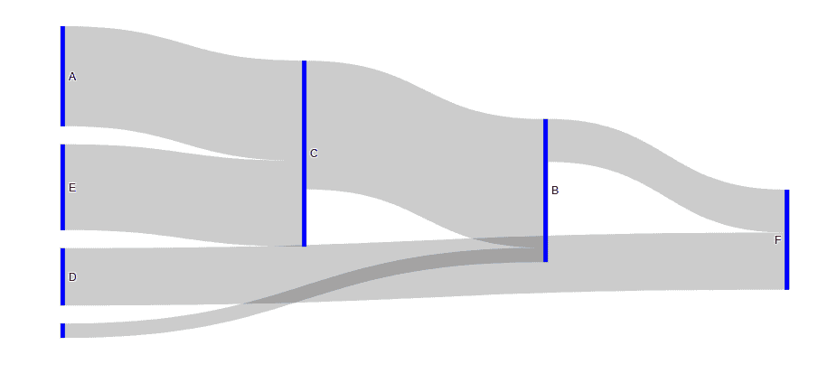
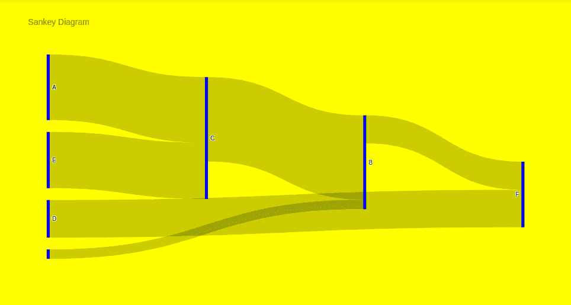

# Python 中使用 Plotly 的三键图

> 原文:[https://www . geesforgeks . org/sankey-diagram-use-plotly-in-python/](https://www.geeksforgeeks.org/sankey-diagram-using-plotly-in-python/)

[Plotly](https://www.geeksforgeeks.org/getting-started-with-plotly-python/) 是一个 Python 库，用来设计图形，尤其是交互图形。它可以绘制各种图形和图表，如直方图、条形图、箱线图、展开图等。它主要用于数据分析以及财务分析。plotly 是一个交互式可视化库。

## 三键图

**三基图**是一种流程图，其中箭头的宽度与流速相当。Sankey 图还可以可视化表示源节点的源、目标节点的目标、设置流量的值以及显示节点名称的标签。如果流量是两倍宽，则表示数量是两倍。

**例 1:**

## 蟒蛇 3

```py
fig = go.Figure(data=[go.Sankey(
    node = dict(
      thickness = 5,
      line = dict(color = "green", width = 0.1),
      label = ["A", "B", "C", "D", "E", "F"],
      color = "blue"
    ),
    link = dict(

      # indices correspond to labels
      source = [0, 6, 1, 4, 2, 3], 
      target = [2, 1, 5, 2, 1, 5],
      value = [7, 1, 3, 6, 9, 4]
  ))])

fig.show()
```

**输出:**



**示例 2:** 设置图表的样式

## 蟒蛇 3

```py
fig = go.Figure(data=[go.Sankey(
    node = dict(
      thickness = 5,
      line = dict(color = "green", width = 0.1),
      label = ["A", "B", "C", "D", "E", "F"],
      color = "blue"
    ),
    link = dict(

      # indices correspond to labels
      source = [0, 6, 1, 4, 2, 3], 
      target = [2, 1, 5, 2, 1, 5],
      value = [7, 1, 3, 6, 9, 4]
  ))])

fig.update_layout(
    hovermode = 'x',
    title="Sankey Diagram",
    font=dict(size = 10, color = 'green'),
    plot_bgcolor='blue',
    paper_bgcolor='yellow'
)

fig.show()
```

**输出:**

