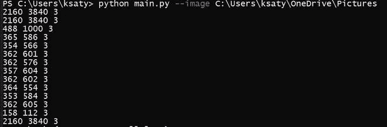
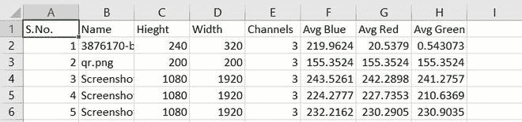

# 使用 Python 将图像属性保存到 CSV

> 原文:[https://www . geesforgeks . org/save-image-properties-to-CSV-using-python/](https://www.geeksforgeeks.org/save-image-properties-to-csv-using-python/)

在本文中，我们将编写 python 脚本来查找给定图像文件中通道的高度、宽度和数量，并将其保存为 CSV 格式。下面是使用 Python3 的实现。这个题目的前提是你已经安装了 [NumPy](https://numpy.org/install/) 和 [OpenCV](https://pypi.org/project/opencv-python/) 。

**进场:**

*   首先，我们将把所需的库加载到 python 文件中(NumPy、OpenCV 等)。).
*   仅当没有现有的 CSV 文件(高度、宽度、通道、颜色等)时，使用列名创建一个空的 CSV 文件。).如果文件 data.csv 不存在，那么 else 语句将创建一个新文件。
*   现在我们将在命令行中使用 **argparse()** 函数从用户处获取图像的目录路径。
*   使用 CV2 查找颜色属性。
*   我们将使用 **image.shape** 功能找出图像的高度、宽度和通道。
*   然后我们将计算图像的平均值**红色**，平均值**蓝色**，平均值**绿色**
*   然后我们将使用 **writerow()** 函数将输出写入 csv 文件。

**下面是实现:**

## 蟒蛇 3

```py
# Required Libraries
from os import listdir
from os.path import isfile, join
from pathlib import Path
import numpy
import cv2
import argparse
import numpy
import csv

# Check whether the CSV 
# exists or not if not then create one.
my_file = Path("csv/details.csv")

if my_file.is_file():
    f = open(my_file, "w+")
    with open('csv/details.csv', 'a', newline='') as file:
        writer = csv.writer(file)

        writer.writerow(["S.No.", "Name", "Height",
                         "Width", "Channels",
                         "Avg Blue", "Avg Red",
                         "Avg Green"])
    f.close()
    pass

else:
    with open('csv/details.csv', 'w', newline = '') as file:
        writer = csv.writer(file)

        writer.writerow(["S.No.", "Name", "Height",
                         "Width", "Channels",
                         "Avg Blue", "Avg Red",
                         "Avg Green"])

# Argparse function to get
# the path of the image directory
ap = argparse.ArgumentParser()

ap.add_argument("-i", "--image", 
                required = True, 
                help = "Path to folder")

args = vars(ap.parse_args())

# Program to find the
# colors and embed in the CSV
mypath = args["image"]

onlyfiles = [ f for f in listdir(mypath) if isfile(join(mypath,f)) ]
images = numpy.empty(len(onlyfiles), dtype = object)

for n in range(0, len(onlyfiles)):

    path = join(mypath,onlyfiles[n])
    images[n] = cv2.imread(join(mypath,onlyfiles[n]),
                           cv2.IMREAD_UNCHANGED)

    img = cv2.imread(path)
    h,w,c = img.shape
    print(h, w, c)

    avg_color_per_row = numpy.average(img, axis = 0)
    avg_color = numpy.average(avg_color_per_row, axis = 0)

    with open('csv/details.csv', 'a', newline = '') as file:
        writer = csv.writer(file)
        writer.writerow([n+1, onlyfiles[n], h, w, c, 
                         avg_color[0], avg_color[1],
                         avg_color[2]])
        file.close()
```

**输出:**



### 用法:

*   保存这个代号为**的 main.py** 。
*   Shift(键)+右键点击，点击这里打开 **PowerShell** 窗口。

```py
python3 main.py --image /path/to/images/folder/:
```

**CSV 文件输出:**



生成的 Csv 文件