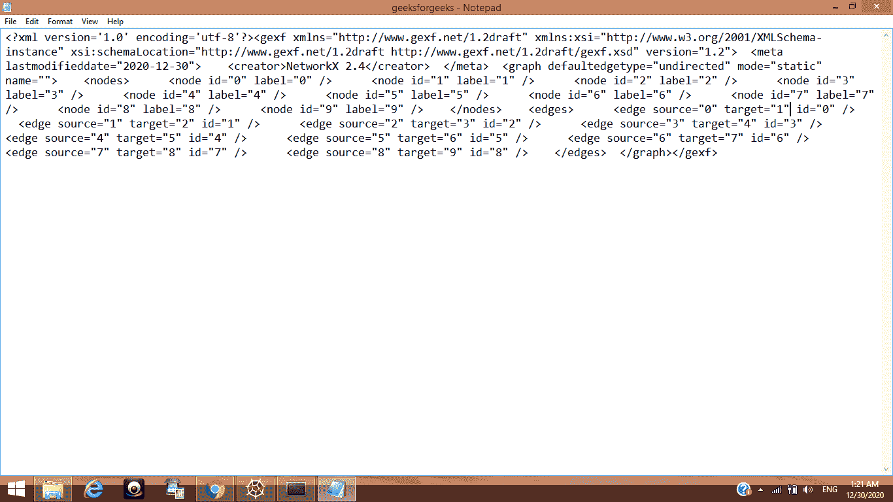
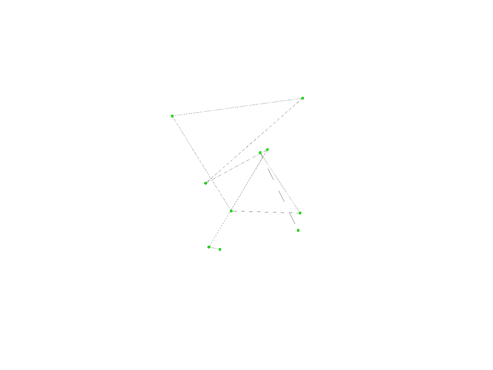

# 保存 GEXF 格式的网络图，并使用 Gephi

可视化

> 原文:[https://www . geesforgeks . org/saving-a-networkx-graph-in-gexf-format-and-visualize-use-gephi/](https://www.geeksforgeeks.org/saving-a-networkx-graph-in-gexf-format-and-visualize-using-gephi/)

**先决条件:** [网络](https://www.geeksforgeeks.org/networkx-python-software-package-study-complex-networks/)

网络是一个 Python 语言软件包，用于创建、操作和研究复杂网络的结构、动力学和功能。它被用来研究以具有节点和边的图的形式表示的大型复杂网络。使用 networkx，我们可以加载和存储复杂的网络。我们可以生成许多类型的随机和经典网络，分析网络结构，建立网络模型，设计新的网络算法和绘制网络。

在本文中，我们将讨论如何以 GEXF 格式保存网络图，然后使用 Gephi 将其可视化。

**GEXF** 代表**图形交换 XML 格式。**虽然它有支持图形可视化的特性，但是网络库提供的可视化方法有一定的局限性。因此，需要使用外部工具，如用于图形可视化的 Gephi。但是我们不能直接将图从 python 导出到 Gephi，我们需要将图转换成它支持的格式。GEXF 就是这样一种文件格式。

需要先安装 Gephi 才能使用: [Gephi](https://gephi.org/)

### 以 gexf 格式保存网络图

为了实现这一点，我们将使用 write_gexf()函数，顾名思义，该函数可以轻松地将网络图保存为 gexf 格式。

> **语法:**
> 
> networkx.write_gexf( G，路径)
> 
> **参数:**
> 
> *   **G:** 在此参数中，NetworkX 图形对象或简称图形作为参数发送。
> *   **路径:**在此参数中，指定了保存图形的有效路径。

**进场:**

*   导入模块
*   创建网络图
*   以 gexf 格式保存此图表

**程序:**

## 蟒蛇 3

```py
# importing the required module
import networkx as nx

# making a simple graph with 1 node.
G = nx.path_graph(10)

# saving graph created above in gexf format
nx.write_gexf(G, "geeksforgeeks.gexf")
```

**输出:**

一个名为 geeksforgeeks.gexf 的文件将保存在指定的路径上，可以使用任何文本编辑器查看，该编辑器将以 XML 显示。



### 使用 Gephi 可视化

上述程序中创建的图形将使用 Gephi 可视化。

**接近**

*   安装 Gephi
*   导入 gexf 文件

可视化后，图是这样的:



<video class="wp-video-shortcode" id="video-534630-1" width="640" height="360" preload="metadata" controls=""><source type="video/mp4" src="https://media.geeksforgeeks.org/wp-content/uploads/20201230182548/op.mp4?_=1">[https://media.geeksforgeeks.org/wp-content/uploads/20201230182548/op.mp4](https://media.geeksforgeeks.org/wp-content/uploads/20201230182548/op.mp4)</video>